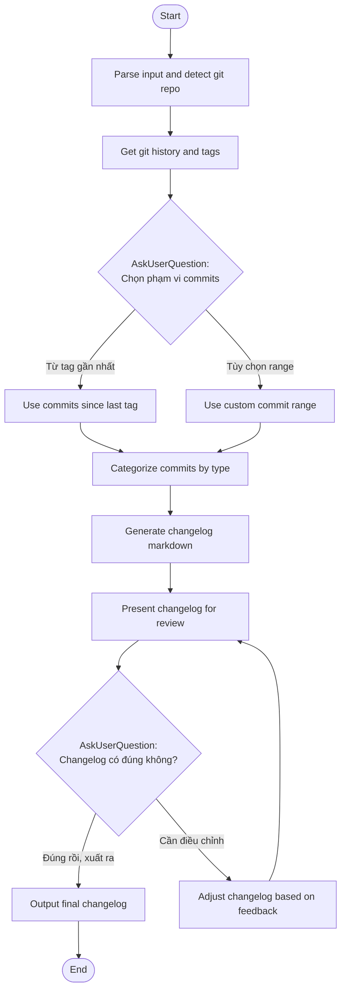

## Workflow Execution Guide

Follow the Mermaid flowchart above to execute the workflow. Each node type has specific execution methods as described below.

### Execution Methods by Node Type

- **Rectangle nodes (Prompt nodes)**: Execute the prompts described in the details section below
- **Diamond nodes (AskUserQuestion:...)**: Use the AskUserQuestion tool to prompt the user and branch based on their response

### Prompt Node Details

#### cl_prompt_parse_input(Parse input and detect git repo)

```
You are starting the Changelog workflow.

User input (optional version/range):
{{input}}

## Your Task

1. **Verify Git Repository**: Check if current directory is a git repository
2. **Parse User Input**: Determine if user specified:
   - A version number (e.g., "1.2.0")
   - A commit range (e.g., "v1.0.0..HEAD")
   - Nothing (will use default: since last tag)

## Actions

Run these bash commands to verify:
```bash
git rev-parse --is-inside-work-tree
```

If not a git repo, inform user and exit workflow.

## Output

**Context to track:**
- isGitRepo: true/false
- userSpecifiedVersion: version if provided
- userSpecifiedRange: range if provided
```

#### cl_prompt_get_git_info(Get git history and tags)

```
## Get Git Information

Gather necessary git information for changelog generation.

## Actions

Run these bash commands IN PARALLEL:

1. **Get all tags (sorted by version)**:
```bash
git tag --sort=-version:refname | head -20
```

2. **Get latest tag**:
```bash
git describe --tags --abbrev=0 2>/dev/null || echo "no-tags"
```

3. **Get current branch**:
```bash
git branch --show-current
```

## Output

**Context to track:**
- allTags: list of recent tags
- latestTag: most recent tag (or "no-tags")
- currentBranch: current branch name
- hasExistingTags: true/false
```

#### cl_prompt_use_last_tag(Use commits since last tag)

```
## Configure: Commits Since Last Tag

User chose to generate changelog from the last tag.

**Latest Tag**: {{latestTag}}

## Actions

Get commits since last tag:
```bash
git log {{latestTag}}..HEAD --pretty=format:"%h|%s|%an|%ad" --date=short
```

If no tags exist, get recent commits:
```bash
git log --oneline -50
```

## Output

**Context to track:**
- commitRange: "{{latestTag}}..HEAD" or "HEAD~50..HEAD"
- commits: array of commit objects with hash, message, author, date
```

#### cl_prompt_use_custom_range(Use custom commit range)

```
## Configure: Custom Commit Range

User wants to specify a custom range.

**Available Tags**: {{allTags}}
**User Input**: {{input}}

## Your Task

If user provided a range, use it. Otherwise, ask for clarification.

Common formats:
- `v1.0.0..v1.1.0` - between two tags
- `abc123..HEAD` - from commit to HEAD
- `HEAD~20..HEAD` - last 20 commits

## Actions

Get commits for the specified range:
```bash
git log {{commitRange}} --pretty=format:"%h|%s|%an|%ad" --date=short
```

## Output

**Context to track:**
- commitRange: the range specified
- commits: array of commit objects
```

#### cl_prompt_categorize_commits(Categorize commits by type)

```
## Categorize Commits

Analyze and categorize all commits by conventional commit type.

**Commits to categorize**:
{{commits}}

## Categorization Rules

Parse each commit message and categorize:

| Prefix | Category | Description |
|--------|----------|-------------|
| `feat:` or `feature:` | Added | New features |
| `fix:` or `bugfix:` | Fixed | Bug fixes |
| `docs:` | Documentation | Documentation changes |
| `style:` | Style | Formatting, no code change |
| `refactor:` | Changed | Code refactoring |
| `perf:` | Performance | Performance improvements |
| `test:` | Tests | Adding/updating tests |
| `chore:` | Chores | Maintenance tasks |
| `build:` | Build | Build system changes |
| `ci:` | CI | CI/CD changes |
| `BREAKING CHANGE:` or `!:` | Breaking | Breaking changes |

For commits without conventional prefix:
- Look for keywords: "add", "fix", "update", "remove", "refactor"
- Categorize as "Other" if unclear

## Output

**Categorized commits:**
```json
{
  "added": [...],
  "fixed": [...],
  "changed": [...],
  "breaking": [...],
  "other": [...]
}
```

Include for each commit:
- Original message (cleaned)
- PR/issue number if present (e.g., #123)
- Author name
```

#### cl_prompt_generate_changelog(Generate changelog markdown)

```
## Generate Changelog Markdown

Create a structured changelog from categorized commits.

**Version**: {{version}} (or "Unreleased")
**Date**: {{currentDate}}
**Categorized Commits**: {{categorizedCommits}}

## Changelog Format (Keep Changelog standard)

Generate markdown following this structure:

```markdown
## [{{version}}] - {{date}}

### Added
- Feature description (#PR)

### Fixed
- Bug fix description (#PR)

### Changed
- Change description (#PR)

### Breaking Changes
- Breaking change with migration guide if needed

### Other
- Other changes
```

## Rules

1. **Only include sections with content** - Skip empty categories
2. **Clean up commit messages**:
   - Remove type prefix (feat:, fix:, etc.)
   - Capitalize first letter
   - Add period if missing
3. **Preserve PR/Issue references** - Keep (#123) format
4. **Group related changes** - Combine similar small changes
5. **Prioritize user-facing changes** - Put important changes first

## Output

The complete changelog markdown block ready for review.
```

#### cl_prompt_present_changelog(Present changelog for review)

```
## Present Changelog for Review

**Generated Changelog**:

{{generatedChangelog}}

---

Present this changelog to the user for review.

Explain:
- How many commits were processed
- How they were categorized
- Any commits that were hard to categorize

User can:
1. **Accept** - Output the final changelog
2. **Adjust** - Request modifications
```

#### cl_prompt_adjust_changelog(Adjust changelog based on feedback)

```
## Adjust Changelog

User wants to modify the changelog.

**Current Changelog**:
{{generatedChangelog}}

**User Feedback**:
{{userFeedback}}

## Your Task

Modify the changelog based on user's feedback:
- Re-categorize items if requested
- Reword descriptions
- Add/remove items
- Change formatting

## Output

Updated changelog ready for another review.
```

#### cl_prompt_final_output(Output final changelog)

```
## Changelog Complete

**Final Changelog**:

{{finalChangelog}}

---

# ✅ Changelog Generated

## Summary
- **Version**: {{version}}
- **Commits Processed**: {{commitCount}}
- **Date Range**: {{commitRange}}

## Next Steps

You can:
1. Copy this to your CHANGELOG.md file
2. Include it in a release description
3. Use it for release notes

---

Output the final changelog markdown for the user to copy.
```

### AskUserQuestion Node Details

Ask the user and proceed based on their choice.

#### cl_question_commit_range(Chọn phạm vi commits)

**Selection mode:** Single Select (branches based on the selected option)

**Options:**
- **Từ tag gần nhất**: Lấy tất cả commits từ {{latestTag}} đến HEAD
- **Tùy chọn range**: Tự chọn phạm vi commits (v1.0.0..v1.1.0)

#### cl_question_satisfied(Changelog có đúng không?)

**Selection mode:** Single Select (branches based on the selected option)

**Options:**
- **Đúng rồi, xuất ra**: Changelog đã đúng, xuất kết quả cuối cùng
- **Cần điều chỉnh**: Muốn sửa đổi một số mục trong changelog
