```mermaid
flowchart TD
    start_node([Start])
    end_node([End])
    mn_prompt_parse_input[Parse input and determine action]
    mn_branch_session_state{Branch:<br/>Session đang active?}
    mn_prompt_start_session[Start session + Create MD file]
    mn_prompt_process_input[Process notes + Write to file]
    mn_branch_is_finalize{Branch:<br/>User muốn kết thúc?}
    mn_prompt_generate_final[Finalize file + Generate final notes]
    mn_prompt_present_notes[Present notes for review]
    mn_question_satisfied{AskUserQuestion:<br/>Notes có đủ không?}
    mn_prompt_adjust_notes[Adjust notes + Update file]
    mn_prompt_final_output[Output final meeting notes]

    start_node --> mn_prompt_parse_input
    mn_prompt_parse_input --> mn_branch_session_state
    mn_branch_session_state -->|Chưa có session| mn_prompt_start_session
    mn_branch_session_state -->|Đã có session| mn_prompt_process_input
    mn_prompt_start_session --> mn_prompt_process_input
    mn_prompt_process_input --> mn_branch_is_finalize
    mn_branch_is_finalize -->|Tiếp tục ghi| end_node
    mn_branch_is_finalize -->|Kết thúc session| mn_prompt_generate_final
    mn_prompt_generate_final --> mn_prompt_present_notes
    mn_prompt_present_notes --> mn_question_satisfied
    mn_question_satisfied -->|Đủ rồi| mn_prompt_final_output
    mn_question_satisfied -->|Cần bổ sung| mn_prompt_adjust_notes
    mn_prompt_adjust_notes --> mn_prompt_present_notes
    mn_prompt_final_output --> end_node
```

## Workflow Execution Guide

This is a **live note-taking workflow** where the agent acts as an intelligent note organizer.

### Core Concept

- **User's job**: Đánh nhanh các notes, không cần format
- **Agent's job**: Tổ chức, sắp xếp, merge, sửa đổi cho phù hợp

### Session-Based Operation

- **First call**: Starts a new meeting session
- **Subsequent calls**: Agent processes input and **intelligently organizes** all notes
- **Finalize**: Use keywords like "done", "kết thúc", "xong" to generate final notes

### Agent Responsibilities

The agent MUST:
1. **Organize** notes into logical sections
2. **Merge** related points together
3. **Update** previous notes if new info clarifies/changes them
4. **Restructure** as the meeting progresses
5. **Infer** context and relationships between notes

### Execution Methods by Node Type

- **Rectangle nodes (Prompt nodes)**: Execute the prompts described below
- **Diamond nodes (Branch:...)**: Auto-branch based on context

### Prompt Node Details

#### mn_prompt_parse_input(Parse input and determine action)

```
You are handling the Meeting Notes workflow.

User input:
{{input}}

## Your Task

### 1. Check for Finalize Keywords
If input contains any of these, user wants to end the session:
- "done", "finish", "end", "kết thúc", "xong", "hoàn thành"
- "xuất", "export", "generate", "tạo notes"
- "tổng kết", "summary"

### 2. Check Session State
Look at conversation history:
- Is there an active meeting session?
- What is the current `filePath` for the notes file?
- What is the current state of organized notes?

### 3. Understand the Input
Parse what user is telling you:
- New information to add?
- Correction to previous note?
- Additional context for existing topic?
- A decision or action item?

## Output

Determine:
- isNewSession: true/false
- isFinalize: true/false
- inputIntent: "new_info" | "correction" | "context" | "decision" | "action"
- filePath: path to current notes file (if session exists)
```

#### mn_prompt_start_session(Start session + Create MD file)

```
## Start New Meeting Session

Initialize a new meeting notes session and create the notes file.

**Argument received:** {{meeting_name}} (optional)

## Your Task

### 1. Determine File Name

**If argument provided:**
- Use `{{meeting_name}}` as file identifier
- Sanitize: replace spaces with `-`, lowercase, remove special chars
- File path: `docs/meeting-notes/{{meeting_name}}.md`

**If no argument:**
- Use timestamp format
- File path: `docs/meeting-notes/meeting-<YYYY-MM-DD>-<HH-MM>.md`

**Examples:**
- `/meeting-notes sprint-planning` → `docs/meeting-notes/sprint-planning.md`
- `/meeting-notes 2026-01-21-standup` → `docs/meeting-notes/2026-01-21-standup.md`
- `/meeting-notes` → `docs/meeting-notes/meeting-2026-01-21-14-30.md`

### 2. Create Notes File

**IMPORTANT:** Use the Write tool to create the file with this template:

```markdown
# Meeting Notes

**Date:** YYYY-MM-DD
**Started:** HH:MM
**Attendees:** TBD

---

## Summary
<!-- Auto-generated at end -->

---

## Key Decisions

| # | Decision | Proposed By | Context |
|---|----------|-------------|---------|

---

## Action Items

| Task | Owner | Due Date | Status |
|------|-------|----------|--------|

---

## Discussion Notes
<!-- Notes will be added here -->

---

## Open Questions / Follow-ups
<!-- Questions will be added here -->

---

## Key Dates & Deadlines

| Date | Event |
|------|-------|
```

### 3. Initialize Session State

```javascript
meetingNotes = {
  topic: "{{meeting_name}}" || null,  // from argument or infer from content
  date: "YYYY-MM-DD",
  startTime: "HH:MM",

  // File path for persistence - CRITICAL
  // Uses {{meeting_name}} if provided, otherwise timestamp
  filePath: "docs/meeting-notes/{{meeting_name}}.md" || "docs/meeting-notes/meeting-<YYYY-MM-DD>-<HH-MM>.md",

  attendees: [],

  // Organized sections - agent maintains these
  summary: "",
  discussions: [],      // grouped by topic
  decisions: [],
  actionItems: [],
  questions: [],
  keyDates: [],

  // Raw input log for reference
  rawInputs: []
}
```

### 4. Brief Acknowledgment

## Output Format

```
📝 Meeting notes started: {{meeting_name || "New Meeting"}}
   Date: [Date] | Started: [Time]

📁 Notes file: [filePath based on argument or timestamp]

Đánh tự nhiên, tôi sẽ tổ chức. Nói "done" hoặc "xong" để kết thúc.
```

## CRITICAL Actions

1. **MUST use Write tool** to create the notes file BEFORE showing output
2. **MUST create directory** `docs/meeting-notes/` if it doesn't exist (use Bash: mkdir -p)
3. **Use {{meeting_name}}** for file naming if provided
4. Keep acknowledgment brief - user wants to start noting
```

#### mn_prompt_process_input(Process notes + Write to file)

```
## Process Input and Organize Notes

This is the CORE of the workflow. You are an intelligent note organizer.
You MUST perform DUAL-WRITE: output to user AND write to file.

**New Input**: {{input}}
**Current Organized Notes**: {{currentNotes}}
**Previous Raw Inputs**: {{rawInputs}}
**File Path**: {{filePath}}

## Your Job

You are NOT just appending. You are **organizing and maintaining** a well-structured meeting notes document.

### Step 1: Understand the New Input

Parse the input:
- **Who said it?** Look for: "Anh/Chị [Name]", "@Name", "[Name]:"
- **What type?**
  - Decision: "quyết định", "chọn", "sẽ dùng", "agreed"
  - Action: "sẽ làm", "will", "by [date]", "deadline", "task"
  - Question: "?", "cần hỏi", "chưa rõ"
  - Context: Additional info about existing topic
  - New topic: Completely new discussion point

### Step 2: Relate to Existing Notes

Check if this input:
- **Adds to existing topic**: Merge into that discussion
- **Answers a previous question**: Update the question status
- **Changes a previous decision**: Update the decision
- **Provides context for earlier point**: Enhance that point
- **Is completely new**: Create new section/item

### Step 3: Reorganize as Needed

You MAY and SHOULD:
- **Merge** related discussion points
- **Move** items between sections if classification changes
- **Update** previous notes with new context
- **Rename** topic headings as scope becomes clearer
- **Reorder** items for logical flow
- **Split** topics that have grown too broad

### Step 4: Maintain Structure

Keep the organized notes clean:

```markdown
## Discussions

### [Topic 1 - Inferred Name]
- [Speaker]: [Point]
- [Speaker]: [Related point]
- Context: [Additional info merged in]

### [Topic 2]
...

## Decisions
1. **[Decision]** - [Who proposed] - [Context]

## Action Items
| Task | Owner | Due | Notes |
|------|-------|-----|-------|
| ... | @... | ... | ... |

## Open Questions
- [ ] [Question] - raised by [who]
- [x] [Answered question] - Answer: [answer]

## Key Dates
- [Date]: [What]
```

### Step 5: DUAL-WRITE (CRITICAL)

**Action 1 - Show to User:**
Brief confirmation of what you did (1-2 lines max)

Good responses:
- "✓ Added to [topic]. [1 sentence about what you did]"
- "✓ New decision: [Decision]. Updated related discussion."
- "✓ Action item added: @[Name] - [Task] by [Date]"
- "✓ Updated: Clarified [topic] based on new context."

**Action 2 - Write to File:**
Use the Edit tool to update the appropriate section in {{filePath}}

For **Discussion Notes**: Append to `## Discussion Notes` section
```markdown
### [Topic Name]
- **[Speaker]**: [Point]
```

For **Decisions**: Add row to `## Key Decisions` table
```markdown
| [#] | [Decision] | [Who] | [Context] |
```

For **Action Items**: Add row to `## Action Items` table
```markdown
| [Task] | @[Name] | [Date] | ⬜ |
```

For **Questions**: Append to `## Open Questions / Follow-ups` section
```markdown
- [ ] [Question] - raised by [who]
```

For **Key Dates**: Add row to `## Key Dates & Deadlines` table
```markdown
| [Date] | [Event] |
```

Also update **Attendees** in header if new speaker mentioned.

## IMPORTANT Rules

1. **Don't ask questions** - Just organize based on best inference
2. **Don't repeat back** the full notes (unless asked)
3. **Be smart about merging** - Related points go together
4. **Keep it brief** - User is busy noting
5. **Track changes mentally** - Know what you changed and why
6. **Infer topic names** - Create meaningful section headers
7. **Handle corrections** - If user says "actually..." or "sửa lại...", update previous
8. **ALWAYS WRITE TO FILE** - This is non-negotiable

## Output

Brief confirmation of what you did + file indicator:
📁 Saved to: {{filePath}}
```

#### mn_branch_is_finalize(Check if finalize)

```
## Branch: Is Finalize Request?

**Input**: {{input}}

## Finalize if input contains:
- "done", "finish", "end", "complete"
- "kết thúc", "xong", "hoàn thành"
- "xuất", "export", "tạo notes"
- "tổng kết", "summary", "wrap up"

→ If yes: mn_prompt_generate_final
→ If no: end_node (wait for next input)
```

#### mn_prompt_generate_final(Finalize file + Generate final notes)

```
## Generate Final Meeting Notes

User is done. Generate the polished final document and finalize the file.

**Organized Notes**: {{organizedNotes}}
**All Raw Inputs**: {{rawInputs}}
**File Path**: {{filePath}}

## Your Task

Create a clean, professional meeting notes document and update the file.

### 1. Finalize Topic
If not explicitly set, create a concise, descriptive title based on content.

### 2. Compile Attendees
List all speakers mentioned throughout.

### 3. Write Executive Summary
2-3 sentences covering:
- Main topics discussed
- Key outcomes/decisions
- Next steps

### 4. Add Completion Metadata
Update the file header:
```markdown
# Meeting Notes: [Inferred Topic]

**Date:** YYYY-MM-DD
**Started:** HH:MM
**Completed:** HH:MM
**Duration:** [X] minutes
**Attendees:** [Names]
```

### 5. Final File Structure

Ensure file has all sections properly filled:

```markdown
# Meeting Notes: [Topic]

**Date:** YYYY-MM-DD
**Started:** HH:MM
**Completed:** HH:MM
**Duration:** [X] minutes
**Attendees:** [Names]

---

## Summary

[2-3 sentence executive summary]

---

## Key Decisions

| # | Decision | Proposed By | Context |
|---|----------|-------------|---------|
| 1 | [What] | [Who] | [Why/Context] |

---

## Action Items

| Task | Owner | Due Date | Status |
|------|-------|----------|--------|
| [Task] | @[Name] | [Date] | ⬜ |

---

## Discussion Notes

### [Topic 1]
- **[Speaker]**: [Point]
- **[Speaker]**: [Point]

### [Topic 2]
- [Point]

---

## Open Questions / Follow-ups

- [ ] [Question to resolve]
- [ ] [Topic for next meeting]

---

## Key Dates & Deadlines

| Date | Event |
|------|-------|
| YYYY-MM-DD | [What] |
```

### 6. FINALIZE FILE

Use the Edit tool to update {{filePath}} with:
1. Meeting topic in title (inferred from content)
2. Completion time and duration in header
3. Generated summary
4. All attendees compiled

## Output

Complete, polished meeting notes ready for review.
Proceed to mn_prompt_present_notes.
```

#### mn_prompt_present_notes(Present notes for review)

```
## Present Final Notes

**Generated Notes**:
{{generatedNotes}}
**File Path**: {{filePath}}

---

Show the final notes to user.

```
📝 Meeting Complete!

📁 File saved: {{filePath}}

Quick stats:
- Decisions: X
- Action Items: X
- Discussion Topics: X
- Duration: X minutes

[Preview of key sections or full notes]
```

Ask if they want to adjust anything before finalizing.
```

#### mn_prompt_adjust_notes(Adjust notes + Update file)

```
## Adjust Notes

**Current Notes**: {{generatedNotes}}
**User Feedback**: {{userFeedback}}
**File Path**: {{filePath}}

Modify as requested and update the file at {{filePath}}.
Then present again.
```

#### mn_prompt_final_output(Output final)

```
## Complete

**Final Notes**:
{{finalNotes}}
**File Path**: {{filePath}}

---

Session complete. Notes saved and ready.

```
✅ Meeting notes complete!

📁 Notes saved to: {{filePath}}

📊 Final Stats:
• Decisions: [X]
• Action Items: [X]
• Discussion Topics: [X]
• Duration: [X] minutes

💡 Your notes are persisted at: {{filePath}}
   Open in any markdown viewer or IDE!

Start new session anytime with `/meeting-notes`.
```
```

### AskUserQuestion Node Details

#### mn_question_satisfied(Notes có đủ không?)

**Selection mode:** Single Select

**Options:**
- **Đủ rồi**: Xuất final notes
- **Cần sửa**: Tôi muốn điều chỉnh

---

## Usage Examples

### Natural Flow
```
User: /meeting-notes
Agent: 📝 Meeting notes started
       Date: 2026-01-21 | Started: 14:30

       📁 Notes file: docs/meeting-notes/meeting-2026-01-21-14-30.md

       Đánh tự nhiên, tôi sẽ tổ chức. Nói "done" hoặc "xong" để kết thúc.

User: /meeting-notes anh Minh nói nên dùng React
Agent: ✓ New topic: Tech Stack. Added Minh's React suggestion.
       📁 Saved to: docs/meeting-notes/meeting-2026-01-21-14-30.md

User: /meeting-notes chị Lan đồng ý
Agent: ✓ Updated Tech Stack discussion. Lan agrees with React.
       📁 Saved to: docs/meeting-notes/meeting-2026-01-21-14-30.md

User: /meeting-notes quyết định dùng React
Agent: ✓ Decision recorded: Use React for frontend.
       📁 Saved to: docs/meeting-notes/meeting-2026-01-21-14-30.md

User: /meeting-notes à mà Minh sẽ setup project
Agent: ✓ Action item: @Minh - Setup project.
       📁 Saved to: docs/meeting-notes/meeting-2026-01-21-14-30.md

User: /meeting-notes deadline thứ 6
Agent: ✓ Updated action: @Minh - Setup project by Friday.
       📁 Saved to: docs/meeting-notes/meeting-2026-01-21-14-30.md

User: /meeting-notes còn vấn đề backend nữa
Agent: ✓ New topic: Backend.
       📁 Saved to: docs/meeting-notes/meeting-2026-01-21-14-30.md

User: /meeting-notes Lan đề xuất dùng Node
Agent: ✓ Added to Backend: Lan suggests Node.js.
       📁 Saved to: docs/meeting-notes/meeting-2026-01-21-14-30.md

User: /meeting-notes done
Agent: 📝 Meeting Complete!

       📁 File saved: docs/meeting-notes/meeting-2026-01-21-14-30.md

       Quick stats:
       - Decisions: 1
       - Action Items: 1
       - Discussion Topics: 2
       - Duration: 25 minutes

       [Shows final organized notes with all topics merged properly]
```

### Correction Flow
```
User: /meeting-notes Minh sẽ làm frontend
Agent: ✓ Action: @Minh - Frontend work.
       📁 Saved to: docs/meeting-notes/meeting-2026-01-21-14-30.md

User: /meeting-notes sửa lại là Lan làm frontend, Minh làm backend
Agent: ✓ Updated: @Lan - Frontend, @Minh - Backend.
       📁 Saved to: docs/meeting-notes/meeting-2026-01-21-14-30.md
```

### Context Addition
```
User: /meeting-notes team đang discuss về auth
Agent: ✓ New topic: Authentication.
       📁 Saved to: docs/meeting-notes/meeting-2026-01-21-14-30.md

User: /meeting-notes có 2 options là JWT và session
Agent: ✓ Added to Auth: Two options - JWT vs Session.
       📁 Saved to: docs/meeting-notes/meeting-2026-01-21-14-30.md

User: /meeting-notes JWT thì stateless, session thì cần redis
Agent: ✓ Added context to Auth options.
       📁 Saved to: docs/meeting-notes/meeting-2026-01-21-14-30.md
```

## Key Principles

1. **User types fast, agent thinks smart**
2. **No rigid format required from user**
3. **Agent infers structure from content**
4. **Related info gets merged automatically**
5. **Corrections update previous notes**
6. **Brief responses keep flow going**
7. **Final output is clean and professional**
8. **Persist immediately** - All content written to file in real-time (NEW)
9. **Dual-write pattern** - Every action outputs to user AND writes to file (NEW)
