```mermaid
flowchart TD
    start_node([Start])
    end_node([End])
    ob_prompt_parse_input[Parse input and detect project]
    ob_question_role{AskUserQuestion:<br/>Role của bạn?}
    ob_prompt_set_role_frontend[Configure for Frontend]
    ob_prompt_set_role_backend[Configure for Backend]
    ob_prompt_set_role_fullstack[Configure for Fullstack]
    ob_prompt_set_role_devops[Configure for DevOps]
    ob_prompt_analyze_project[Analyze project structure]
    ob_prompt_identify_stack[Identify tech stack]
    ob_prompt_find_key_files[Find key files for role]
    ob_prompt_analyze_conventions[Analyze code conventions]
    ob_prompt_generate_guide[Generate onboarding guide]
    ob_prompt_present_guide[Present guide for review]
    ob_question_satisfied{AskUserQuestion:<br/>Guide có đủ không?}
    ob_prompt_add_details[Add more details]
    ob_prompt_final_output[Output final guide]

    start_node --> ob_prompt_parse_input
    ob_prompt_parse_input --> ob_question_role
    ob_question_role -->|Frontend| ob_prompt_set_role_frontend
    ob_question_role -->|Backend| ob_prompt_set_role_backend
    ob_question_role -->|Fullstack| ob_prompt_set_role_fullstack
    ob_question_role -->|DevOps| ob_prompt_set_role_devops
    ob_prompt_set_role_frontend --> ob_prompt_analyze_project
    ob_prompt_set_role_backend --> ob_prompt_analyze_project
    ob_prompt_set_role_fullstack --> ob_prompt_analyze_project
    ob_prompt_set_role_devops --> ob_prompt_analyze_project
    ob_prompt_analyze_project --> ob_prompt_identify_stack
    ob_prompt_identify_stack --> ob_prompt_find_key_files
    ob_prompt_find_key_files --> ob_prompt_analyze_conventions
    ob_prompt_analyze_conventions --> ob_prompt_generate_guide
    ob_prompt_generate_guide --> ob_prompt_present_guide
    ob_prompt_present_guide --> ob_question_satisfied
    ob_question_satisfied -->|Đủ rồi| ob_prompt_final_output
    ob_question_satisfied -->|Cần thêm chi tiết| ob_prompt_add_details
    ob_prompt_add_details --> ob_prompt_present_guide
    ob_prompt_final_output --> end_node
```

## Workflow Execution Guide

Follow the Mermaid flowchart above to execute the workflow. Each node type has specific execution methods as described below.

### Execution Methods by Node Type

- **Rectangle nodes (Prompt nodes)**: Execute the prompts described in the details section below
- **Diamond nodes (AskUserQuestion:...)**: Use the AskUserQuestion tool to prompt the user and branch based on their response

### Prompt Node Details

#### ob_prompt_parse_input(Parse input and detect project)

```
You are starting the Onboarding Guide workflow.

User input (optional role specification):
{{input}}

## Your Task

1. **Verify Project**: Check if we're in a valid project directory
2. **Initial Detection**: Quick scan for project type indicators

## Actions

Run these bash commands to detect project:

```bash
ls -la
```

Check for common project files:
- package.json (Node.js)
- requirements.txt / pyproject.toml (Python)
- go.mod (Go)
- Cargo.toml (Rust)
- pom.xml / build.gradle (Java)
- Gemfile (Ruby)
- composer.json (PHP)

## Output

**Context to track:**
- projectRoot: current directory
- detectedProjectType: based on config files
- hasReadme: true/false
- userRequestedRole: role if specified in input
```

#### ob_prompt_set_role_frontend(Configure for Frontend)

```
## Configure for Frontend Developer

**Role**: Frontend Developer

## Focus Areas

Prioritize these aspects when analyzing:

1. **UI Components**: Component library, styling solution
2. **State Management**: Redux, Zustand, Context, etc.
3. **Routing**: Next.js pages, React Router, etc.
4. **Build Tools**: Webpack, Vite, etc.
5. **Testing**: Jest, Cypress, Playwright

## Key Directories to Highlight

- `src/components/` or `app/components/`
- `src/pages/` or `app/`
- `src/styles/` or CSS modules
- `src/hooks/`
- `src/utils/` or `src/lib/`

## Role-Specific Commands

- `npm run dev` / `yarn dev` - Start dev server
- `npm run build` - Build for production
- `npm run test` - Run tests
- `npm run lint` - Lint code

**roleConfig**: Frontend specific configuration
```

#### ob_prompt_set_role_backend(Configure for Backend)

```
## Configure for Backend Developer

**Role**: Backend Developer

## Focus Areas

Prioritize these aspects when analyzing:

1. **API Routes**: REST endpoints, GraphQL schemas
2. **Database**: ORM, migrations, models
3. **Authentication**: Auth middleware, session management
4. **Services**: Business logic layers
5. **Testing**: Unit tests, integration tests

## Key Directories to Highlight

- `src/api/` or `src/routes/`
- `src/models/` or `src/entities/`
- `src/services/`
- `src/middleware/`
- `src/database/` or `prisma/`

## Role-Specific Commands

- `npm run dev` - Start dev server
- `npm run db:migrate` - Run migrations
- `npm run db:seed` - Seed database
- `npm run test` - Run tests

**roleConfig**: Backend specific configuration
```

#### ob_prompt_set_role_fullstack(Configure for Fullstack)

```
## Configure for Fullstack Developer

**Role**: Fullstack Developer

## Focus Areas

Cover both frontend and backend aspects:

1. **Frontend**: Components, state, routing
2. **Backend**: APIs, database, services
3. **Integration Points**: How frontend calls backend
4. **Shared Code**: Types, utilities, validation

## Key Directories to Highlight

- All frontend directories
- All backend directories
- `src/shared/` or `src/common/`
- `src/types/`

## Role-Specific Commands

Combination of frontend and backend commands

**roleConfig**: Fullstack specific configuration
```

#### ob_prompt_set_role_devops(Configure for DevOps)

```
## Configure for DevOps/Infrastructure

**Role**: DevOps Engineer

## Focus Areas

Prioritize these aspects when analyzing:

1. **CI/CD**: GitHub Actions, Jenkins, etc.
2. **Docker**: Dockerfile, docker-compose
3. **Infrastructure**: Terraform, CloudFormation
4. **Monitoring**: Logging, metrics, alerts
5. **Deployment**: Scripts, configurations

## Key Directories to Highlight

- `.github/workflows/`
- `docker/` or Dockerfile
- `infrastructure/` or `terraform/`
- `scripts/`
- `k8s/` or `kubernetes/`

## Role-Specific Commands

- `docker-compose up` - Start local environment
- `terraform plan` - Preview infra changes
- `kubectl apply` - Deploy to k8s

**roleConfig**: DevOps specific configuration
```

#### ob_prompt_analyze_project(Analyze project structure)

```
## Analyze Project Structure

Perform deep analysis of the project structure.

**Role**: {{selectedRole}}
**Project Root**: {{projectRoot}}

## Actions

Use the Task tool with subagent_type="Explore" to analyze:

1. **Directory Structure**: Map out the project layout
2. **Entry Points**: Find main entry files
3. **Configuration**: Identify all config files

## Analysis Queries

Ask the Explore agent to find:
- "What is the overall project structure?"
- "Where are the main entry points?"
- "What configuration files exist?"

## Output

**projectStructure**:
- directories: tree of main directories
- entryPoints: main files to start from
- configFiles: list of config files found
```

#### ob_prompt_identify_stack(Identify tech stack)

```
## Identify Tech Stack

Determine the technologies used in this project.

**Project Structure**: {{projectStructure}}

## Actions

Read key configuration files to identify stack:

### For Node.js projects:
Read `package.json` to extract:
- Dependencies (main libraries/frameworks)
- DevDependencies (build tools, testing)
- Scripts (available commands)

### For Python projects:
Read `requirements.txt` or `pyproject.toml`

### For other projects:
Read respective config files

## Categorize Stack

Organize into categories:
- **Framework**: React, Next.js, Express, Django, etc.
- **Language**: TypeScript, JavaScript, Python, etc.
- **Database**: PostgreSQL, MongoDB, Redis, etc.
- **ORM**: Prisma, TypeORM, SQLAlchemy, etc.
- **Testing**: Jest, Pytest, etc.
- **Build Tools**: Webpack, Vite, esbuild, etc.
- **Linting**: ESLint, Prettier, etc.

## Output

**techStack**:
```json
{
  "framework": "Next.js",
  "language": "TypeScript",
  "database": "PostgreSQL",
  "orm": "Prisma",
  "testing": "Jest + Cypress",
  "buildTool": "Webpack",
  "styling": "Tailwind CSS"
}
```
```

#### ob_prompt_find_key_files(Find key files for role)

```
## Find Key Files for Role

Identify the most important files for this role to read first.

**Role**: {{selectedRole}}
**Role Config**: {{roleConfig}}
**Project Structure**: {{projectStructure}}
**Tech Stack**: {{techStack}}

## Actions

Use Glob and Read tools to find and examine key files.

### Find Files by Priority

**For Frontend**:
1. Main layout/app file
2. Key component examples
3. State management setup
4. Routing configuration

**For Backend**:
1. Main server entry
2. API route examples
3. Database models
4. Auth middleware

**For Fullstack**:
1. Both frontend and backend key files
2. API integration examples
3. Shared types/utilities

**For DevOps**:
1. CI/CD workflows
2. Docker configurations
3. Infrastructure code
4. Deployment scripts

## Output

**keyFiles**: List of important files with:
- path: file location
- purpose: why it's important
- readOrder: suggested reading order
```

#### ob_prompt_analyze_conventions(Analyze code conventions)

```
## Analyze Code Conventions

Identify coding patterns and conventions used in this project.

**Key Files**: {{keyFiles}}

## Actions

Read sample files to identify:

### Naming Conventions
- File naming: camelCase, kebab-case, PascalCase
- Variable naming: conventions used
- Component naming: patterns

### Code Patterns
- Error handling approach
- Logging patterns
- API response formats
- State management patterns

### Project Conventions
- Folder organization logic
- Import ordering
- Comment styles
- Testing patterns

## Look For

- `.eslintrc` / `eslint.config.js` - Linting rules
- `.prettierrc` - Formatting rules
- `tsconfig.json` - TypeScript configuration
- `CONTRIBUTING.md` - Contribution guidelines

## Output

**conventions**:
- naming: naming conventions summary
- patterns: common patterns used
- rules: linting/formatting rules
- bestPractices: project-specific practices
```

#### ob_prompt_generate_guide(Generate onboarding guide)

```
## Generate Onboarding Guide

Create personalized onboarding guide for the role.

**Role**: {{selectedRole}}
**Project Structure**: {{projectStructure}}
**Tech Stack**: {{techStack}}
**Key Files**: {{keyFiles}}
**Conventions**: {{conventions}}

## Guide Format

Generate markdown following this structure:

```markdown
# Onboarding Guide: {{role}} Developer

Welcome to the project! This guide will help you get started quickly.

---

## Quick Start

### Prerequisites
- [ ] Node.js v18+ installed
- [ ] [Other prerequisites]

### Setup Steps
1. Clone the repository
   ```bash
   git clone <repo-url>
   cd <project-name>
   ```

2. Install dependencies
   ```bash
   npm install
   ```

3. Environment setup
   ```bash
   cp .env.example .env
   # Edit .env with required values
   ```

4. Start development server
   ```bash
   npm run dev
   ```

---

## Project Structure

```
project-root/
├── src/
│   ├── [folder]/ - [purpose]
│   └── ...
├── [other folders]
└── [config files]
```

### Key Directories for Your Role

| Directory | Purpose | When to Look Here |
|-----------|---------|-------------------|
| `src/[path]` | [Purpose] | [Use case] |

---

## Tech Stack Overview

| Category | Technology | Notes |
|----------|------------|-------|
| Framework | [Name] | [Brief note] |
| Language | [Name] | [Version] |
| Database | [Name] | [Brief note] |

---

## Key Files to Read First

Read these files in order to understand the codebase:

1. **`[file-path]`**
   - Purpose: [Why this file is important]
   - Key concepts: [What you'll learn]

2. **`[file-path]`**
   - Purpose: [...]
   - Key concepts: [...]

---

## Code Conventions

### Naming
- Files: `[convention]` (example: `user-profile.tsx`)
- Components: `[convention]` (example: `UserProfile`)
- Variables: `[convention]`

### Patterns Used
- **[Pattern Name]**: [How it's used, with file example]

### Import Order
```typescript
// 1. External libraries
// 2. Internal modules
// 3. Relative imports
// 4. Styles
```

---

## Useful Commands

| Command | Purpose | When to Use |
|---------|---------|-------------|
| `npm run dev` | Start dev server | Daily development |
| `npm run build` | Production build | Before deploying |
| `npm run test` | Run tests | Before committing |
| `npm run lint` | Check code style | Before committing |

---

## Your First Tasks

Suggested tasks to get familiar with the codebase:

1. [ ] **Explore the codebase**: Spend 30 min navigating the project
2. [ ] **Run locally**: Get the project running on your machine
3. [ ] **Read key files**: Go through the files listed above
4. [ ] **Small bug fix**: Find a small issue to fix (check Issues)
5. [ ] **Feature trace**: Follow a feature from UI to database

---

## Getting Help

- **README.md**: Project overview
- **CONTRIBUTING.md**: How to contribute
- **[Team channel]**: Ask questions
- **[Docs link]**: Extended documentation

---

Happy coding! 🚀
```

## Output

Complete onboarding guide markdown.
```

#### ob_prompt_present_guide(Present guide for review)

```
## Present Onboarding Guide

**Generated Guide**:

{{generatedGuide}}

---

Present this guide to the user for review.

Highlight:
- Number of key files identified
- Conventions discovered
- Commands available

User can:
1. **Accept** - Output the final guide
2. **Request more details** - Add specific sections
```

#### ob_prompt_add_details(Add more details)

```
## Add More Details

User wants additional information in the guide.

**Current Guide**:
{{generatedGuide}}

**User Request**:
{{userRequest}}

## Your Task

Based on user's request, add more details:
- Expand specific sections
- Add more key files
- Include additional commands
- Explain specific patterns in detail

Use codebase exploration if needed to gather more information.

## Output

Updated guide with additional details.
```

#### ob_prompt_final_output(Output final guide)

```
## Onboarding Guide Complete

**Final Guide**:

{{finalGuide}}

---

# ✅ Onboarding Guide Generated

## Summary
- **Role**: {{selectedRole}}
- **Tech Stack**: {{techStackSummary}}
- **Key Files**: {{keyFileCount}} files identified
- **Commands**: {{commandCount}} useful commands

## Next Steps

1. **Save this guide**: Copy to your local machine or team wiki
2. **Follow the Quick Start**: Get the project running
3. **Read the key files**: In the order suggested
4. **Start your first task**: Pick from the suggestions

---

Output the final guide for the user to copy.
```

### AskUserQuestion Node Details

Ask the user and proceed based on their choice.

#### ob_question_role(Role của bạn?)

**Selection mode:** Single Select (branches based on the selected option)

**Options:**
- **Frontend**: Frontend developer - focus on UI, components, state
- **Backend**: Backend developer - focus on APIs, database, services
- **Fullstack**: Fullstack developer - both frontend and backend
- **DevOps**: DevOps/Infrastructure - focus on CI/CD, deployment, infra

#### ob_question_satisfied(Guide có đủ không?)

**Selection mode:** Single Select (branches based on the selected option)

**Options:**
- **Đủ rồi**: Guide đã đủ thông tin để bắt đầu
- **Cần thêm chi tiết**: Muốn thêm chi tiết về một phần cụ thể
