```mermaid
flowchart TD
    fbp_start([Start])
    fbp_parse_input[## Parse User Input]
    fbp_ask_basic_info{AskUserQuestion: 4 questions<br/>Platform, Audience, Language, Tone}
    fbp_ask_goals_config{AskUserQuestion: 3 questions<br/>Goal, Research Depth, Current Time}
    fbp_dispatch_research[## Dispatch Research Agents]
    fbp_merge_research[## Merge All Research Results]
    content_generator[content-generator]
    fbp_present_draft[## Present Draft for Review]
    fbp_review_draft{AskUserQuestion:<br/>Nội dung draft này có ổn không?}
    fbp_collect_feedback[## Collect User Feedback]
    fbp_generate_visual[## Generate Visual Concepts]
    fbp_quality_audit[## Quality Audit]
    fbp_present_final{AskUserQuestion:<br/>Package cuối cùng OK chưa?}
    fbp_collect_final_feedback[## Collect Final Feedback]
    fbp_format_output[## Format Final Output]
    fbp_end([End])

    fbp_start --> fbp_parse_input
    fbp_parse_input --> fbp_ask_basic_info
    fbp_ask_basic_info --> fbp_ask_goals_config
    fbp_ask_goals_config --> fbp_dispatch_research
    fbp_dispatch_research --> fbp_merge_research
    fbp_merge_research --> content_generator
    content_generator --> fbp_present_draft
    fbp_present_draft --> fbp_review_draft
    fbp_review_draft -->|Approve| fbp_generate_visual
    fbp_review_draft -->|Adjust| fbp_collect_feedback
    fbp_collect_feedback --> content_generator
    fbp_generate_visual --> fbp_quality_audit
    fbp_quality_audit --> fbp_present_final
    fbp_present_final -->|OK| fbp_format_output
    fbp_present_final -->|Adjust| fbp_collect_final_feedback
    fbp_collect_final_feedback --> content_generator
    fbp_format_output --> fbp_end
```

## Workflow Execution Guide

Follow the Mermaid flowchart above to execute the workflow. Each node type has specific execution methods as described below.

### Execution Methods by Node Type

- **Rectangle nodes with agent names** (e.g., `content-generator`): Execute Sub-Agents using the Task tool
- **Diamond nodes (AskUserQuestion:...)**: Use the AskUserQuestion tool to prompt the user
- **Rectangle nodes (Prompt nodes)**: Execute the prompts directly (main agent handles)

### Prompt Node Details

#### fbp_parse_input(## Parse User Input)

```
## Parse User Input

User đã cung cấp topic/idea cho social media post:

**Input**: {{input}}

---

## Extracted Information

**Topic/Subject**: {{input}}

Đây là chủ đề mà user muốn viết bài. Thông tin này sẽ được truyền sang các bước tiếp theo.

---

*Topic đã được capture, tiếp tục workflow...*
```

#### fbp_dispatch_research(## Dispatch Research Agents)

```
## Dispatch Research Agents

Dựa trên thông tin user đã cung cấp, launch research agents IN PARALLEL.

### Collected Context
- **Platform**: {{platform}}
- **Topic**: {{topic}}
- **Audience**: {{audience}}
- **Language**: {{language}}
- **Tone**: {{tone}}
- **Goal**: {{goal}}
- **Research Depth**: {{researchDepth}}
- **Current Time**: {{currentTime}}

### Your Task

Analyze context và dispatch `research` instances using the Task tool.

**Research angles to cover:**
1. **Topic Facts & Statistics**: Core facts, statistics, and recent developments about {{topic}}
2. **Trending Content**: Current slang, memes, viral content for {{language}} audience
3. **Writing Style**: How to write {{tone}} content for {{platform}}
4. **Audience Preferences**: What {{audience}} wants to see on {{platform}}
5. **Competitor Analysis**: Successful posts about {{topic}} on {{platform}}
6. **Platform Policy**: {{platform}} guidelines, algorithm tips, shadowban triggers

### Research Depth Mapping
- **Quick**: 3 queries per angle
- **Medium**: 5 queries per angle
- **Deep**: 10+ queries per angle

### Execution

Launch ALL research agents in ONE message (parallel execution) using the Task tool:

```
Task tool calls (all in parallel):
1. subagent_type: "research", model: "haiku"
   prompt: "Research topic: {{topic}}. Assigned angle: Topic facts & statistics. Current time: {{currentTime}}. Execute 3-5 searches to find key facts, statistics, recent news about this topic."

2. subagent_type: "research", model: "haiku"
   prompt: "Research topic: {{topic}} for {{language}} audience. Assigned angle: Trending content & slang. Current time: {{currentTime}}. Execute 3-5 searches to find current slang, memes, viral expressions."

3. subagent_type: "research", model: "haiku"
   prompt: "Research topic: Writing style. Assigned angle: {{tone}} writing for {{platform}}. Execute 3-5 searches to find how to write {{tone}} content on {{platform}}, sentence patterns, emoji usage."

4. subagent_type: "research", model: "haiku"
   prompt: "Research topic: {{audience}} audience. Assigned angle: Audience preferences on {{platform}}. Execute 3-5 searches to find what {{audience}} wants, post length preferences, engagement patterns."

5. subagent_type: "research", model: "haiku"
   prompt: "Research topic: {{topic}} competitors. Assigned angle: Successful posts analysis on {{platform}}. Execute 3-5 searches to find viral posts, winning hooks, common mistakes."

6. subagent_type: "research", model: "haiku"
   prompt: "Research topic: {{platform}} policy. Assigned angle: Platform guidelines & algorithm. Execute 3-5 searches to find content rules, shadowban triggers, algorithm tips for {{platform}}."
```

**IMPORTANT**: Adjust number of agents and queries based on context. Not all angles may be needed for every post.
```

#### fbp_merge_research(## Merge All Research Results)

```
## Merge All Research Results

Combine findings from all research agents into a unified brief.

### User Requirements
- **Platform**: {{platform}}
- **Topic**: {{topic}}
- **Audience**: {{audience}}
- **Language**: {{language}}
- **Tone**: {{tone}}
- **Goal**: {{goal}}
- **Research Depth**: {{researchDepth}}

### Research Input

{{allResearchResults}}

---

## Synthesized Brief for Content Generator

### Platform Guidelines (CRITICAL)
- Content rules: [from platform policy research]
- Optimal format: [length, hashtags, etc.]
- What to avoid: [shadowban triggers, prohibited content]
- Algorithm tips: [what gets boosted]

### Key Facts to Include
[Extract most important facts from topic research]

### Available Slang & Expressions
[List ALL slang from trending research - do not filter]

### Humorous Phrases Pool
- General: [from trending research - list all]
- Topic-specific: [from trending research - list all]

### Current Events to Reference
- Topic-related: [from trending research]
- General trending: [from trending research]

### Tone & Writing Style Guide
- How to write this tone: [from writing style research]
- Sentence patterns: [from writing style research]
- Words to use/avoid: [from writing style research]
- Emoji guide: [from writing style research]
- Post structure: [from writing style research]

### Audience Insights
- What they want: [from audience research]
- Post length: [recommendation]
- CTA style: [recommendation]

### Competitive Edge
- Gap to exploit: [from competitor analysis]
- Hooks that work: [combined from all research]
- Mistakes to avoid: [from competitor analysis]

### Top 5 Hook Recommendations
1. [Best hook from all research]
2. [Second best hook]
3. [Third hook]
4. [Fourth hook]
5. [Fifth hook]

---

**This synthesized brief will be passed to the Content Generator.**
```

#### fbp_present_draft(## Present Draft for Review)

```
## Present Draft for Review

### Generated Content
{{generatedContent}}

---

# Draft Bài Post

Dựa trên research và yêu cầu của bạn, đây là draft:

{{generatedContent}}

---

**Bạn có thể:**
1. **Approve** - Tiếp tục tạo visual concepts và audit
2. **Điều chỉnh** - Cho feedback để sửa

*Lưu ý: Sau khi approve, bài post sẽ được tạo visual concepts và audit quality.*
```

#### fbp_collect_feedback(## Collect User Feedback)

```
## Collect User Feedback for Revision

### Current Draft
{{generatedContent}}

### User's Feedback
{{userFeedback}}

---

## Parse Feedback

Analyze what the user wants to change:
- **Tone adjustment?** [yes/no - what]
- **Hook change?** [yes/no - what]
- **Length adjustment?** [yes/no - longer/shorter]
- **Message focus?** [yes/no - what]
- **Specific wording?** [yes/no - what]
- **Other?** [specify]

## Feedback Summary for Content Generator

**User requests the following changes:**
1. [Change 1]
2. [Change 2]
3. [Change 3 if any]

**Keep these elements:**
- [What user liked or didn't mention]

---

*This feedback will be passed back to Content Generator for revision.*
```

#### fbp_generate_visual(## Generate Visual Concepts)

```
## Generate Visual Concepts

Main agent directly generates visual concepts for the approved post.

### Context
- **Platform**: {{platform}}
- **Post Content**: {{approvedContent}}
- **Tone**: {{tone}}
- **Audience**: {{audience}}

### Your Task

Generate 2-3 visual concepts that complement the post content. For each concept, provide:

### Visual Concept 1: [Name]
- **Type**: [Photo/Illustration/Infographic/Meme/Screenshot/etc.]
- **Description**: [Detailed description of the visual]
- **Dimensions**: [Platform-appropriate size]
- **Color palette**: [Suggested colors that match the tone]
- **Text overlay**: [If any text should appear on the image]

#### 🍌 Google Imagen Prompt (Copy & Paste):
```
[Optimized prompt for Google Imagen/Nano Banana. Include style, composition, lighting, mood. Be specific and descriptive.]
```

#### Alternative AI Prompts:
- **Midjourney**: [Prompt with MJ-specific syntax like --ar 1:1 --v 6]
- **DALL-E**: [Prompt optimized for DALL-E]
- **Stock search terms**: [Keywords to find similar stock images]

### Visual Concept 2: [Name]
[Same structure]

### Visual Concept 3 (Optional): [Name]
[Same structure]

### Platform-Specific Guidelines

**Facebook**: 1200x630px link posts, 1:1 or 4:5 feed, <20% text
**LinkedIn**: Professional imagery, 1200x627px, infographics work well
**X (Twitter)**: 1600x900px or 1:1, bold simple visuals
**Instagram**: 1:1, 4:5, or 1.91:1, high quality aesthetic

### Google Imagen Prompt Tips
- Style: "photorealistic", "flat illustration", "watercolor", "3D render"
- Composition: "centered", "rule of thirds", "close-up", "wide shot"
- Lighting: "soft natural light", "studio lighting", "golden hour"
- Mood: "cheerful", "professional", "dramatic", "minimalist"
```

#### fbp_quality_audit(## Quality Audit)

```
## Quality Audit

Main agent directly audits the post and visual concepts.

### Context
- **Platform**: {{platform}}
- **Post Content**: {{approvedContent}}
- **Visual Concepts**: {{visualConcepts}}
- **Target Audience**: {{audience}}
- **Tone**: {{tone}}
- **Goal**: {{goal}}

### Scoring Rubric (60 points total)

| Criterion | Max | Description |
|-----------|-----|-------------|
| Hook Effectiveness | 10 | Scroll-stopping, engaging opening |
| Platform Compliance | 10 | Follows platform guidelines |
| Tone Consistency | 10 | Matches requested tone throughout |
| Goal Alignment | 10 | Achieves the stated goal |
| Audience Fit | 10 | Perfect for target audience |
| Visual Relevance | 10 | Visuals complement content |

### Output Format

## Quality Audit Report

### Score Summary

| Criterion | Score | Notes |
|-----------|-------|-------|
| Hook Effectiveness | X/10 | [brief note] |
| Platform Compliance | X/10 | [brief note] |
| Tone Consistency | X/10 | [brief note] |
| Goal Alignment | X/10 | [brief note] |
| Audience Fit | X/10 | [brief note] |
| Visual Relevance | X/10 | [brief note] |
| **TOTAL** | **X/60** | |

### Quality Grade
- 50-60: Excellent ⭐⭐⭐
- 40-49: Good ⭐⭐
- 30-39: Needs Improvement ⭐
- Below 30: Requires Revision ❌

### Issues Found
[List any issues - if none, state "No issues found"]

### Suggested Improvements
[List improvements - if none, state "No improvements needed"]

### Final Post (with minor fixes applied)
[Post content with any typo/formatting fixes]

### Hashtags (Optimized)
[Optimized hashtags for the platform]

### Posting Recommendations
- **Best time to post**: [based on platform and audience]
- **Engagement tips**: [how to boost initial engagement]
- **Reply strategy**: [how to handle comments]
```

#### fbp_collect_final_feedback(## Collect Final Feedback)

```
## Collect Final Feedback

User muốn điều chỉnh package cuối cùng.

### Current Package
- **Post**: {{finalPost}}
- **Visual Concepts**: {{visualConcepts}}
- **Audit Score**: {{auditScore}}/60

### User's Feedback
{{userFeedback}}

---

## Parse Feedback

Analyze what needs to change:
- **Post content?** [yes/no - what]
- **Visual concepts?** [yes/no - what]
- **Hashtags?** [yes/no - what]
- **Other?** [specify]

## Action Plan

Based on feedback, determine what to regenerate:
1. [Action 1]
2. [Action 2]

---

*Loop back to content-generator with this feedback for revision.*
```

#### fbp_format_output(## Format Final Output)

```
## Format Final Output

### Audit Result
{{auditResult}}

### Visual Concepts
{{visualConcepts}}

---

# {{platform}} Post Package - Ready to Publish

## Bài Post

---
{{finalPost}}
---

## Hashtags
{{hashtags}}

---

## Visual Concepts

{{visualConcepts}}

---

## Quality Score: {{totalScore}}/60 {{grade}}

{{scoreTable}}

---

## Posting Tips

{{postingRecommendations}}

---

## Checklist Trước Khi Đăng

- [ ] Copy nội dung vào {{platform}}
- [ ] Tạo/chọn hình ảnh theo visual concept
- [ ] Thêm hashtags (nếu phù hợp với {{platform}})
- [ ] Chọn thời điểm đăng phù hợp
- [ ] Chuẩn bị reply cho comments đầu tiên

---

**Workflow hoàn tất!**
```

### AskUserQuestion Node Details

Ask the user and proceed based on their choice.

#### fbp_ask_basic_info(4 questions: Platform, Audience, Language, Tone)

Use AskUserQuestion tool with **4 questions in ONE call**:

**Question 1 - Platform:**
- Header: "Platform"
- Question: "Bạn muốn đăng bài lên nền tảng nào?"
- Options:
  - Facebook: "Facebook post (feed, group, page)"
  - LinkedIn: "LinkedIn post (professional network)"
  - X (Twitter): "X/Twitter post (threads supported)"
  - Instagram: "Instagram caption (for feed post)"

**Question 2 - Audience:**
- Header: "Audience"
- Question: "Đối tượng mục tiêu của bài post là ai?"
- Options:
  - Developers/IT: "Lập trình viên, kỹ sư phần mềm"
  - Business: "Doanh nhân, startup founders"
  - Students: "Sinh viên, học sinh"
  - General: "Đối tượng rộng, không chuyên biệt"

**Question 3 - Language:**
- Header: "Language"
- Question: "Ngôn ngữ và quốc gia target?"
- Options:
  - Vietnamese-VN: "Tiếng Việt, đối tượng Việt Nam"
  - English-Global: "English, global audience"
  - English-US: "English, US-focused content"

**Question 4 - Tone:**
- Header: "Tone"
- Question: "Tone/giọng văn mong muốn?"
- Options:
  - Professional: "Chuyên nghiệp, formal"
  - Casual: "Thân thiện, gần gũi"
  - Humorous: "Hài hước, vui vẻ"
  - Inspirational: "Truyền cảm hứng, motivational"

#### fbp_ask_goals_config(3 questions: Goal, Research Depth, Current Time)

Use AskUserQuestion tool with **3 questions in ONE call**:

**Question 1 - Goal:**
- Header: "Goal"
- Question: "Mục tiêu chính của bài post?"
- Options:
  - Share Knowledge: "Chia sẻ kiến thức, giáo dục"
  - Promote: "Quảng bá sản phẩm/dịch vụ"
  - Engagement: "Tăng tương tác, thảo luận"
  - Personal Story: "Chia sẻ câu chuyện cá nhân"

**Question 2 - Research Depth:**
- Header: "Research"
- Question: "Mức độ research?"
- Options:
  - Quick: "Nhanh (3 queries/agent)"
  - Medium: "Cân bằng (5 queries/agent)"
  - Deep: "Toàn diện (10+ queries/agent)"

**Question 3 - Current Time:**
- Header: "Time"
- Question: "Thời gian hiện tại? (để search trends chính xác)"
- Options:
  - [AI suggests current month/year]: "Use actual current date"
  - Custom: "Nhập thời gian khác"

#### fbp_review_draft(Nội dung draft này có ổn không?)

**Selection mode:** Single Select

**Options:**
- **Approve, tiếp tục**: Nội dung OK, tạo visual concepts và audit
- **Cần điều chỉnh**: Muốn sửa nội dung

#### fbp_present_final(Package cuối cùng OK chưa?)

**Selection mode:** Single Select

**Options:**
- **OK, hoàn tất**: Package sẵn sàng để đăng
- **Cần điều chỉnh**: Muốn sửa lại (loop về content-generator)
