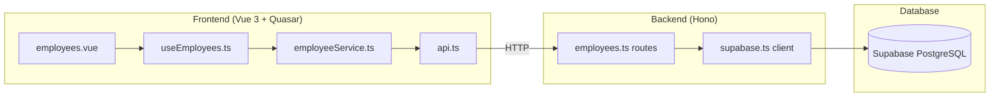
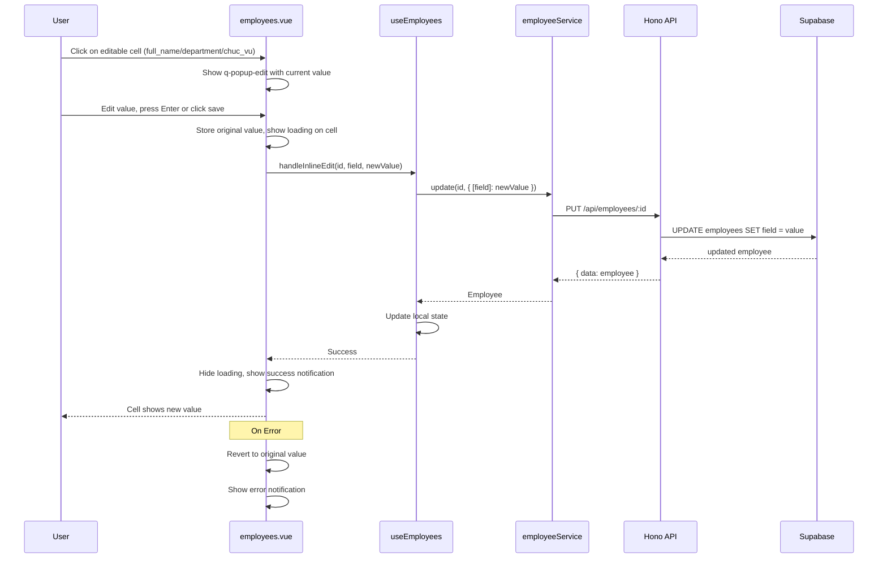

# Employee Management Feature Specification

**Status:** COMPLETED ✅
**Last Updated:** 2026-01-29
**Implementation Files:** src/pages/employees.vue, src/composables/useEmployees.ts, server/routes/employees.ts

---

# Requirements

**Implementation Status: COMPLETED** ✅

## Overview

Employee management system for viewing, creating, editing, and deleting employee records. Provides a responsive data table with search/filter capabilities using Vietnamese UI labels. Features pagination with customizable page sizes (10, 25, 50, 100 rows) and inline editing capabilities for efficient data management of 1630+ employees.

## User Stories

### Story 1: View Employee List with Pagination (Priority: P1) 🎯 MVP

As an administrator, I want to view all employees in a paginated table with customizable page sizes so that I can efficiently browse the entire employee database (1630+ records) with traditional pagination controls.

**Independent Test**: Navigate to /employees page, verify table displays employees with pagination controls and page size selector.

**Acceptance Criteria**:
- [x] WHEN the user navigates to the employees page, THE SYSTEM SHALL display a data table with columns: Tên Nhân Viên, Mã NV, Phòng Ban, Chức Vụ.
- [x] WHEN the table is loading data, THE SYSTEM SHALL display a loading skeleton.
- [x] WHEN no employees exist in the database, THE SYSTEM SHALL display an empty state message "Chưa có nhân viên nào".
- [x] WHEN the user clicks a column header, THE SYSTEM SHALL sort the table by that column.
- [x] ~~WHEN the employees page loads, THE SYSTEM SHALL fetch all employees using `limit=0` parameter.~~ *(Replaced by pagination)*
- [x] ~~WHILE displaying more than 50 employees, THE SYSTEM SHALL use virtual-scroll to render only visible rows.~~ *(Replaced by pagination)*
- [x] ~~WHEN the user scrolls the table, THE SYSTEM SHALL render new rows dynamically without pagination controls.~~ *(Replaced by pagination)*

**AC7**: Pagination Display
- [x] WHEN user views employee list, THEN THE SYSTEM SHALL display pagination controls at bottom of table.
- [x] WHEN total records exceed page size, THEN THE SYSTEM SHALL show page navigation (previous/next, page numbers).

**AC8**: Page Size Selector
- [x] WHEN user views employee list, THEN a page size dropdown SHALL appear next to pagination controls.
- [x] WHEN user selects page size option (10, 25, 50, 100), THEN table SHALL immediately update to show selected number of rows.
- [x] WHEN page size changes, THEN pagination SHALL reset to page 1.
- Options: 10, 25, 50, 100 rows per page
- Default: 25 rows per page

**AC9**: Pagination State Persistence
- [x] WHEN user navigates between pages, THEN current page and page size SHALL be maintained.
- [x] WHEN user filters/searches, THEN pagination SHALL reset to page 1 while preserving page size.

**AC10**: Complete Data Fetch
- [x] WHEN user views employee list, THEN system SHALL fetch ALL employees from database without row limits.
- [x] WHEN database contains more than 1000 records, THEN system SHALL still display all records.
- [x] System SHALL use batch fetching to bypass Supabase's default 1000-row limit.

> **Spec Drift**: Column label "Mã Nhân Viên" abbreviated to "Mã NV" for better mobile fit.
> **Spec Update**: Virtual scroll replaced with traditional pagination mode (AC7-AC9) for better UX with page size control.

### Story 2: Search and Filter Employees (Priority: P1) 🎯 MVP

As an administrator, I want to search and filter employees by name, code, or department so that I can quickly find specific employees.

**Independent Test**: Enter search term in search box, verify table filters results in real-time.

**Acceptance Criteria**:
- [x] WHEN the user types in the search box, THE SYSTEM SHALL filter employees by full_name, employee_code, department, or position.
- [x] WHEN the search term matches no employees, THE SYSTEM SHALL display "Không tìm thấy nhân viên phù hợp".
- [x] WHEN the user clears the search box, THE SYSTEM SHALL display all employees.

> **Spec Drift**: Search also filters by `position` field (enhancement beyond original spec).

### Story 3: Create New Employee (Priority: P2)

As an administrator, I want to create a new employee record so that I can add new staff to the system.

**Independent Test**: Click add button, fill form, submit, verify new employee appears in table.

**Acceptance Criteria**:
- [x] WHEN the user clicks the "Thêm nhân viên" button, THE SYSTEM SHALL display a form dialog with fields: Tên Nhân Viên, Mã Nhân Viên, Phòng Ban, Chức Vụ.
- [x] WHEN the user submits a valid form, THE SYSTEM SHALL create the employee and display success message "Thêm nhân viên thành công".
- [x] IF required fields are empty, THEN THE SYSTEM SHALL display validation error "Vui lòng điền đầy đủ thông tin".
- [x] IF employee_code already exists, THEN THE SYSTEM SHALL display error "Mã nhân viên đã tồn tại".

### Story 4: Edit Employee via Modal (Priority: P2)

As an administrator, I want to edit an existing employee's information via a modal dialog so that I can make comprehensive changes to employee records.

**Independent Test**: Click edit button on a row, modify data, submit, verify changes persist.

**Acceptance Criteria**:
- [x] WHEN the user clicks the edit button on a row, THE SYSTEM SHALL display a pre-filled form dialog with employee_code field disabled.
- [x] WHEN the user submits valid changes, THE SYSTEM SHALL update the employee and display "Cập nhật thành công".
- [x] IF the update fails, THEN THE SYSTEM SHALL display error "Cập nhật thất bại. Vui lòng thử lại".

> **Spec Drift**: `employee_code` field is immutable during edit (business rule discovered during implementation).

### Story 7: Inline Edit Employee Fields (Priority: P1) 🎯 NEW

As an administrator, I want to quickly edit employee fields (name, department, position) directly in the table row so that I can make rapid updates without opening a modal.

**Independent Test**: Click on a cell in full_name/department/chuc_vu column, edit value inline, verify change saves to database.

**Acceptance Criteria**:
- [x] WHEN the user clicks on the full_name cell in any row, THE SYSTEM SHALL display a q-popup-edit input pre-filled with current value.
- [x] WHEN the user clicks on the department cell in any row, THE SYSTEM SHALL display a q-popup-edit input pre-filled with current value.
- [x] WHEN the user clicks on the chuc_vu cell in any row, THE SYSTEM SHALL display a q-popup-edit dropdown pre-filled with current value.
- [x] WHEN the user confirms the inline edit (Enter key or save button), THE SYSTEM SHALL call PUT /api/employees/:id with the updated field.
- [x] WHILE an inline edit is being saved, THE SYSTEM SHALL display a per-cell loading indicator.
- [x] WHEN the inline edit succeeds, THE SYSTEM SHALL update the cell value and display success notification.
- [x] IF the inline edit fails, THEN THE SYSTEM SHALL revert the cell to original value and display error notification.
- [x] WHEN the user presses Escape or clicks outside, THE SYSTEM SHALL cancel the edit without saving.
- [x] THE SYSTEM SHALL NOT allow inline editing of employee_id/employee_code (immutable field).

### Story 5: Delete Employee (Priority: P2)

As an administrator, I want to delete an employee record so that I can remove outdated entries.

**Independent Test**: Click delete button, confirm in dialog, verify employee removed from table.

**Acceptance Criteria**:
- [x] WHEN the user clicks the delete button, THE SYSTEM SHALL display a confirmation dialog "Bạn có chắc muốn xóa nhân viên này?".
- [x] WHEN the user confirms deletion, THE SYSTEM SHALL remove the employee and display "Xóa nhân viên thành công".
- [x] WHEN the user cancels deletion, THE SYSTEM SHALL close the dialog without changes.

### Story 8: View Employee Details (Priority: P2)

As an administrator, I want to view complete employee details in a dialog so that I can see all information including timestamps and status.

**Independent Test**: Click on employee row, verify detail dialog displays all fields including is_active status and timestamps.

**Acceptance Criteria**:
- [x] WHEN the user clicks on an employee row, THE SYSTEM SHALL display a detail dialog with all employee fields.
- [x] THE SYSTEM SHALL display employee_id (Mã Nhân Viên) with badge styling.
- [x] THE SYSTEM SHALL display full_name, department, and chuc_vu with appropriate icons.
- [x] THE SYSTEM SHALL display is_active status with color-coded badge ("Đang hoạt động" / "Ngừng hoạt động").
- [x] THE SYSTEM SHALL display created_at and updated_at timestamps formatted with formatDateTime().
- [x] THE SYSTEM SHALL provide action buttons: Edit (opens edit dialog), Close.

> **Implementation**: See `src/pages/employees.vue:350-540` for detail dialog template.

### Story 6: Error Handling (Priority: P1) 🎯 MVP

As a user, I want clear error messages when operations fail so that I understand what went wrong.

**Independent Test**: Disconnect network, attempt action, verify Vietnamese error message displays.

**Acceptance Criteria**:
- [x] IF the API request fails due to network error, THEN THE SYSTEM SHALL display "Lỗi kết nối. Vui lòng kiểm tra mạng".
- [x] IF the API returns a 500 error, THEN THE SYSTEM SHALL display "Lỗi hệ thống. Vui lòng thử lại sau".
- [x] IF the API request times out after 10 seconds, THEN THE SYSTEM SHALL display "Yêu cầu quá thời gian. Vui lòng thử lại".

## Assumptions (Auto-inferred)

| Decision | Chosen | Reasoning | Alternatives |
|----------|--------|-----------|--------------|
| Backend port | 3000 | Vite uses 5173, need separate port for API | 8080, 4000 |
| Pagination default | 25 rows | Balanced view for 1630+ records | 10, 50, 100 |
| Page size options | 10, 25, 50, 100 | Standard pagination options | Custom values |
| ~~Virtual scroll height~~ | ~~`calc(100vh - 200px)`~~ | Replaced by pagination | N/A |
| ~~Virtual scroll row height~~ | ~~48px~~ | Replaced by pagination | N/A |
| Search debounce | 300ms | Prevents excessive filtering on 1630+ rows | 200ms, 500ms |
| Delete confirmation | Required | Prevents accidental data loss | Soft delete only |
| Form validation | Client + Server | UX + data integrity | Client only |
| Inline edit fields | 3 fields | full_name, department, chuc_vu editable | All fields |
| Inline save trigger | Enter/blur | Standard UX for popup edit | Button only |
| Department dropdown | Dynamic with add | Derived from existing + user can add new | Fixed list |
| ChucVu dropdown | Dynamic (computed) | Extracted from employees.chuc_vu column (same pattern as Department) | Fixed list, Separate API |

> These assumptions were made autonomously based on codebase patterns and industry standards.
> Override in spec if different behavior is required.

## Non-Functional Requirements

| Requirement | Target | Measurement |
|-------------|--------|-------------|
| API response time (paginated) | < 500ms | P95 latency per page |
| Page navigation response | < 100ms | Client-side page change |
| Initial table render | < 200ms | First contentful paint |
| Inline edit response | < 500ms | Save to database |
| Mobile responsive | 375px+ | Viewport width |
| Tablet responsive | 768px+ | Viewport width |
| Desktop responsive | 1200px+ | Viewport width |

## Out of Scope

- Employee profile photos/avatars
- Employee import/export (CSV, Excel)
- Role-based access control
- Audit logging
- Employee hierarchy/org chart
- Bulk operations (delete multiple)

## Implementation Enhancements

These features were added during implementation beyond original spec:

| Enhancement | Description |
|-------------|-------------|
| `/health` endpoint | Added for server monitoring and health checks |
| Position search | Search now includes `position` field |
| Immutable employee_code | Code cannot be changed during edit (data integrity) |
| Mobile column labels | "Mã Nhân Viên" → "Mã NV" for mobile responsiveness |
| Detail Dialog | View all employee fields including is_active status and timestamps |
| Department new-value-mode | Users can add new department values via dropdown |

## Data Model

**Employee Interface** (matches `src/types/employee.ts`):

| Field | Type | Description |
|-------|------|-------------|
| id | number | Auto-increment primary key (NOT UUID) |
| employee_id | string | Mã Nhân Viên (UNIQUE, IMMUTABLE) |
| full_name | string | Tên Nhân Viên |
| department | string | Phòng Ban |
| chuc_vu | string | Chức Vụ (plain string, not enum) |
| is_active | boolean | Trạng thái hoạt động |
| created_at | string | ISO timestamp |
| updated_at | string | ISO timestamp |

**ChucVu Options** (computed dynamically from `src/pages/employees.vue:617-620`):
- Extracted from unique values in `employees.chuc_vu` column
- Uses same pattern as Department dropdown
- No hardcoded list - options are data-driven

## Implementation Notes

**Status**: Completed
**Files**: `src/pages/employees.vue`, `src/composables/useEmployees.ts`, `src/services/employeeService.ts`, `server/routes/employees.ts`
**Deviations**:
- chuc_vu field uses q-select dropdown with predefined ChucVu options
- Per-cell loading state tracks individual field editing status
**Limitations**: None

**AC7-AC9 Implementation (2026-01-27)**:
- Removed virtual scroll in favor of Quasar's built-in pagination
- Added pagination ref with default rowsPerPage: 25
- Options: 10, 25, 50, 100 rows per page
- Added watch on searchQuery to reset page to 1

**AC10 Implementation (2026-01-27)**:
- Implemented batch fetching in server/routes/employees.ts
- BATCH_SIZE = 1000 to match Supabase's default max_rows
- Uses .range() pagination to fetch all records when limit=0
- Optimized with push() instead of spread for memory efficiency

**RLS Fix (2026-01-27)**:
- Added `supabaseAdmin` client using `SERVICE_ROLE_KEY` for backend CRUD operations
- US-004 (Edit Employee) and US-007 (Inline Edit) now fully operational
- Backend routes use `supabaseAdmin` to bypass RLS for server-side operations

**Spec Sync (2026-01-29)**:
- ChucVu dropdown changed from hardcoded options to dynamic computed values
- Removed dependency on usePositions composable and positions API
- ChucVu now follows same pattern as Department: extracted from employees.chuc_vu column
- Updated Data Model section to reflect dynamic ChucVu options source

---

# Technical Design

## Architecture



**Data Flow**: Supabase → Hono API → Vue Service → Composable → Component

## Components

| Component | Responsibility | Location |
|-----------|---------------|----------|
| employees.vue | Main page with table, dialogs, actions | `src/pages/employees.vue` |
| useEmployees | State management, CRUD operations | `src/composables/useEmployees.ts` |
| employeeService | HTTP calls to API | `src/services/employeeService.ts` |
| api | Base fetch wrapper with error handling | `src/services/api.ts` |
| Hono server | REST API endpoints | `server/index.ts` |
| Employee routes | CRUD route handlers | `server/routes/employees.ts` |
| Supabase client | Database connection | `server/db/supabase.ts` |

## File Structure

```
server/                           # NEW - Hono backend
├── index.ts                      # Entry point, CORS, routes
├── db/
│   └── supabase.ts              # Supabase client initialization
├── routes/
│   └── employees.ts             # Employee CRUD endpoints
└── types/
    └── employee.ts              # Backend types

src/
├── pages/
│   └── employees.vue            # NEW - Employee list page
├── composables/
│   ├── index.ts                 # UPDATE - Export useEmployees
│   └── useEmployees.ts          # NEW - Employee state management
├── services/                    # NEW - API services
│   ├── api.ts                   # Base API client
│   └── employeeService.ts       # Employee API calls
└── types/
    ├── index.ts                 # UPDATE - Export employee types
    └── employee.ts              # NEW - Employee type definitions
```

## Data Models

**User-Provided Structure** (updated to match implementation):

```typescript
interface Employee {
  id: number              // Auto-increment primary key (NOT UUID/string)
  employee_id: string     // Mã Nhân Viên (UNIQUE, IMMUTABLE)
  full_name: string       // Tên Nhân Viên
  department: string      // Phòng Ban
  chuc_vu: string         // Chức Vụ (plain string, NOT enum type)
  is_active: boolean      // Trạng thái hoạt động
  created_at: string      // ISO timestamp
  updated_at: string      // ISO timestamp
}

// ChucVu options are computed dynamically from employees data
// See src/pages/employees.vue:617-620
const chucVuOptions = computed(() => {
  const positions = [...new Set(employees.value.map(e => e.chuc_vu).filter(Boolean))]
  return positions.sort().map(pos => ({ label: pos, value: pos }))
})

// No hardcoded labels - chuc_vu values are displayed as-is
// This follows the same pattern as Department dropdown
```

**Key differences from original spec**:
- `id` is `number` (auto-increment), NOT `string` (UUID)
- `chuc_vu` is `string`, NOT enum type `ChucVu`
- `is_active: boolean` field exists (was not previously documented)
- Type definitions: see `src/types/employee.ts` and `server/types/employee.ts`

**Derived Types**:

```typescript
// For create/update operations (without id, timestamps, is_active)
// See src/types/employee.ts:26-31
interface EmployeeFormData {
  employee_id: string     // Mã Nhân Viên
  full_name: string       // Tên Nhân Viên
  department: string      // Phòng Ban
  chuc_vu: string         // Chức Vụ
}

// Table column definition - follow pattern from src/types/components.ts:10-19
interface EmployeeColumn extends DataTableColumn {
  name: keyof Employee | 'actions'
  label: string  // Vietnamese labels
}

// API response wrapper
interface ApiResponse<T> {
  data: T | null
  error: string | null
  message?: string
}

// Paginated response
interface PaginatedResponse<T> {
  data: T[]
  total: number
  page: number
  pageSize: number
}
```

## Table Columns Configuration

Follow pattern from `src/pages/components.vue:622-626`:

```typescript
const columns: EmployeeColumn[] = [
  { name: 'full_name', label: 'Tên Nhân Viên', field: 'full_name', align: 'left', sortable: true },
  { name: 'employee_id', label: 'Mã NV', field: 'employee_id', align: 'left', sortable: true },
  { name: 'department', label: 'Phòng Ban', field: 'department', align: 'left', sortable: true },
  { name: 'chuc_vu', label: 'Chức Vụ', field: 'chuc_vu', align: 'left', sortable: true },
  { name: 'actions', label: 'Thao tác', field: 'actions', align: 'center' }
]
```

## Key Flows

### Load Employee List

```mermaid
sequenceDiagram
    participant U as User
    participant P as employees.vue
    participant C as useEmployees
    participant S as employeeService
    participant A as Hono API
    participant D as Supabase

    U->>P: Navigate to /employees
    P->>C: onMounted → fetchEmployees()
    C->>C: isLoading = true
    C->>S: getEmployees({ limit: 0 })
    S->>A: GET /api/employees?limit=0
    A->>D: SELECT * FROM employees
    D-->>A: rows[] (1630+ records)
    A-->>S: { data: employees[], total }
    S-->>C: All employees array
    C->>C: employees = data, isLoading = false
    C-->>P: reactive state updated
    P-->>U: Render q-table with virtual-scroll
```



### Inline Edit Flow (NEW)



### Create Employee

```mermaid
sequenceDiagram
    participant U as User
    participant P as employees.vue
    participant C as useEmployees
    participant S as employeeService
    participant A as Hono API
    participant D as Supabase

    U->>P: Click "Thêm nhân viên"
    P->>P: showDialog = true
    U->>P: Fill form, submit
    P->>C: createEmployee(formData)
    C->>S: create(employee)
    S->>A: POST /api/employees
    A->>D: INSERT INTO employees
    D-->>A: new employee
    A-->>S: { data: employee }
    S-->>C: Employee
    C->>C: employees.push(employee)
    C-->>P: Success
    P->>P: Close dialog, show notification
    P-->>U: "Thêm nhân viên thành công"
```



## API Endpoints

| Method | Endpoint | Request | Response | Description |
|--------|----------|---------|----------|-------------|
| GET | /api/employees | `?limit=0` | `Employee[]` | All records (limit=0 disables pagination) |
| GET | /api/employees/:id | - | `ApiResponse<Employee>` | Get single employee |
| POST | /api/employees | `EmployeeInput` | `ApiResponse<Employee>` | Create employee |
| PUT | /api/employees/:id | `Partial<EmployeeInput>` | `ApiResponse<Employee>` | Update employee (used by inline edit) |
| DELETE | /api/employees/:id | - | `ApiResponse<{success: true}>` | Delete employee |

> **Note**: Backend already supports `limit=0` for fetching all records without pagination.

### Error Response Format

```typescript
interface ErrorResponse {
  error: string      // Error message (Vietnamese for display)
  code?: string      // Error code for programmatic handling
  details?: unknown  // Additional debug info (dev only)
}
```

| HTTP Status | Meaning | Vietnamese Message |
|-------------|---------|-------------------|
| 400 | Validation error | Dữ liệu không hợp lệ |
| 404 | Employee not found | Không tìm thấy nhân viên |
| 409 | Duplicate employee_code | Mã nhân viên đã tồn tại |
| 500 | Server error | Lỗi hệ thống |

## Composable Pattern

Follow pattern from `src/composables/useLoading.ts:1-42` and `src/composables/useDialog.ts:1-28`:

```typescript
// useEmployees.ts structure
export function useEmployees() {
  // State
  const employees = ref<Employee[]>([])
  const isLoading = ref(false)
  const error = ref<string | null>(null)
  const pagination = ref({ page: 1, limit: 10, total: 0 })
  const searchQuery = ref('')
  
  // Dialog state (following useDialog pattern)
  const formDialog = ref({ isOpen: false, mode: 'create', data: null })
  
  // Actions
  const fetchEmployees = async () => { /* ... */ }
  const createEmployee = async (data: EmployeeInput) => { /* ... */ }
  const updateEmployee = async (id: number, data: Partial<EmployeeFormData>) => { /* ... */ }
  const deleteEmployee = async (id: number) => { /* ... */ }
  
  // Computed
  const filteredEmployees = computed(() => { /* client-side filter */ })
  
  return {
    // State
    employees,
    isLoading,
    error,
    pagination,
    searchQuery,
    formDialog,
    // Actions
    fetchEmployees,
    createEmployee,
    updateEmployee,
    deleteEmployee,
    // Computed
    filteredEmployees
  }
}
```

**Note**: The `usePositions` composable previously used for ChucVu options has been removed. ChucVu options are now computed directly in the page component from the employees array, following the same pattern as Department options.

## CORS Configuration

Frontend runs on port 5173 (Vite dev server), backend on port 3000.

```typescript
// server/index.ts
import { cors } from 'hono/cors'

app.use('/api/*', cors({
  origin: ['http://localhost:5173', 'http://127.0.0.1:5173'],
  allowMethods: ['GET', 'POST', 'PUT', 'DELETE'],
  allowHeaders: ['Content-Type']
}))
```

## Supabase Connection

```typescript
// server/db/supabase.ts
import { createClient } from '@supabase/supabase-js'

const supabaseUrl = process.env.SUPABASE_URL || 'http://127.0.0.1:54321'
const supabaseKey = process.env.SUPABASE_ANON_KEY || '...'

export const supabase = createClient(supabaseUrl, supabaseKey)
```

### Supabase Client Pattern

The backend uses dual Supabase clients:

| Client | Key | Purpose |
|--------|-----|---------|
| `supabase` | `ANON_KEY` | For frontend-like operations (respects RLS) |
| `supabaseAdmin` | `SERVICE_ROLE_KEY` | For backend CRUD operations (bypasses RLS) |

**Important**: `supabaseAdmin` bypasses all Row Level Security policies. Only use for server-side operations. Never expose to frontend.

**Environment Variables**:
- `NEXT_PUBLIC_SUPABASE_URL` - Supabase instance URL
- `NEXT_PUBLIC_SUPABASE_ANON_KEY` - Anon key for frontend
- `SUPABASE_SERVICE_ROLE_KEY` - Service role key for backend (keep secret)

## Error Handling

### Backend (Hono)
```typescript
// Wrap all handlers with try-catch
app.onError((err, c) => {
  console.error(err)
  return c.json({ error: 'Lỗi hệ thống' }, 500)
})
```

### Frontend (Service Layer)
```typescript
// src/services/api.ts
export async function apiFetch<T>(url: string, options?: RequestInit): Promise<T> {
  const response = await fetch(url, {
    ...options,
    headers: { 'Content-Type': 'application/json', ...options?.headers }
  })
  
  if (!response.ok) {
    const error = await response.json()
    throw new Error(error.error || 'Lỗi không xác định')
  }
  
  return response.json()
}
```

## Responsive Breakpoints

Follow Quasar responsive design. Table adapts:
- **Mobile (< 600px)**: Stack layout, hide less important columns
- **Tablet (600-1024px)**: Show all columns, compact spacing
- **Desktop (> 1024px)**: Full layout with actions

```vue
<!-- employees.vue -->
<q-table
  :columns="$q.screen.lt.sm ? mobileColumns : columns"
  :dense="$q.screen.lt.md"
/>
```

## Virtual Scroll Configuration (NEW)

For handling 1630+ employee records efficiently, replace pagination with Quasar's virtual scroll.

### Q-Table Virtual Scroll Setup

```vue
<q-table
  flat
  bordered
  virtual-scroll
  :virtual-scroll-sticky-size-start="48"
  :rows="filteredEmployees"
  :columns="visibleColumns"
  row-key="id"
  :loading="loading"
  style="height: calc(100vh - 200px)"
  class="employee-table"
>
```

### Configuration Details

| Property | Value | Purpose |
|----------|-------|---------|
| `virtual-scroll` | true | Enable virtual scrolling |
| `virtual-scroll-sticky-size-start` | 48 | Header row height in px |
| `style="height: calc(100vh - 200px)"` | dynamic | Viewport-based height for better UX |
| `:rows-per-page-options="[0]"` | disable | Hide pagination (show all rows) |

### Performance Considerations

- **Initial Load**: Fetches all 1630 records in single API call (~1s with limit=0)
- **Memory**: ~500KB for 1630 records in memory (acceptable)
- **Render**: Only visible rows rendered (~10-15 at a time)
- **Scroll**: 60fps smooth scrolling with virtualization
- **Search**: Client-side filtering on full dataset (instant with computed)

## Inline Editing with q-popup-edit (NEW)

Enable rapid editing of employee fields directly in table cells.

### Editable Fields

| Field | Column Name | Editable | Component |
|-------|-------------|----------|-----------|
| full_name | Tên Nhân Viên | Yes | q-popup-edit |
| department | Phòng Ban | Yes | q-popup-edit |
| chuc_vu | Chức Vụ | Yes | q-popup-edit |
| employee_id | Mã NV | No | Read-only |
| actions | Thao Tác | N/A | Buttons |

### Template Slot Pattern

```vue
<!-- Inline edit for full_name -->
<template #body-cell-full_name="props">
  <q-td :props="props" class="cursor-pointer">
    {{ props.row.full_name }}
    <q-popup-edit
      v-model="props.row.full_name"
      v-slot="scope"
      buttons
      label-set="Lưu"
      label-cancel="Hủy"
      @save="(val, initialVal) => handleInlineEdit(props.row.id, 'full_name', val, initialVal)"
    >
      <q-input
        v-model="scope.value"
        dense
        autofocus
        @keyup.enter="scope.set"
      />
    </q-popup-edit>
    <q-icon name="edit" size="xs" class="q-ml-xs text-grey-5" />
  </q-td>
</template>
```

### handleInlineEdit Method Specification

```typescript
/**
 * Handle inline field edits via q-popup-edit
 * @param id - Employee ID
 * @param field - Field name being edited (full_name, department, chuc_vu)
 * @param newValue - New value from popup edit
 * @param originalValue - Original value for rollback on error
 */
const handleInlineEdit = async (
  id: number,
  field: 'full_name' | 'department' | 'chuc_vu',
  newValue: string,
  originalValue: string
): Promise<void> => {
  // Skip if no change
  if (newValue === originalValue) return
  
  // Optimistic update already applied by v-model
  const result = await updateEmployee(id, { [field]: newValue })
  
  if (!result) {
    // Revert on error - find employee and restore original value
    const emp = employees.value.find(e => e.id === id)
    if (emp) {
      emp[field] = originalValue
    }
  }
}
```

### Loading State per Cell

Track which cells are currently saving:

```typescript
// State for tracking inline edit loading
const inlineEditLoading = ref<Record<string, boolean>>({})

// Generate key for loading state
const getCellKey = (id: number, field: string) => `${id}-${field}`

// In handleInlineEdit
inlineEditLoading.value[getCellKey(id, field)] = true
try {
  await updateEmployee(id, { [field]: newValue })
} finally {
  inlineEditLoading.value[getCellKey(id, field)] = false
}
```

### Visual Indicator

```vue
<q-td :props="props" class="cursor-pointer">
  <q-spinner-dots 
    v-if="inlineEditLoading[getCellKey(props.row.id, 'full_name')]"
    size="sm"
  />
  <template v-else>
    {{ props.row.full_name }}
    <!-- popup-edit here -->
  </template>
</q-td>
```

## Vietnamese Labels Reference

| Field | Database Column | Vietnamese Label |
|-------|-----------------|------------------|
| Name | full_name | Tên Nhân Viên |
| Code | employee_id | Mã NV |
| Department | department | Phòng Ban |
| Position | chuc_vu | Chức Vụ |
| Status | is_active | Trạng Thái |
| Actions | - | Thao tác |
| Add | - | Thêm nhân viên |
| Edit | - | Sửa |
| Delete | - | Xóa |
| Search | - | Tìm kiếm |
| Confirm | - | Xác nhận |
| Cancel | - | Hủy |
| Active | - | Đang hoạt động |
| Inactive | - | Ngừng hoạt động |

## Detail Dialog

Employee details are displayed in a modal dialog when user clicks on a table row.

**Implementation**: `src/pages/employees.vue:350-540`

### Dialog Structure

```mermaid
flowchart TD
    subgraph DetailDialog["Detail Dialog"]
        Header["Header: Mã NV badge"]
        Section1["Employee Info Section"]
        Section2["Timestamps Section"]
        Actions["Action Buttons"]
    end
    
    Section1 --> FieldID["employee_id - Mã Nhân Viên"]
    Section1 --> FieldName["full_name - Tên Nhân Viên"]
    Section1 --> FieldDept["department - Phòng Ban"]
    Section1 --> FieldPos["chuc_vu - Chức Vụ"]
    Section1 --> FieldActive["is_active - Trạng Thái"]
    
    Section2 --> Created["created_at - Ngày tạo"]
    Section2 --> Updated["updated_at - Cập nhật lần cuối"]
    
    Actions --> EditBtn["Sửa - opens edit dialog"]
    Actions --> CloseBtn["Đóng - closes dialog"]
```



### Fields Displayed

| Field | Icon | Display Format |
|-------|------|----------------|
| employee_id | badge | Badge with primary color |
| full_name | person | Plain text |
| department | business | Plain text or "Chưa xác định" |
| chuc_vu | work | Raw value (no label mapping) |
| is_active | check_circle/cancel | Color-coded chip (positive/negative) |
| created_at | event | formatDateTime() |
| updated_at | update | formatDateTime() |

### State Management

```typescript
// src/pages/employees.vue:725-728
interface DetailDialogState {
  isOpen: boolean
  employee: Employee | null
}

const detailDialog = reactive<DetailDialogState>({
  isOpen: false,
  employee: null,
})
```

## Department Dropdown with new-value-mode

The department dropdown supports adding new values that don't exist in the current list.

**Implementation**: `src/pages/employees.vue:276-289`

### Configuration

```vue
<AppSelect
  v-model="formData.department"
  label="Phòng Ban"
  :options="filteredDepartmentOptions"
  use-input
  new-value-mode="add-unique"
  clearable
  @filter="filterDepartments"
/>
```

### Behavior

| Feature | Description |
|---------|-------------|
| Dynamic options | Computed from existing employees' departments |
| Type-ahead search | `use-input` enables filtering as user types |
| Add new values | `new-value-mode="add-unique"` allows creating new departments |
| Filter function | `filterDepartments()` filters options based on input |

### Options Source

```typescript
// src/pages/employees.vue:611-614
const departmentOptions = computed(() => {
  const departments = [...new Set(employees.value.map(e => e.department).filter(Boolean))]
  return departments.sort().map(dept => ({ label: dept, value: dept }))
})
```

## ChucVu (Position) Dropdown - Dynamic Options

The ChucVu dropdown follows the exact same pattern as Department - options are computed dynamically from existing employee data.

**Implementation**: `src/pages/employees.vue:291-301` (form), `src/pages/employees.vue:194-207` (inline edit)

### Configuration

```vue
<!-- In form dialog -->
<AppSelect
  v-model="formData.chuc_vu"
  label="Chức Vụ"
  :options="chucVuOptions"
  clearable
/>

<!-- In inline edit popup -->
<q-select
  v-model="scope.value"
  :options="chucVuOptions"
  option-value="value"
  option-label="label"
  emit-value
  map-options
/>
```

### Behavior

| Feature | Description |
|---------|-------------|
| Dynamic options | Computed from existing employees' chuc_vu values |
| No hardcoded list | Options are data-driven from employees table |
| Same pattern as Department | Uses identical extraction logic |
| No separate API | No dependency on usePositions or /unique-positions endpoint |

### Options Source

```typescript
// src/pages/employees.vue:617-620
const chucVuOptions = computed(() => {
  const positions = [...new Set(employees.value.map(e => e.chuc_vu).filter(Boolean))]
  return positions.sort().map(pos => ({ label: pos, value: pos }))
})
```

### Key Changes from Previous Implementation

| Aspect | OLD | NEW |
|--------|-----|-----|
| Data source | usePositions composable + API | Computed from employees array |
| API dependency | GET /api/employees/unique-positions | None - no separate API call |
| Options type | Hardcoded list (quan_ly, nhan_vien, truong_phong) | Dynamic from database |
| Initialization | fetchPositions() in onMounted | Reactive computed property |
| Pattern | Separate logic from Department | Identical pattern to Department |

## Risk Mitigations

| Risk | Mitigation |
|------|------------|
| CORS errors | Configure CORS middleware from start |
| Type mismatch frontend/backend | Shared types in both locations |
| Supabase connection failure | Environment variable fallbacks |
| Slow API responses | Loading states, timeout handling |
| XSS in user input | Quasar sanitizes by default |
| **NEW** Large dataset performance | Virtual scroll renders only visible rows |
| **NEW** Memory with 1630+ records | ~500KB acceptable, use computed for filtering |
| **NEW** Inline edit race conditions | Loading state per cell, optimistic update with rollback |
| **NEW** Inline edit data loss | Store original value, revert on API failure |

## Test Strategy

- **Unit**: Test useEmployees composable in isolation
- **Integration**: Test employeeService with mock API
- **E2E**: Test full CRUD flow on employees page
- **NEW** Virtual scroll: Verify smooth scrolling with 1630 records
- **NEW** Inline edit: Test save/cancel/error rollback scenarios

## Implementation Notes

### API Configuration

| Setting | Value | Description |
|---------|-------|-------------|
| Request timeout | 10 seconds | Using AbortController |
| Timeout error code | 408 | Request Timeout |
| Health endpoint | `/health` | Server monitoring |

### Additional Composable Methods

Beyond the spec, these methods were added for convenience:

| Method | Description |
|--------|-------------|
| `selectEmployee(id)` | Select an employee for editing/viewing |
| `getEmployeeById(id)` | Fetch single employee details |

### Error Code Reference

| HTTP Status | Error Code | Vietnamese Message |
|-------------|------------|-------------------|
| 400 | VALIDATION_ERROR | Dữ liệu không hợp lệ |
| 404 | NOT_FOUND | Không tìm thấy nhân viên |
| 408 | TIMEOUT | Yêu cầu quá thời gian. Vui lòng thử lại |
| 409 | DUPLICATE | Mã nhân viên đã tồn tại |
| 500 | SERVER_ERROR | Lỗi hệ thống |

### Spec Sync (2026-01-29)

| Change | Old Value | New Value |
|--------|-----------|-----------|
| Employee.id type | `string` (UUID) | `number` (auto-increment) |
| Employee.chuc_vu type | `ChucVu` (enum) | `string` (plain) |
| is_active field | Not documented | `boolean` field added |
| Detail Dialog | Not documented | Full section added |
| Department dropdown | Not documented | `new-value-mode="add-unique"` documented |
| **ChucVu dropdown source** | **Hardcoded options** | **Computed from employees.chuc_vu** |
| **ChucVu API dependency** | **usePositions + /unique-positions** | **None - computed locally** |
| **ChucVu pattern** | **Separate implementation** | **Same as Department dropdown** |
