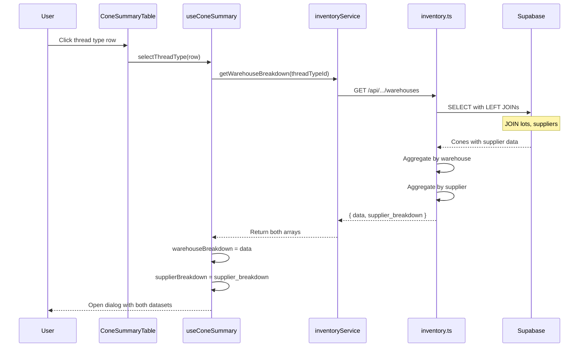
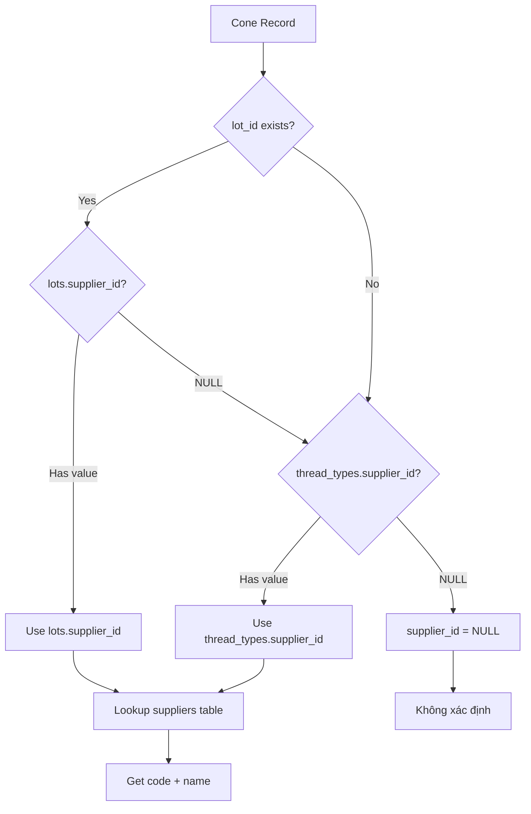

<!-- @SECTION:ARCHITECTURE -->
# Thread Inventory Supplier Breakdown - Technical Design

## Architecture

Extend existing warehouse breakdown flow to include supplier aggregation. Follow pattern established in `server/routes/inventory.ts:382-467`.

### Data Flow

```
Supabase Query (with LEFT JOINs to lots + suppliers)
    ↓
inventory.ts route aggregates by supplier_id
    ↓
inventoryService returns { data: ConeWarehouseBreakdown[], supplier_breakdown: SupplierBreakdown[] }
    ↓
useConeSummary composable exposes supplierBreakdown ref
    ↓
ConeWarehouseBreakdownDialog renders supplier q-table
```
<!-- @END:ARCHITECTURE -->

<!-- @SECTION:COMPONENTS -->
## Components

| Component | Responsibility | Location |
|-----------|---------------|----------|
| `inventory.ts` route | Fetch cones, LEFT JOIN lots + suppliers, aggregate by supplier | `server/routes/inventory.ts:382-467` |
| `SupplierBreakdown` type | Type definition for supplier breakdown row | `server/types/thread.ts` (new), `src/types/thread/inventory.ts` (mirror) |
| `inventoryService` | Parse API response with `supplier_breakdown` field | `src/services/inventoryService.ts:208-218` |
| `useConeSummary` | Expose `supplierBreakdown` reactive state | `src/composables/thread/useConeSummary.ts` |
| `ConeWarehouseBreakdownDialog` | Render supplier breakdown q-table section | `src/components/thread/ConeWarehouseBreakdownDialog.vue` |
<!-- @END:COMPONENTS -->

<!-- @SECTION:DATA_MODELS -->
## Data Models

### New: SupplierBreakdown Interface

Add to `server/types/thread.ts` after `ConeWarehouseBreakdown` (line ~357):

```typescript
/**
 * Supplier breakdown for a specific thread type
 * Used for drill-down view showing supplier distribution
 */
export interface SupplierBreakdown {
  supplier_id: number | null
  supplier_code: string | null
  supplier_name: string         // "Không xác định" if null
  full_cones: number
  partial_cones: number
  partial_meters: number
}
```

Mirror in `src/types/thread/inventory.ts` after `ConeWarehouseBreakdown` (line ~105).

### Enhanced API Response

```typescript
// Response from GET /api/inventory/summary/by-cone/:id/warehouses
interface WarehouseBreakdownResponse {
  data: ConeWarehouseBreakdown[]      // Existing - unchanged
  supplier_breakdown: SupplierBreakdown[]  // New field
  error: string | null
  message?: string
}
```
<!-- @END:DATA_MODELS -->

<!-- @SECTION:API_ENDPOINTS -->
## API Endpoints

### GET /api/inventory/summary/by-cone/:threadTypeId/warehouses

**Enhanced Implementation**: `server/routes/inventory.ts:382-467`

**Changes Required**:

1. **Add LEFT JOINs** to query:
```sql
-- Current: Only joins warehouses
.select('*, warehouses(code, name)')

-- Enhanced: Add lots and suppliers
.select(`
  *,
  warehouses(code, name),
  lots(supplier_id, suppliers(id, code, name)),
  thread_types!inner(supplier_id, suppliers(id, code, name))
`)
```

2. **COALESCE Logic** for supplier resolution:
```typescript
const supplierId = cone.lots?.supplier_id 
  ?? cone.thread_types?.supplier_id 
  ?? null

const supplierData = cone.lots?.suppliers 
  ?? cone.thread_types?.suppliers 
  ?? null
```

3. **Aggregate by Supplier**:
```typescript
const supplierMap: Map<number | 'null', SupplierBreakdown> = new Map()

for (const cone of cones || []) {
  const supplierId = cone.lots?.supplier_id ?? cone.thread_types?.supplier_id ?? null
  const supplier = cone.lots?.suppliers ?? cone.thread_types?.suppliers
  const key = supplierId ?? 'null'

  if (!supplierMap.has(key)) {
    supplierMap.set(key, {
      supplier_id: supplierId,
      supplier_code: supplier?.code ?? null,
      supplier_name: supplier?.name ?? 'Không xác định',
      full_cones: 0,
      partial_cones: 0,
      partial_meters: 0
    })
  }

  const row = supplierMap.get(key)!
  if (cone.is_partial) {
    row.partial_cones++
    row.partial_meters += cone.quantity_meters || 0
  } else {
    row.full_cones++
  }
}
```

4. **Response Structure**:
```typescript
return c.json<ThreadApiResponse<ConeWarehouseBreakdown[]>>({
  data: breakdownList,                    // Existing warehouse breakdown
  supplier_breakdown: supplierList,       // New supplier breakdown
  error: null,
  message: `Tim thay ${breakdownList.length} kho chua loai chi nay`
})
```
<!-- @END:API_ENDPOINTS -->

<!-- @SECTION:KEY_FLOWS -->
## Key Flows

### Enhanced Drill-Down Flow



### Supplier Resolution Logic


<!-- @END:KEY_FLOWS -->

<!-- @SECTION:FRONTEND_CHANGES -->
## Frontend Changes

### useConeSummary Composable

Add to `src/composables/thread/useConeSummary.ts`:

```typescript
// New state (line ~48)
const supplierBreakdown = ref<SupplierBreakdown[]>([])

// Update fetchWarehouseBreakdown (line ~111-145)
const fetchWarehouseBreakdown = async (threadTypeId: number): Promise<void> => {
  breakdownLoading.value = true
  try {
    const response = await inventoryService.getWarehouseBreakdownWithSuppliers(threadTypeId)
    warehouseBreakdown.value = response.data
    supplierBreakdown.value = response.supplier_breakdown  // New
  } catch (err) {
    snackbar.error('Loi khi tai du lieu phan bo')
  } finally {
    breakdownLoading.value = false
  }
}

// Export in return (line ~277-307)
return {
  // ... existing
  supplierBreakdown,  // New
}
```

### inventoryService

Update `src/services/inventoryService.ts:208-218`:

```typescript
interface WarehouseBreakdownResponse {
  data: ConeWarehouseBreakdown[]
  supplier_breakdown: SupplierBreakdown[]
}

async getWarehouseBreakdownWithSuppliers(threadTypeId: number): Promise<WarehouseBreakdownResponse> {
  const response = await fetchApi<ApiResponse<ConeWarehouseBreakdown[]> & { supplier_breakdown: SupplierBreakdown[] }>(
    `/api/inventory/summary/by-cone/${threadTypeId}/warehouses`
  )

  if (response.error) {
    throw new Error(response.error)
  }

  return {
    data: response.data || [],
    supplier_breakdown: response.supplier_breakdown || []
  }
}
```

### ConeWarehouseBreakdownDialog.vue

Add supplier section after warehouse table (`src/components/thread/ConeWarehouseBreakdownDialog.vue`):

**Props** (add):
```typescript
supplierBreakdown: SupplierBreakdown[]
```

**Template** (add after warehouse q-table, ~line 180):
```vue
<!-- Supplier breakdown table -->
<q-card-section class="q-pt-none">
  <div class="text-subtitle1 q-mb-sm">Phan bo theo nha cung cap</div>
  <q-table
    :rows="supplierBreakdown"
    :columns="supplierColumns"
    :loading="loading"
    row-key="supplier_id"
    flat
    bordered
    dense
    :pagination="{ rowsPerPage: 0 }"
    hide-pagination
  >
    <template #body-cell-supplier_name="props">
      <q-td :props="props">
        <div class="row items-center no-wrap q-gutter-sm">
          <q-icon name="business" size="sm" color="grey" />
          <div class="column">
            <span class="text-weight-medium">
              {{ props.row.supplier_name }}
            </span>
            <span v-if="props.row.supplier_code" class="text-caption text-grey">
              {{ props.row.supplier_code }}
            </span>
          </div>
        </div>
      </q-td>
    </template>
  </q-table>
</q-card-section>
```

**Script** (add columns):
```typescript
const supplierColumns: QTableColumn[] = [
  { name: 'supplier_name', label: 'Nha cung cap', field: 'supplier_name', align: 'left' },
  { name: 'full_cones', label: 'Cuon day', field: 'full_cones', align: 'center' },
  { name: 'partial_cones', label: 'Cuon le', field: 'partial_cones', align: 'center' },
]
```
<!-- @END:FRONTEND_CHANGES -->

<!-- @SECTION:ERROR_HANDLING -->
## Error Handling

| Error Case | Response |
|------------|----------|
| Invalid threadTypeId | 400 - "ID loai chi khong hop le" |
| Database query failure | 500 - "Loi he thong" (log error) |
| No cones found | Return empty arrays for both breakdowns |
| Supplier lookup fails | Use NULL fallback with "Không xác định" |
<!-- @END:ERROR_HANDLING -->

<!-- @SECTION:FILES_TO_MODIFY -->
## Files to Modify

| File | Changes |
|------|---------|
| `server/types/thread.ts` | Add `SupplierBreakdown` interface after line 357 |
| `server/routes/inventory.ts` | Enhance warehouse breakdown endpoint (382-467): add LEFT JOINs, supplier aggregation |
| `src/types/thread/inventory.ts` | Mirror `SupplierBreakdown` interface after line 105 |
| `src/services/inventoryService.ts` | Update `getWarehouseBreakdown` to return `{ data, supplier_breakdown }` |
| `src/composables/thread/useConeSummary.ts` | Add `supplierBreakdown` ref and expose in return |
| `src/components/thread/ConeWarehouseBreakdownDialog.vue` | Add `supplierBreakdown` prop and render supplier q-table |
<!-- @END:FILES_TO_MODIFY -->

<!-- @SECTION:TESTING -->
## Testing Considerations

### Unit Tests
- Verify COALESCE logic correctly prioritizes lot supplier over thread_type supplier
- Verify NULL supplier groups under "Khong xac dinh"
- Verify aggregation counts match raw cone data

### Integration Tests
- API returns both warehouse and supplier breakdowns
- Response time < 500ms for thread types with < 1000 cones
- Frontend correctly binds and displays supplier data

### Manual Verification
- Open breakdown dialog for thread type with:
  - Multiple suppliers via lots
  - Thread type with supplier_id set
  - Cones with no supplier linkage (NULL case)
<!-- @END:TESTING -->

<!-- @SECTION:IMPLEMENTATION_NOTES -->
## Implementation Notes

**Completed**: 2026-02-04

### Files Modified
| File | Changes |
|------|---------|
| `server/types/thread.ts` | Added `SupplierBreakdown` interface |
| `server/routes/inventory.ts` | Enhanced endpoint with LEFT JOINs and supplier aggregation |
| `src/types/thread/inventory.ts` | Mirrored `SupplierBreakdown` interface |
| `src/services/inventoryService.ts` | Updated return type |
| `src/composables/thread/useConeSummary.ts` | Added `supplierBreakdown` ref |
| `src/components/thread/ConeWarehouseBreakdownDialog.vue` | Added supplier table section |
| `src/pages/thread/inventory.vue` | Pass `supplierBreakdown` prop to dialog |

### Key Implementation Details
- Supplier resolution uses JavaScript OR operator: `lotSupplier || typeSupplier` (equivalent to SQL COALESCE)
- NULL suppliers grouped under "Không xác định" with `supplier_id: null`
- Backward compatible API: existing `data` field unchanged, new `supplier_breakdown` added
- Single Supabase query with nested JOINs for performance
<!-- @END:IMPLEMENTATION_NOTES -->
