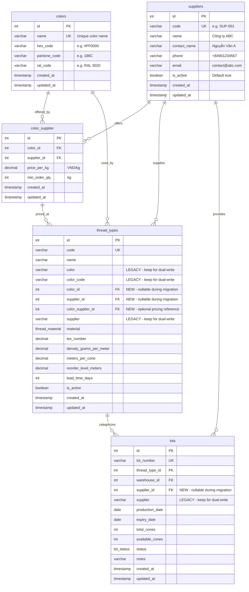
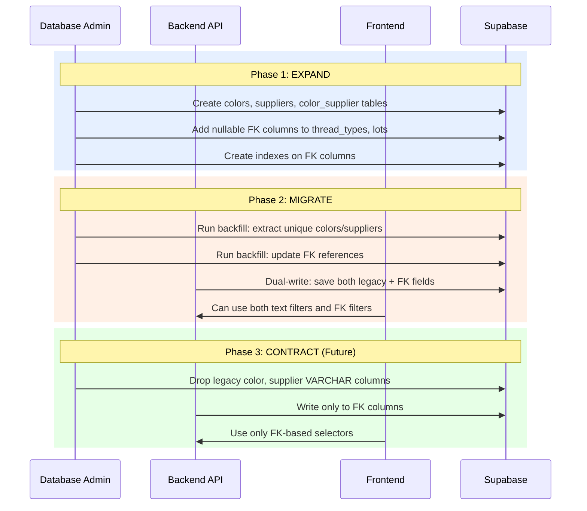
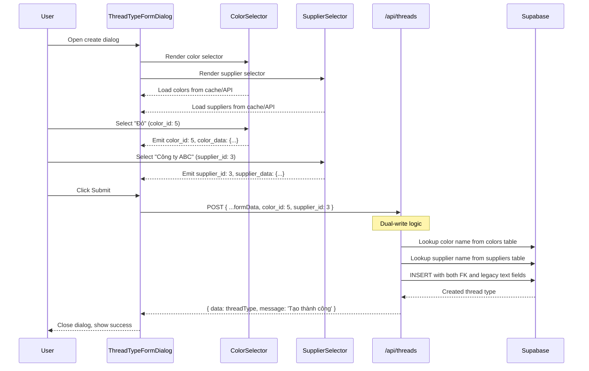

<!-- @SECTION:ARCHITECTURE -->
# Thread Management Hierarchical Restructure - Technical Design

## Architecture Overview

This restructure transforms thread management from denormalized free-text fields to a properly normalized hierarchical model. The migration uses the Expand-Contract pattern for zero-downtime deployment.

```
Current State:                    Target State:
┌─────────────────┐              ┌─────────────┐
│  thread_types   │              │   colors    │
│  - color (text) │              │  (master)   │
│  - supplier(txt)│              └──────┬──────┘
└─────────────────┘                     │ 1:N
                                        ▼
┌─────────────────┐              ┌─────────────────┐
│      lots       │              │ color_supplier  │
│  - supplier(txt)│              │  (junction)     │
└─────────────────┘              └───────┬─────────┘
                                         │ N:1
                                         ▼
                                 ┌─────────────────┐
                                 │   suppliers     │
                                 │    (master)     │
                                 └───────┬─────────┘
                                         │ 1:N
                           ┌─────────────┴─────────────┐
                           ▼                           ▼
                   ┌─────────────────┐         ┌─────────────┐
                   │  thread_types   │         │    lots     │
                   │ + color_id (FK) │         │+ supplier_id│
                   │ + supplier_id   │         │    (FK)     │
                   │ + color_supplier│         └─────────────┘
                   │   _id (FK)      │
                   └─────────────────┘
```

Follow pattern: `src/services/warehouseService.ts` for service layer
Follow pattern: `src/composables/useWarehouses.ts` for composable pattern
Follow pattern: `src/components/ui/inputs/AppWarehouseSelect.vue` for selector components
<!-- @END:ARCHITECTURE -->

<!-- @SECTION:DATABASE_SCHEMA -->
## Database Schema

### Entity Relationship Diagram



### Table Definitions

#### `colors` - Color Master Table

```sql
CREATE TABLE colors (
    id SERIAL PRIMARY KEY,
    name VARCHAR(100) UNIQUE NOT NULL,
    hex_code VARCHAR(7),
    pantone_code VARCHAR(20),
    ral_code VARCHAR(20),
    created_at TIMESTAMPTZ DEFAULT NOW(),
    updated_at TIMESTAMPTZ DEFAULT NOW()
);

CREATE INDEX idx_colors_name ON colors(name);
```

#### `suppliers` - Supplier Master Table

```sql
CREATE TABLE suppliers (
    id SERIAL PRIMARY KEY,
    code VARCHAR(50) UNIQUE NOT NULL,
    name VARCHAR(200) NOT NULL,
    contact_name VARCHAR(100),
    phone VARCHAR(20),
    email VARCHAR(100),
    is_active BOOLEAN DEFAULT TRUE,
    created_at TIMESTAMPTZ DEFAULT NOW(),
    updated_at TIMESTAMPTZ DEFAULT NOW()
);

CREATE INDEX idx_suppliers_code ON suppliers(code);
CREATE INDEX idx_suppliers_name ON suppliers(name);
CREATE INDEX idx_suppliers_active ON suppliers(is_active) WHERE is_active = TRUE;
```

#### `color_supplier` - Junction Table with Pricing

```sql
CREATE TABLE color_supplier (
    id SERIAL PRIMARY KEY,
    color_id INTEGER NOT NULL REFERENCES colors(id) ON DELETE RESTRICT,
    supplier_id INTEGER NOT NULL REFERENCES suppliers(id) ON DELETE RESTRICT,
    price_per_kg DECIMAL(12,2),
    min_order_qty INTEGER DEFAULT 1,
    created_at TIMESTAMPTZ DEFAULT NOW(),
    updated_at TIMESTAMPTZ DEFAULT NOW(),
    UNIQUE(color_id, supplier_id)
);

CREATE INDEX idx_color_supplier_color ON color_supplier(color_id);
CREATE INDEX idx_color_supplier_supplier ON color_supplier(supplier_id);
```

#### `thread_types` - Add FK Columns (Expand Phase)

```sql
ALTER TABLE thread_types
    ADD COLUMN color_id INTEGER REFERENCES colors(id) ON DELETE SET NULL,
    ADD COLUMN supplier_id INTEGER REFERENCES suppliers(id) ON DELETE SET NULL,
    ADD COLUMN color_supplier_id INTEGER REFERENCES color_supplier(id) ON DELETE SET NULL;

CREATE INDEX idx_thread_types_color_id ON thread_types(color_id);
CREATE INDEX idx_thread_types_supplier_id ON thread_types(supplier_id);
CREATE INDEX idx_thread_types_color_supplier_id ON thread_types(color_supplier_id);
```

#### `lots` - Add supplier_id FK (Expand Phase)

```sql
ALTER TABLE lots
    ADD COLUMN supplier_id INTEGER REFERENCES suppliers(id) ON DELETE SET NULL;

CREATE INDEX idx_lots_supplier_id ON lots(supplier_id);
```
<!-- @END:DATABASE_SCHEMA -->

<!-- @SECTION:COMPONENTS -->
## Components

| Component | Responsibility | Location |
|-----------|---------------|----------|
| ColorService | API client for colors CRUD | `src/services/colorService.ts` |
| SupplierService | API client for suppliers CRUD | `src/services/supplierService.ts` |
| useColors | Composable for color state management | `src/composables/useColors.ts` |
| useSuppliers | Composable for supplier state management | `src/composables/useSuppliers.ts` |
| ColorSelector | Color dropdown with swatch preview | `src/components/ui/inputs/ColorSelector.vue` |
| SupplierSelector | Supplier dropdown with search | `src/components/ui/inputs/SupplierSelector.vue` |
| ColorsRoute | Hono route handler for /api/colors | `server/routes/colors.ts` |
| SuppliersRoute | Hono route handler for /api/suppliers | `server/routes/suppliers.ts` |
<!-- @END:COMPONENTS -->

<!-- @SECTION:DATA_MODELS -->
## Data Models

### Backend Types (server/types/)

```typescript
// server/types/color.ts
export interface ColorRow {
  id: number
  name: string
  hex_code: string | null
  pantone_code: string | null
  ral_code: string | null
  created_at: string
  updated_at: string
}

export interface CreateColorDTO {
  name: string
  hex_code?: string
  pantone_code?: string
  ral_code?: string
}

export interface UpdateColorDTO extends Partial<CreateColorDTO> {}

// server/types/supplier.ts
export interface SupplierRow {
  id: number
  code: string
  name: string
  contact_name: string | null
  phone: string | null
  email: string | null
  is_active: boolean
  created_at: string
  updated_at: string
}

export interface CreateSupplierDTO {
  code: string
  name: string
  contact_name?: string
  phone?: string
  email?: string
}

export interface UpdateSupplierDTO extends Partial<CreateSupplierDTO> {
  is_active?: boolean
}

// server/types/color-supplier.ts
export interface ColorSupplierRow {
  id: number
  color_id: number
  supplier_id: number
  price_per_kg: number | null
  min_order_qty: number
  created_at: string
  updated_at: string
}
```

### Frontend Types (src/types/)

```typescript
// src/types/color.ts
export interface Color {
  id: number
  name: string
  hex_code: string | null
  pantone_code: string | null
  ral_code: string | null
  created_at: string
  updated_at: string
}

// src/types/supplier.ts
export interface Supplier {
  id: number
  code: string
  name: string
  contact_name: string | null
  phone: string | null
  email: string | null
  is_active: boolean
  created_at: string
  updated_at: string
}

// Updated src/types/thread/thread-type.ts
export interface ThreadType {
  // ... existing fields ...
  color_id: number | null           // NEW
  supplier_id: number | null        // NEW
  color_supplier_id: number | null  // NEW
  color_data?: Color                // Joined data
  supplier_data?: Supplier          // Joined data
}
```
<!-- @END:DATA_MODELS -->

<!-- @SECTION:API_CONTRACTS -->
## API Contracts

### Colors API

| Method | Endpoint | Request | Response | Description |
|--------|----------|---------|----------|-------------|
| GET | /api/colors | - | `{ data: Color[], error: null }` | List all colors |
| GET | /api/colors/:id | - | `{ data: Color, error: null }` | Get color by ID |
| POST | /api/colors | CreateColorDTO | `{ data: Color, error: null, message: 'Tạo màu thành công' }` | Create color |
| PUT | /api/colors/:id | UpdateColorDTO | `{ data: Color, error: null, message: 'Cập nhật màu thành công' }` | Update color |
| DELETE | /api/colors/:id | - | `{ data: null, error: null, message: 'Xóa màu thành công' }` | Delete color |

**Error Responses**:
- 400: `{ data: null, error: 'Vui lòng điền đầy đủ thông tin bắt buộc' }`
- 404: `{ data: null, error: 'Không tìm thấy màu' }`
- 409: `{ data: null, error: 'Tên màu "X" đã tồn tại' }`
- 500: `{ data: null, error: 'Lỗi hệ thống' }`

### Suppliers API

| Method | Endpoint | Request | Response | Description |
|--------|----------|---------|----------|-------------|
| GET | /api/suppliers | ?search=&is_active= | `{ data: Supplier[], error: null }` | List suppliers |
| GET | /api/suppliers/:id | - | `{ data: Supplier, error: null }` | Get supplier by ID |
| POST | /api/suppliers | CreateSupplierDTO | `{ data: Supplier, error: null, message: 'Tạo nhà cung cấp thành công' }` | Create supplier |
| PUT | /api/suppliers/:id | UpdateSupplierDTO | `{ data: Supplier, error: null, message: 'Cập nhật nhà cung cấp thành công' }` | Update supplier |
| DELETE | /api/suppliers/:id | - | `{ data: null, error: null, message: 'Xóa nhà cung cấp thành công' }` | Delete supplier |

**Error Responses**:
- 400: `{ data: null, error: 'Vui lòng điền đầy đủ thông tin bắt buộc' }`
- 404: `{ data: null, error: 'Không tìm thấy nhà cung cấp' }`
- 409: `{ data: null, error: 'Mã nhà cung cấp "X" đã tồn tại' }`
- 500: `{ data: null, error: 'Lỗi hệ thống' }`

### Updated Thread Types API

GET /api/threads now returns joined data:
```json
{
  "data": [{
    "id": 1,
    "code": "T-RED-40",
    "name": "Chỉ Đỏ 40",
    "color": "Đỏ",
    "color_code": "#DC2626",
    "color_id": 5,
    "supplier": "Công ty ABC",
    "supplier_id": 3,
    "color_supplier_id": 12,
    "color_data": {
      "id": 5,
      "name": "Đỏ",
      "hex_code": "#DC2626",
      "pantone_code": "186C",
      "ral_code": null
    },
    "supplier_data": {
      "id": 3,
      "code": "SUP-003",
      "name": "Công ty ABC",
      "contact_name": "Nguyễn Văn A",
      "phone": "+84901234567",
      "email": "contact@abc.com"
    }
  }],
  "error": null
}
```

Filter parameters extended:
- `color_id`: Filter by color FK (alongside existing `color` text filter)
- `supplier_id`: Filter by supplier FK (alongside existing `supplier` text filter)
<!-- @END:API_CONTRACTS -->

<!-- @SECTION:KEY_FLOWS -->
## Key Flows

### Migration Flow (Expand-Contract)



### Create Thread Type with New Selectors


<!-- @END:KEY_FLOWS -->

<!-- @SECTION:ERROR_HANDLING -->
## Error Handling

| Error Case | Response | User Message |
|------------|----------|--------------|
| Duplicate color name | 409 Conflict | `Tên màu "X" đã tồn tại` |
| Duplicate supplier code | 409 Conflict | `Mã nhà cung cấp "X" đã tồn tại` |
| Color not found | 404 Not Found | `Không tìm thấy màu` |
| Supplier not found | 404 Not Found | `Không tìm thấy nhà cung cấp` |
| FK constraint violation (delete) | 400 Bad Request | `Không thể xóa màu đang được sử dụng` |
| Invalid color_id reference | 400 Bad Request | `Mã màu không hợp lệ` |
| Invalid supplier_id reference | 400 Bad Request | `Mã nhà cung cấp không hợp lệ` |
| Missing required fields | 400 Bad Request | `Vui lòng điền đầy đủ thông tin bắt buộc` |
| Database error | 500 Internal | `Lỗi hệ thống` |
<!-- @END:ERROR_HANDLING -->

<!-- @SECTION:BOUNDARIES -->
## Boundary Definitions

| System | Integration | Reference |
|--------|-------------|-----------|
| Supabase | Direct query via supabaseAdmin | `server/db/supabase.ts` |
| Frontend API | fetchApi utility | `src/services/api.ts` |
| Hono Routes | Route registration | `server/index.ts` |
<!-- @END:BOUNDARIES -->

<!-- @SECTION:COMPONENT_SPECS -->
## Component Specifications

### ColorSelector Component

**Location**: `src/components/ui/inputs/ColorSelector.vue`

**Props**:
```typescript
interface Props {
  modelValue?: number | null      // color_id
  label?: string                  // Default: 'Chọn màu'
  required?: boolean
  disable?: boolean
  clearable?: boolean
  showHexPreview?: boolean        // Show color swatch
  autoFetch?: boolean             // Default: true
}
```

**Emits**:
```typescript
{
  'update:modelValue': [value: number | null]
  'update:colorData': [data: Color | null]  // Full color object
}
```

**Template Structure**:
- Uses `<q-select>` with custom option template
- Shows color swatch (hex_code) next to color name
- Emits both color_id AND full color object for dual-write

### SupplierSelector Component

**Location**: `src/components/ui/inputs/SupplierSelector.vue`

**Props**:
```typescript
interface Props {
  modelValue?: number | null      // supplier_id
  label?: string                  // Default: 'Chọn nhà cung cấp'
  required?: boolean
  disable?: boolean
  clearable?: boolean
  showCode?: boolean              // Show supplier code
  activeOnly?: boolean            // Filter is_active=true
  autoFetch?: boolean             // Default: true
}
```

**Emits**:
```typescript
{
  'update:modelValue': [value: number | null]
  'update:supplierData': [data: Supplier | null]  // Full supplier object
}
```

**Template Structure**:
- Uses `<q-select>` with search capability
- Shows supplier name with code in parentheses
- Emits both supplier_id AND full supplier object for dual-write
<!-- @END:COMPONENT_SPECS -->

<!-- @SECTION:TEST_STRATEGY -->
## Test Strategy

### Unit Tests
- ColorService: Mock fetch, test all CRUD methods
- SupplierService: Mock fetch, test all CRUD methods
- useColors composable: Test state management
- useSuppliers composable: Test state management

### Integration Tests
- Colors API routes: Test against local Supabase
- Suppliers API routes: Test against local Supabase
- Dual-write logic: Verify both legacy and FK fields populated

### E2E Tests
- Create thread type with ColorSelector and SupplierSelector
- Filter thread types by color_id and supplier_id
- Migration backfill verification
<!-- @END:TEST_STRATEGY -->
