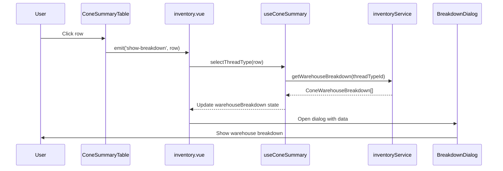
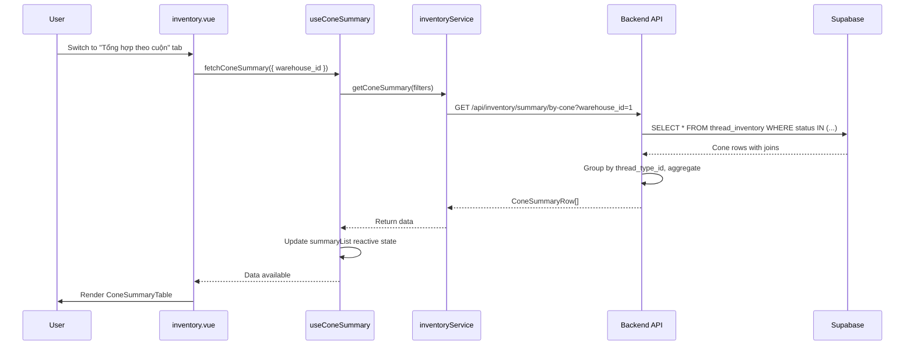
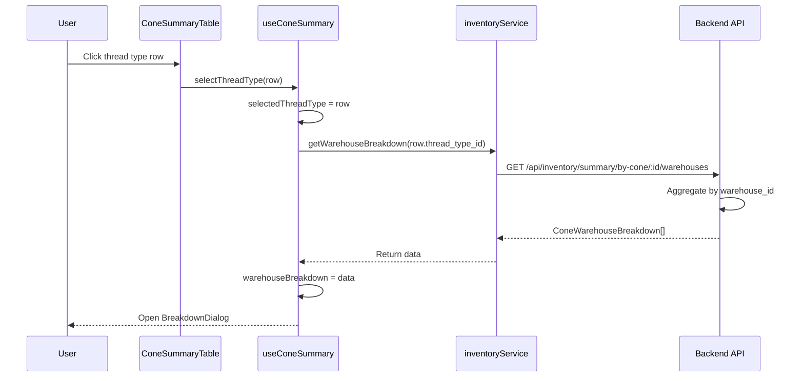

<!-- @SECTION:ARCHITECTURE -->
# System Architecture

## Overview

The Cone Inventory Summary feature follows a standard 3-tier architecture with backend aggregation, service layer abstraction, and reactive frontend state management.

```
┌─────────────────────────────────────────────────────────────┐
│                        Frontend Layer                        │
├─────────────────────────────────────────────────────────────┤
│  inventory.vue (Page)                                        │
│    ├─── Tab Navigation (detail | summary)                   │
│    ├─── ConeSummaryTable (displays summary)                 │
│    └─── ConeWarehouseBreakdownDialog (drill-down)           │
│                                                              │
│  useConeSummary (Composable)                                 │
│    ├─── summaryList: Ref<ConeSummaryRow[]>                  │
│    ├─── warehouseBreakdown: Ref<ConeWarehouseBreakdown[]>   │
│    ├─── fetchSummary(), selectThreadType()                  │
│    └─── Reactive totals computation                         │
└─────────────────────────────────────────────────────────────┘
                             ▼
┌─────────────────────────────────────────────────────────────┐
│                      Service Layer                           │
├─────────────────────────────────────────────────────────────┤
│  inventoryService.ts                                         │
│    ├─── getConeSummary(filters)                             │
│    └─── getWarehouseBreakdown(threadTypeId)                 │
└─────────────────────────────────────────────────────────────┘
                             ▼
┌─────────────────────────────────────────────────────────────┐
│                       Backend API                            │
├─────────────────────────────────────────────────────────────┤
│  server/routes/inventory.ts                                  │
│    GET /api/inventory/summary/by-cone                        │
│    GET /api/inventory/summary/by-cone/:threadTypeId/warehouses │
│                                                              │
│  Supabase PostgreSQL                                         │
│    ├─── thread_inventory table                              │
│    ├─── thread_types table (joined)                         │
│    └─── warehouses table (joined)                           │
└─────────────────────────────────────────────────────────────┘
```

**Reference**: See full data flow in `server/routes/inventory.ts:262-467`

<!-- @END:ARCHITECTURE -->

<!-- @SECTION:DATA_MODELS -->
## Data Models

### ConeSummaryRow

Represents aggregated inventory summary for one thread type.

**Type definition**: `server/types/thread.ts:300-318`, `src/types/thread/inventory.ts:78-92`

```typescript
interface ConeSummaryRow {
  thread_type_id: number          // Primary key
  thread_code: string              // e.g., "P100"
  thread_name: string              // e.g., "Polyester trắng"
  color: string | null             // e.g., "Trắng"
  color_code: string | null        // Hex color: "#FFFFFF"
  material: ThreadMaterial         // "polyester" | "cotton" | ...
  tex_number: number | null        // Thread thickness
  meters_per_cone: number | null   // Standard cone length
  full_cones: number               // Count of is_partial=false
  partial_cones: number            // Count of is_partial=true
  partial_meters: number           // Sum(quantity_meters) for partials
  partial_weight_grams: number     // Sum(weight_grams) for partials
}
```

### ConeWarehouseBreakdown

Represents warehouse distribution for one thread type.

**Type definition**: `server/types/thread.ts:320-332`, `src/types/thread/inventory.ts:97-105`

```typescript
interface ConeWarehouseBreakdown {
  warehouse_id: number
  warehouse_code: string           // e.g., "KHO-A"
  warehouse_name: string           // e.g., "Kho chính"
  location: string | null          // e.g., "Kệ A-1"
  full_cones: number
  partial_cones: number
  partial_meters: number
}
```

### ConeSummaryFilters

Frontend filter criteria passed to API.

**Type definition**: `src/types/thread/inventory.ts:110-114`

```typescript
interface ConeSummaryFilters {
  warehouse_id?: number    // Filter to specific warehouse
  material?: string        // Filter by thread material
  search?: string          // Search by code/name/color
}
```

<!-- @END:DATA_MODELS -->

<!-- @SECTION:API_ENDPOINTS -->
## API Endpoints

### GET /api/inventory/summary/by-cone

Groups inventory by thread type, returns summary with cone counts.

**Implementation**: `server/routes/inventory.ts:262-380`

**Query Parameters**:
- `warehouse_id` (optional): Filter to specific warehouse
- `material` (optional): Filter by thread material
- `search` (optional): Search by code/name/color (case-insensitive)

**Response**:
```typescript
{
  data: ConeSummaryRow[],
  error: string | null,
  message?: string  // e.g., "Tổng hợp 15 loại chỉ"
}
```

**Business Logic**:
1. Fetch all cones with usable statuses (RECEIVED, INSPECTED, AVAILABLE, SOFT_ALLOCATED, HARD_ALLOCATED)
2. Join with thread_types table to get code, name, color, material, tex_number
3. Apply filters (warehouse, material, search)
4. Group by thread_type_id, aggregate:
   - Count full_cones (is_partial = false)
   - Count partial_cones (is_partial = true)
   - Sum partial_meters, partial_weight_grams
5. Sort by thread_code ascending
6. Return summary list

**Error Handling**:
- Database error → 500 "Lỗi khi tải tổng hợp tồn kho"
- Empty result → Success with empty array

---

### GET /api/inventory/summary/by-cone/:threadTypeId/warehouses

Returns warehouse breakdown for a specific thread type.

**Implementation**: `server/routes/inventory.ts:382-467`

**Path Parameters**:
- `threadTypeId` (required): Thread type ID (must be valid integer)

**Response**:
```typescript
{
  data: ConeWarehouseBreakdown[],
  error: string | null,
  message?: string  // e.g., "Tìm thấy 3 kho chứa loại chỉ này"
}
```

**Business Logic**:
1. Validate threadTypeId is numeric
2. Fetch all usable cones for this thread type
3. Join with warehouses table to get code, name
4. Group by warehouse_id, aggregate:
   - Count full_cones, partial_cones
   - Sum partial_meters
5. Sort by warehouse_code ascending
6. Return breakdown list

**Error Handling**:
- Invalid threadTypeId → 400 "ID loại chỉ không hợp lệ"
- Database error → 500 "Lỗi khi tải chi tiết kho"

<!-- @END:API_ENDPOINTS -->

<!-- @SECTION:COMPONENT_STRUCTURE -->
## Component Structure

### ConeSummaryTable.vue

**Location**: `src/components/thread/ConeSummaryTable.vue:1-344`

**Props**:
- `rows: ConeSummaryRow[]` - Summary data to display
- `loading: boolean` - Loading state

**Emits**:
- `refresh` - User clicked refresh button
- `show-breakdown` - User clicked row or action button
- `row-click` - Generic row click event

**Key Features**:
- Client-side search filter (thread_code, thread_name, color)
- Color swatch display with color_code
- Badge styling for cone counts (green=full, orange=partial)
- Bottom summary row with totals
- Row click handler for drill-down

**Computed Totals**:
```typescript
totalFullCones = sum(rows.map(r => r.full_cones))
totalPartialCones = sum(rows.map(r => r.partial_cones))
totalPartialMeters = sum(rows.map(r => r.partial_meters))
totalPartialWeight = sum(rows.map(r => r.partial_weight_grams))
```

---

### ConeWarehouseBreakdownDialog.vue

**Location**: `src/components/thread/ConeWarehouseBreakdownDialog.vue:1-302`

**Props**:
- `modelValue: boolean` - Dialog visibility (v-model)
- `threadType: ConeSummaryRow | null` - Selected thread type for header display
- `breakdown: ConeWarehouseBreakdown[]` - Warehouse breakdown data
- `loading: boolean` - Loading state for breakdown fetch

**Emits**:
- `update:modelValue` - Dialog close event

**Key Features**:
- Maximized dialog with slide-up transition
- Summary cards showing totals from threadType prop
- Warehouse breakdown table with icon + location
- Loading state with q-inner-loading
- Empty state message

**Layout**:
- Header: Thread type name, code, color, tex
- Summary cards: Full cones, partial cones, partial meters, warehouse count
- Table: Warehouse list with cone counts
- Footer: Close button

<!-- @END:COMPONENT_STRUCTURE -->

<!-- @SECTION:STATE_MANAGEMENT -->
## State Management

### useConeSummary Composable

**Location**: `src/composables/thread/useConeSummary.ts:1-209`

**Reactive State**:
```typescript
summaryList: Ref<ConeSummaryRow[]>              // Main summary data
warehouseBreakdown: Ref<ConeWarehouseBreakdown[]>  // Drill-down data
selectedThreadType: Ref<ConeSummaryRow | null>  // Currently selected row
filters: Ref<ConeSummaryFilters>                // Active filters
error: Ref<string | null>                       // Error message
breakdownLoading: Ref<boolean>                  // Breakdown fetch state
```

**Computed Properties**:
```typescript
isLoading: ComputedRef<boolean>         // From useLoading composable
hasSummary: ComputedRef<boolean>        // summaryList.length > 0
summaryCount: ComputedRef<number>       // summaryList.length
totalFullCones: ComputedRef<number>     // Sum from summaryList
totalPartialCones: ComputedRef<number>  // Sum from summaryList
totalPartialMeters: ComputedRef<number> // Sum from summaryList
```

**Methods**:
- `fetchSummary(filters?)` - Fetch cone summary from API
- `fetchWarehouseBreakdown(threadTypeId)` - Fetch warehouse breakdown
- `selectThreadType(row)` - Select thread type and auto-fetch breakdown
- `setFilters(filters)` - Update filters and refetch
- `clearFilters()` - Reset filters and refetch
- `closeBreakdown()` - Clear selected thread type
- `clearError()` - Reset error state
- `reset()` - Reset all state to initial values

**Error Handling**:
- Network errors → "Lỗi kết nối. Vui lòng kiểm tra mạng"
- Vietnamese API errors → Pass through from backend
- Generic errors → "Lỗi hệ thống. Vui lòng thử lại sau"
- Show notification via `useSnackbar()` on errors

<!-- @END:STATE_MANAGEMENT -->

<!-- @SECTION:INTEGRATION -->
## Page Integration Flow

**Reference**: `src/pages/thread/inventory.vue:574-942`

### Tab Navigation

```typescript
activeTab: Ref<'detail' | 'summary'>  // Default: 'detail'

watch(activeTab, async (newTab) => {
  if (newTab === 'summary') {
    await fetchConeSummary({ warehouse_id: filters.warehouse_id })
  }
})
```

When user switches to summary tab, system automatically fetches cone summary filtered by current warehouse selection.

### Filter Synchronization

```typescript
watch(() => filters.warehouse_id, async (newWarehouseId) => {
  if (activeTab.value === 'summary') {
    await fetchConeSummary({ warehouse_id: newWarehouseId })
  }
})
```

Warehouse filter applies to BOTH detail and summary views. When changed, summary refetches if active.

### Post-Receipt Refresh

```typescript
// After stock receipt success
await Promise.all([
  fetchInventory({ search: searchQuery.value || undefined, ...filters }),
  fetchConeSummary({ warehouse_id: filters.warehouse_id })
])
```

Both views refresh in parallel to ensure data consistency.

### Drill-Down Flow



<!-- @END:INTEGRATION -->

<!-- @SECTION:PERFORMANCE -->
## Performance Considerations

### Backend Aggregation

**In-memory grouping**: Backend fetches ALL matching cones and groups in Node.js memory. For large datasets (10,000+ cones), consider database-level aggregation:

```sql
-- Example: PostgreSQL GROUP BY (not implemented)
SELECT 
  thread_type_id,
  COUNT(CASE WHEN is_partial = false THEN 1 END) as full_cones,
  COUNT(CASE WHEN is_partial = true THEN 1 END) as partial_cones,
  SUM(CASE WHEN is_partial = true THEN quantity_meters ELSE 0 END) as partial_meters,
  SUM(CASE WHEN is_partial = true THEN weight_grams ELSE 0 END) as partial_weight_grams
FROM thread_inventory
WHERE status IN ('RECEIVED', 'INSPECTED', 'AVAILABLE', 'SOFT_ALLOCATED', 'HARD_ALLOCATED')
GROUP BY thread_type_id
```

### Frontend Filtering

Table search filter operates **client-side** on already-fetched data. For large result sets (100+ thread types), consider debouncing or server-side search.

### Caching Strategy

No caching implemented. Every tab switch and filter change triggers fresh API call. Consider:
- Cache summary data for 30 seconds
- Invalidate on stock receipt/update operations
- Use SWR (stale-while-revalidate) pattern

<!-- @END:PERFORMANCE -->

<!-- @SECTION:DIAGRAMS -->
## Sequence Diagrams

### Summary Fetch Flow



### Warehouse Breakdown Drill-Down Flow



<!-- @END:DIAGRAMS -->

<!-- @SECTION:DEPENDENCIES -->
## Dependencies

### Backend Dependencies
- Hono (routing framework)
- `server/db/supabase.ts` - Supabase admin client
- `server/types/thread.ts` - Type definitions

### Frontend Dependencies
- Vue 3 (Composition API)
- Quasar Framework (UI components)
- `src/services/inventoryService.ts` - API client
- `src/composables/useSnackbar.ts` - Notifications
- `src/composables/useLoading.ts` - Loading state
- `src/composables/useWarehouses.ts` - Warehouse options

### Shared Types
- `ConeSummaryRow` - Defined in both backend and frontend
- `ConeWarehouseBreakdown` - Defined in both backend and frontend
- `ConeStatus` enum - Must match between layers

<!-- @END:DEPENDENCIES -->
