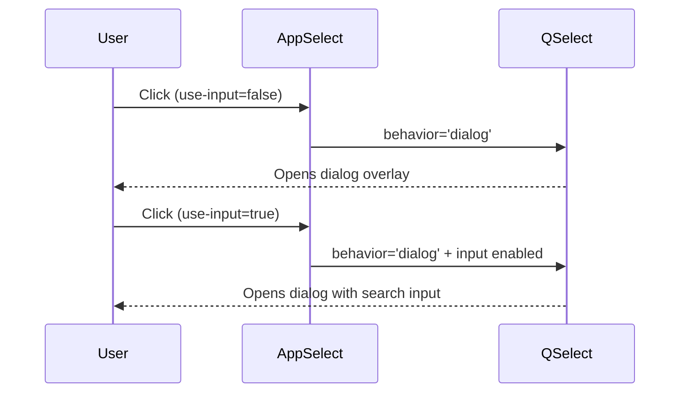

# AppSelect Behavior Prop Fix - Technical Design

## Architecture

AppSelect wraps QSelect from Quasar. The fix adds explicit `behavior` prop binding to ensure popup opens consistently.

**Root Cause**: When `use-input=false`, QSelect's default behavior mode can fail to trigger popup on click. Explicitly setting `behavior='dialog'` resolves this.

## Components

| Component | Responsibility | Location |
|-----------|---------------|----------|
| AppSelect | Wrapper for QSelect with standardized props | `src/components/ui/inputs/AppSelect.vue` |
| AppSelectProps | TypeScript interface for props | `src/types/ui/inputs.ts` |

## Prop Interface Changes

Add to `AppSelectProps` in `src/types/ui/inputs.ts:56-123`:

```typescript
export interface AppSelectProps extends BaseComponentProps, LabeledProps, ValidatableProps {
  // ... existing props ...
  
  /** Popup behavior mode - 'dialog' recommended when use-input=false */
  behavior?: 'menu' | 'dialog'
}
```

## Implementation Pattern

### 1. Update Type Definition

File: `src/types/ui/inputs.ts`

Add `behavior` prop after line 122 (before closing brace):
```typescript
/** Popup behavior mode - 'dialog' recommended when use-input=false */
behavior?: 'menu' | 'dialog'
```

### 2. Update Component

File: `src/components/ui/inputs/AppSelect.vue`

**Add to template** (after line 35, before `:rules`):
```vue
:behavior="behavior"
```

**Add to withDefaults** (after line 86, before `required`):
```typescript
behavior: 'dialog',
```

## Key Flows



## Error Handling

| Error Case | Response |
|------------|----------|
| Invalid behavior value | TypeScript compile error (union type enforcement) |
| Popup still not opening | Debug logs already in place (see lines 106-130) |

## Testing Verification

After implementation, verify:
1. Click AppSelect with `use-input=false` → popup opens
2. Click AppSelect with `use-input=true` → popup opens with search
3. Click AppSelect with `behavior="menu"` → popup opens as dropdown menu
4. Default behavior is 'dialog' without explicit prop
