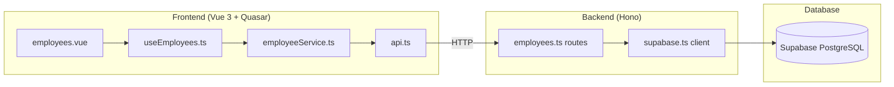
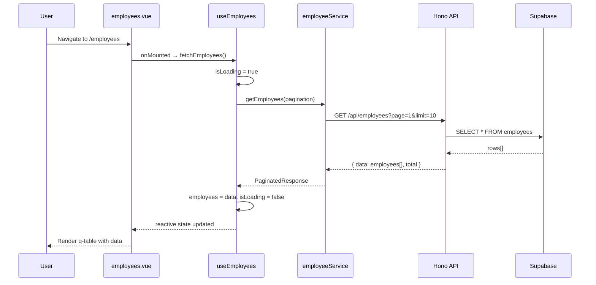
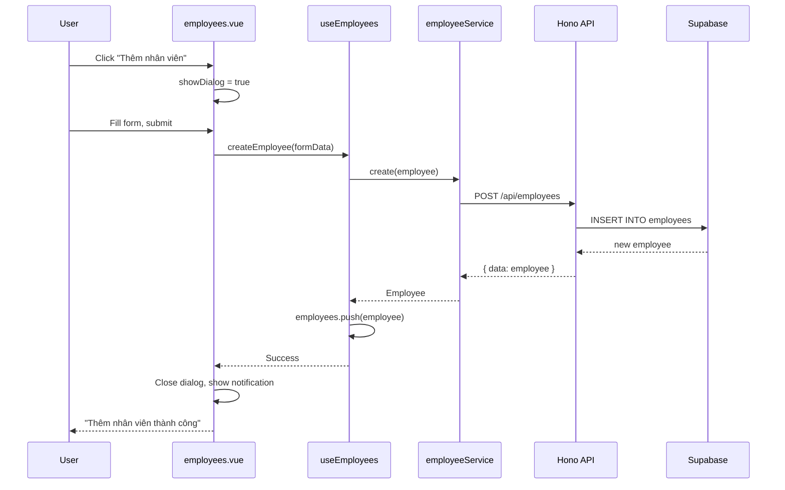

# Employee Management - Technical Design

## Architecture



**Data Flow**: Supabase → Hono API → Vue Service → Composable → Component

## Components

| Component | Responsibility | Location |
|-----------|---------------|----------|
| employees.vue | Main page with table, dialogs, actions | `src/pages/employees.vue` |
| useEmployees | State management, CRUD operations | `src/composables/useEmployees.ts` |
| employeeService | HTTP calls to API | `src/services/employeeService.ts` |
| api | Base fetch wrapper with error handling | `src/services/api.ts` |
| Hono server | REST API endpoints | `server/index.ts` |
| Employee routes | CRUD route handlers | `server/routes/employees.ts` |
| Supabase client | Database connection | `server/db/supabase.ts` |

## File Structure

```
server/                           # NEW - Hono backend
├── index.ts                      # Entry point, CORS, routes
├── db/
│   └── supabase.ts              # Supabase client initialization
├── routes/
│   └── employees.ts             # Employee CRUD endpoints
└── types/
    └── employee.ts              # Backend types

src/
├── pages/
│   └── employees.vue            # NEW - Employee list page
├── composables/
│   ├── index.ts                 # UPDATE - Export useEmployees
│   └── useEmployees.ts          # NEW - Employee state management
├── services/                    # NEW - API services
│   ├── api.ts                   # Base API client
│   └── employeeService.ts       # Employee API calls
└── types/
    ├── index.ts                 # UPDATE - Export employee types
    └── employee.ts              # NEW - Employee type definitions
```

## Data Models

**User-Provided Structure** (do not modify):

```typescript
interface Employee {
  id: string              // UUID from Supabase
  full_name: string       // Tên Nhân Viên
  employee_code: string   // Mã Nhân Viên
  department: string      // Phòng Ban
  position: string        // Chức Vụ
  created_at: string      // ISO timestamp
  updated_at: string      // ISO timestamp
}
```

This structure was provided by the user and must be used exactly as shown:
- Field names: snake_case (preserve exact casing)
- Types: string for all fields including id (UUID)
- No additional fields should be added without user approval

**Derived Types**:

```typescript
// For create/update operations (without id, timestamps)
type EmployeeInput = Pick<Employee, 'full_name' | 'employee_code' | 'department' | 'position'>

// Table column definition - follow pattern from src/types/components.ts:10-19
interface EmployeeColumn extends DataTableColumn {
  name: keyof Employee | 'actions'
  label: string  // Vietnamese labels
}

// API response wrapper
interface ApiResponse<T> {
  data: T
  error?: string
}

// Paginated response
interface PaginatedResponse<T> {
  data: T[]
  total: number
  page: number
  pageSize: number
}
```

## Table Columns Configuration

Follow pattern from `src/pages/components.vue:622-626`:

```typescript
const columns: EmployeeColumn[] = [
  { name: 'full_name', label: 'Tên Nhân Viên', field: 'full_name', align: 'left', sortable: true },
  { name: 'employee_code', label: 'Mã Nhân Viên', field: 'employee_code', align: 'left', sortable: true },
  { name: 'department', label: 'Phòng Ban', field: 'department', align: 'left', sortable: true },
  { name: 'position', label: 'Chức Vụ', field: 'position', align: 'left', sortable: true },
  { name: 'actions', label: 'Thao tác', field: 'actions', align: 'center' }
]
```

## Key Flows

### Load Employee List



### Create Employee



## API Endpoints

| Method | Endpoint | Request | Response | Description |
|--------|----------|---------|----------|-------------|
| GET | /api/employees | `?page=1&limit=10&search=` | `PaginatedResponse<Employee>` | List with pagination |
| GET | /api/employees/:id | - | `ApiResponse<Employee>` | Get single employee |
| POST | /api/employees | `EmployeeInput` | `ApiResponse<Employee>` | Create employee |
| PUT | /api/employees/:id | `Partial<EmployeeInput>` | `ApiResponse<Employee>` | Update employee |
| DELETE | /api/employees/:id | - | `ApiResponse<{success: true}>` | Delete employee |

### Error Response Format

```typescript
interface ErrorResponse {
  error: string      // Error message (Vietnamese for display)
  code?: string      // Error code for programmatic handling
  details?: unknown  // Additional debug info (dev only)
}
```

| HTTP Status | Meaning | Vietnamese Message |
|-------------|---------|-------------------|
| 400 | Validation error | Dữ liệu không hợp lệ |
| 404 | Employee not found | Không tìm thấy nhân viên |
| 409 | Duplicate employee_code | Mã nhân viên đã tồn tại |
| 500 | Server error | Lỗi hệ thống |

## Composable Pattern

Follow pattern from `src/composables/useLoading.ts:1-42` and `src/composables/useDialog.ts:1-28`:

```typescript
// useEmployees.ts structure
export function useEmployees() {
  // State
  const employees = ref<Employee[]>([])
  const isLoading = ref(false)
  const error = ref<string | null>(null)
  const pagination = ref({ page: 1, limit: 10, total: 0 })
  const searchQuery = ref('')
  
  // Dialog state (following useDialog pattern)
  const formDialog = ref({ isOpen: false, mode: 'create', data: null })
  
  // Actions
  const fetchEmployees = async () => { /* ... */ }
  const createEmployee = async (data: EmployeeInput) => { /* ... */ }
  const updateEmployee = async (id: string, data: Partial<EmployeeInput>) => { /* ... */ }
  const deleteEmployee = async (id: string) => { /* ... */ }
  
  // Computed
  const filteredEmployees = computed(() => { /* client-side filter */ })
  
  return {
    // State
    employees,
    isLoading,
    error,
    pagination,
    searchQuery,
    formDialog,
    // Actions
    fetchEmployees,
    createEmployee,
    updateEmployee,
    deleteEmployee,
    // Computed
    filteredEmployees
  }
}
```

## CORS Configuration

Frontend runs on port 5173 (Vite dev server), backend on port 3000.

```typescript
// server/index.ts
import { cors } from 'hono/cors'

app.use('/api/*', cors({
  origin: ['http://localhost:5173', 'http://127.0.0.1:5173'],
  allowMethods: ['GET', 'POST', 'PUT', 'DELETE'],
  allowHeaders: ['Content-Type']
}))
```

## Supabase Connection

```typescript
// server/db/supabase.ts
import { createClient } from '@supabase/supabase-js'

const supabaseUrl = process.env.SUPABASE_URL || 'http://127.0.0.1:54321'
const supabaseKey = process.env.SUPABASE_ANON_KEY || '...'

export const supabase = createClient(supabaseUrl, supabaseKey)
```

## Error Handling

### Backend (Hono)
```typescript
// Wrap all handlers with try-catch
app.onError((err, c) => {
  console.error(err)
  return c.json({ error: 'Lỗi hệ thống' }, 500)
})
```

### Frontend (Service Layer)
```typescript
// src/services/api.ts
export async function apiFetch<T>(url: string, options?: RequestInit): Promise<T> {
  const response = await fetch(url, {
    ...options,
    headers: { 'Content-Type': 'application/json', ...options?.headers }
  })
  
  if (!response.ok) {
    const error = await response.json()
    throw new Error(error.error || 'Lỗi không xác định')
  }
  
  return response.json()
}
```

## Responsive Breakpoints

Follow Quasar responsive design. Table adapts:
- **Mobile (< 600px)**: Stack layout, hide less important columns
- **Tablet (600-1024px)**: Show all columns, compact spacing
- **Desktop (> 1024px)**: Full layout with actions

```vue
<!-- employees.vue -->
<q-table
  :columns="$q.screen.lt.sm ? mobileColumns : columns"
  :dense="$q.screen.lt.md"
/>
```

## Vietnamese Labels Reference

| Field | Database Column | Vietnamese Label |
|-------|-----------------|------------------|
| Name | full_name | Tên Nhân Viên |
| Code | employee_code | Mã Nhân Viên |
| Department | department | Phòng Ban |
| Position | position | Chức Vụ |
| Actions | - | Thao tác |
| Add | - | Thêm nhân viên |
| Edit | - | Sửa |
| Delete | - | Xóa |
| Search | - | Tìm kiếm |
| Confirm | - | Xác nhận |
| Cancel | - | Hủy |

## Risk Mitigations

| Risk | Mitigation |
|------|------------|
| CORS errors | Configure CORS middleware from start |
| Type mismatch frontend/backend | Shared types in both locations |
| Supabase connection failure | Environment variable fallbacks |
| Slow API responses | Loading states, timeout handling |
| XSS in user input | Quasar sanitizes by default |

## Test Strategy

- **Unit**: Test useEmployees composable in isolation
- **Integration**: Test employeeService with mock API
- **E2E**: Test full CRUD flow on employees page

## Implementation Notes

### API Configuration

| Setting | Value | Description |
|---------|-------|-------------|
| Request timeout | 10 seconds | Using AbortController |
| Timeout error code | 408 | Request Timeout |
| Health endpoint | `/health` | Server monitoring |

### Additional Composable Methods

Beyond the spec, these methods were added for convenience:

| Method | Description |
|--------|-------------|
| `selectEmployee(id)` | Select an employee for editing/viewing |
| `getEmployeeById(id)` | Fetch single employee details |

### Error Code Reference

| HTTP Status | Error Code | Vietnamese Message |
|-------------|------------|-------------------|
| 400 | VALIDATION_ERROR | Dữ liệu không hợp lệ |
| 404 | NOT_FOUND | Không tìm thấy nhân viên |
| 408 | TIMEOUT | Yêu cầu quá thời gian. Vui lòng thử lại |
| 409 | DUPLICATE | Mã nhân viên đã tồn tại |
| 500 | SERVER_ERROR | Lỗi hệ thống |
