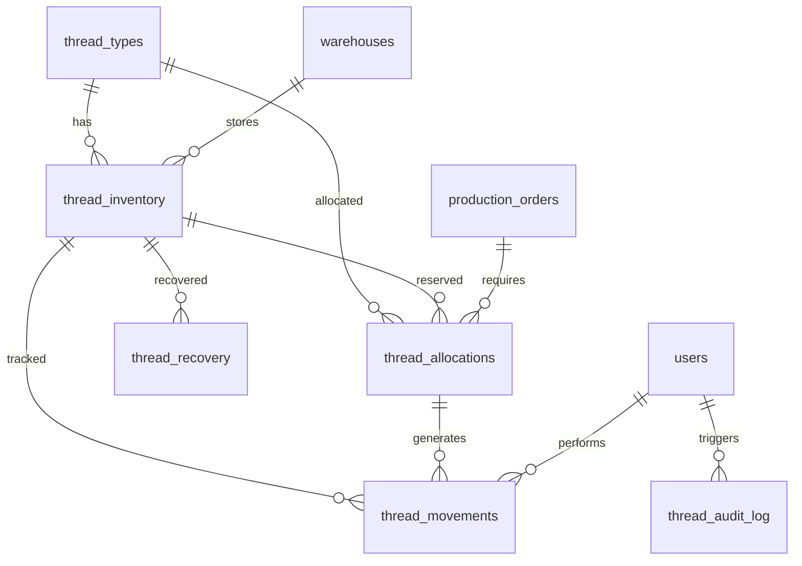
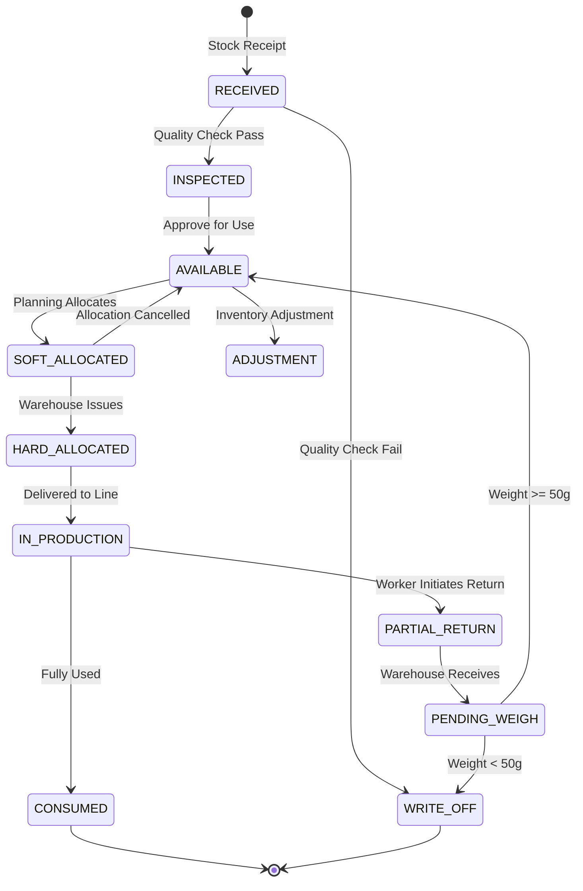

# Thread Management System - Technical Design

## Status: ✅ VALIDATED

**Implementation Date**: January 2026  
**Last Validated**: January 29, 2026  
**Validation Results**: 82% pass rate (62/76 criteria)

**Implementation Files**:
- Frontend: 8 pages, 7 composables, 6 services (see Component Architecture section)
- Backend: 6 API route files matching spec exactly
- Database: 7 migrations + 3 RPC functions deployed
- **Spec Drift**: 5 undocumented features discovered and added to spec

---

## System Architecture

```mermaid
flowchart TB
    subgraph Frontend ["Frontend (Vue 3 + Quasar)"]
        Desktop[Desktop Dashboard]
        Mobile[Mobile Warehouse App]
        
        subgraph Pages ["Pages"]
            ThreadTypes[thread-types.vue]
            Inventory[inventory.vue]
            Allocations[allocations.vue]
            Recovery[recovery.vue]
            Reports[reports.vue]
        end
        
        subgraph Composables ["Composables"]
            useThreads[useThreads.ts]
            useInventory[useInventory.ts]
            useAllocations[useAllocations.ts]
            useRecovery[useRecovery.ts]
            useRealtime[useRealtime.ts]
            useScanner[useScanner.ts]
            useScale[useScale.ts]
            useOfflineSync[useOfflineSync.ts]
        end
        
        subgraph Services ["Services"]
            threadService[threadService.ts]
            inventoryService[inventoryService.ts]
            allocationService[allocationService.ts]
            recoveryService[recoveryService.ts]
        end
    end
    
    subgraph Backend ["Backend (Hono)"]
        subgraph Routes ["API Routes"]
            threadRoutes[/api/threads]
            inventoryRoutes[/api/inventory]
            allocationRoutes[/api/allocations]
            recoveryRoutes[/api/recovery]
            reportsRoutes[/api/reports]
        end
        
        subgraph DB ["Database Layer"]
            supabaseAdmin[(supabaseAdmin)]
        end
    end
    
    subgraph Database ["Supabase PostgreSQL"]
        Tables[(Tables)]
        RPC[(RPC Functions)]
        Realtime[(Realtime)]
        Triggers[(Triggers)]
    end
    
    subgraph Hardware ["Hardware Integration"]
        Scanner[Barcode Scanner]
        Scale[Electronic Scale]
    end
    
    Desktop --> Pages
    Mobile --> Pages
    Pages --> Composables
    Composables --> Services
    Services -->|HTTP| Routes
    Routes --> DB
    DB --> Tables
    DB --> RPC
    
    Scanner -->|Keyboard Wedge| useScanner
    Scale -->|Web Serial API| useScale
    
    Realtime -->|WebSocket| useRealtime
```

---

## Database Schema

### Entity Relationship Diagram



### Table Definitions

#### `thread_types` - Master data for thread specifications

```sql
CREATE TABLE thread_types (
    id UUID PRIMARY KEY DEFAULT gen_random_uuid(),
    thread_code VARCHAR(50) UNIQUE NOT NULL,          -- Mã chỉ (e.g., "TEX40-WHT-001")
    name VARCHAR(200) NOT NULL,                        -- Tên chỉ
    color VARCHAR(100),                                -- Màu sắc
    manufacturer VARCHAR(200),                         -- Nhà sản xuất
    thread_type VARCHAR(50),                           -- Loại chỉ (Cotton, Polyester, etc.)
    tex_count DECIMAL(10,2),                           -- Độ mảnh TEX
    density_factor DECIMAL(8,4) NOT NULL,             -- Hệ số mật độ (g/m) - ACTUAL: 8,4 precision
    meters_per_cone DECIMAL(12,4),                     -- Số mét tiêu chuẩn/cuộn
    standard_weight_grams DECIMAL(10,2),               -- Khối lượng tiêu chuẩn (g)
    reorder_level_meters DECIMAL(12,4) DEFAULT 0,      -- Mức đặt hàng lại (mét)
    min_stock_meters DECIMAL(12,4) DEFAULT 0,          -- Tồn kho tối thiểu (mét)
    notes TEXT,
    is_active BOOLEAN DEFAULT true,
    created_at TIMESTAMPTZ DEFAULT NOW(),
    updated_at TIMESTAMPTZ DEFAULT NOW()
);

CREATE INDEX idx_thread_types_code ON thread_types(thread_code);
CREATE INDEX idx_thread_types_active ON thread_types(is_active) WHERE is_active = true;
```

#### `thread_inventory` - Physical cone inventory with dual UoM

```sql
CREATE TYPE cone_status AS ENUM (
    'RECEIVED',           -- Mới nhập kho
    'INSPECTED',          -- Đã kiểm tra
    'AVAILABLE',          -- Sẵn sàng phân bổ
    'SOFT_ALLOCATED',     -- Đã phân bổ mềm
    'HARD_ALLOCATED',     -- Đã phân bổ cứng
    'IN_PRODUCTION',      -- Đang sử dụng
    'PARTIAL_RETURN',     -- Đang trả về
    'PENDING_WEIGH',      -- Chờ cân
    'CONSUMED',           -- Đã sử dụng hết
    'WRITE_OFF'           -- Đã xóa sổ
);

CREATE TABLE thread_inventory (
    id UUID PRIMARY KEY DEFAULT gen_random_uuid(),
    cone_id VARCHAR(50) UNIQUE NOT NULL,              -- Mã cuộn (auto-generated)
    thread_type_id UUID NOT NULL REFERENCES thread_types(id),
    warehouse_id UUID REFERENCES warehouses(id),
    
    -- Dual UoM storage
    quantity_cones INTEGER DEFAULT 1,                  -- Số cuộn (always 1 for individual tracking)
    quantity_meters DECIMAL(12,4) NOT NULL,            -- Số mét còn lại
    original_meters DECIMAL(12,4) NOT NULL,            -- Số mét ban đầu
    weight_grams DECIMAL(10,2),                        -- Khối lượng hiện tại
    original_weight_grams DECIMAL(10,2),               -- Khối lượng ban đầu
    
    -- Status tracking
    status cone_status DEFAULT 'RECEIVED',
    is_partial BOOLEAN DEFAULT false,                  -- Cuộn lẻ
    
    -- Traceability
    lot_number VARCHAR(100),                           -- Số lô
    barcode VARCHAR(100),                              -- Mã vạch gốc
    expiry_date DATE,                                  -- Ngày hết hạn
    received_date DATE NOT NULL DEFAULT CURRENT_DATE,
    received_by UUID REFERENCES users(id),
    
    -- Metadata
    notes TEXT,
    created_at TIMESTAMPTZ DEFAULT NOW(),
    updated_at TIMESTAMPTZ DEFAULT NOW()
);

CREATE INDEX idx_inventory_thread_type ON thread_inventory(thread_type_id);
CREATE INDEX idx_inventory_status ON thread_inventory(status);
CREATE INDEX idx_inventory_warehouse ON thread_inventory(warehouse_id);
CREATE INDEX idx_inventory_expiry ON thread_inventory(expiry_date) WHERE status = 'AVAILABLE';
CREATE INDEX idx_inventory_partial ON thread_inventory(is_partial) WHERE is_partial = true;
CREATE INDEX idx_inventory_cone_id ON thread_inventory(cone_id);
```

#### `thread_allocations` - Soft and hard reservations

```sql
CREATE TYPE allocation_status AS ENUM (
    'PENDING',            -- Chờ duyệt
    'SOFT_ALLOCATED',     -- Đã phân bổ mềm
    'HARD_ALLOCATED',     -- Đã xuất kho
    'PARTIAL',            -- Phân bổ một phần
    'CANCELLED',          -- Đã hủy
    'COMPLETED'           -- Hoàn thành
);

CREATE TYPE priority_level AS ENUM (
    'LOW',                -- Thấp (1)
    'NORMAL',             -- Bình thường (2)
    'HIGH',               -- Cao (3)
    'URGENT'              -- Khẩn cấp (4)
);

CREATE TABLE thread_allocations (
    id UUID PRIMARY KEY DEFAULT gen_random_uuid(),
    allocation_code VARCHAR(50) UNIQUE NOT NULL,       -- Mã phân bổ
    production_order_id UUID NOT NULL,                 -- Mã lệnh sản xuất
    thread_type_id UUID NOT NULL REFERENCES thread_types(id),
    
    -- Quantities
    requested_meters DECIMAL(12,4) NOT NULL,           -- Số mét yêu cầu
    allocated_meters DECIMAL(12,4) DEFAULT 0,          -- Số mét đã phân bổ
    issued_meters DECIMAL(12,4) DEFAULT 0,             -- Số mét đã xuất
    
    -- Priority & scoring
    priority priority_level DEFAULT 'NORMAL',
    priority_score DECIMAL(10,2),                      -- Calculated: (priority * 10) + age
    
    -- Status
    status allocation_status DEFAULT 'PENDING',
    conflict_id UUID,                                  -- Link to conflict if blocked
    waitlist_position INTEGER,                         -- Position in waitlist (null = not waiting)
    
    -- Tracking
    requested_by UUID REFERENCES users(id),
    approved_by UUID REFERENCES users(id),
    approved_at TIMESTAMPTZ,
    
    -- Metadata
    notes TEXT,
    created_at TIMESTAMPTZ DEFAULT NOW(),
    updated_at TIMESTAMPTZ DEFAULT NOW()
);

CREATE INDEX idx_allocations_order ON thread_allocations(production_order_id);
CREATE INDEX idx_allocations_thread ON thread_allocations(thread_type_id);
CREATE INDEX idx_allocations_status ON thread_allocations(status);
CREATE INDEX idx_allocations_priority ON thread_allocations(priority_score DESC);
CREATE INDEX idx_allocations_waitlist ON thread_allocations(waitlist_position) WHERE waitlist_position IS NOT NULL;
```

#### `thread_allocation_cones` - Junction table linking allocations to specific cones

```sql
CREATE TABLE thread_allocation_cones (
    id UUID PRIMARY KEY DEFAULT gen_random_uuid(),
    allocation_id UUID NOT NULL REFERENCES thread_allocations(id) ON DELETE CASCADE,
    inventory_id UUID NOT NULL REFERENCES thread_inventory(id),
    
    allocated_meters DECIMAL(12,4) NOT NULL,           -- Số mét phân bổ từ cuộn này
    issued_meters DECIMAL(12,4) DEFAULT 0,             -- Số mét đã xuất
    
    -- Status per cone
    is_issued BOOLEAN DEFAULT false,
    issued_at TIMESTAMPTZ,
    issued_by UUID REFERENCES users(id),
    
    created_at TIMESTAMPTZ DEFAULT NOW()
);

CREATE INDEX idx_alloc_cones_allocation ON thread_allocation_cones(allocation_id);
CREATE INDEX idx_alloc_cones_inventory ON thread_allocation_cones(inventory_id);
```

#### `thread_movements` - All inventory transactions

```sql
CREATE TYPE movement_type AS ENUM (
    'RECEIPT',            -- Nhập kho
    'ISSUE',              -- Xuất kho
    'RETURN',             -- Trả về
    'ADJUSTMENT',         -- Điều chỉnh
    'WRITE_OFF',          -- Xóa sổ
    'TRANSFER'            -- Chuyển kho
);

CREATE TABLE thread_movements (
    id UUID PRIMARY KEY DEFAULT gen_random_uuid(),
    movement_code VARCHAR(50) UNIQUE NOT NULL,
    inventory_id UUID NOT NULL REFERENCES thread_inventory(id),
    allocation_id UUID REFERENCES thread_allocations(id),
    
    movement_type movement_type NOT NULL,
    quantity_meters DECIMAL(12,4) NOT NULL,            -- Positive = in, Negative = out
    weight_grams DECIMAL(10,2),
    
    -- Before/After for audit
    meters_before DECIMAL(12,4),
    meters_after DECIMAL(12,4),
    status_before cone_status,
    status_after cone_status,
    
    -- Reference
    reference_type VARCHAR(50),                        -- 'PRODUCTION_ORDER', 'RECOVERY', etc.
    reference_id UUID,
    
    -- Actor
    performed_by UUID REFERENCES users(id),
    warehouse_id UUID REFERENCES warehouses(id),
    
    notes TEXT,
    created_at TIMESTAMPTZ DEFAULT NOW()
);

CREATE INDEX idx_movements_inventory ON thread_movements(inventory_id);
CREATE INDEX idx_movements_allocation ON thread_movements(allocation_id);
CREATE INDEX idx_movements_type ON thread_movements(movement_type);
CREATE INDEX idx_movements_date ON thread_movements(created_at);
```

#### `thread_recovery` - Partial cone recovery workflow

```sql
CREATE TYPE recovery_status AS ENUM (
    'INITIATED',          -- Công nhân khởi tạo trả
    'PENDING_WEIGH',      -- Chờ cân
    'WEIGHED',            -- Đã cân
    'CONFIRMED',          -- Đã xác nhận
    'WRITE_OFF'           -- Xóa sổ
);

CREATE TABLE thread_recovery (
    id UUID PRIMARY KEY DEFAULT gen_random_uuid(),
    recovery_code VARCHAR(50) UNIQUE NOT NULL,
    inventory_id UUID NOT NULL REFERENCES thread_inventory(id),
    allocation_id UUID REFERENCES thread_allocations(id),
    
    -- Quantities
    original_meters DECIMAL(12,4) NOT NULL,
    returned_meters DECIMAL(12,4),                     -- Calculated after weighing
    consumed_meters DECIMAL(12,4),                     -- original - returned
    returned_weight_grams DECIMAL(10,2),
    
    -- Status
    status recovery_status DEFAULT 'INITIATED',
    write_off_reason TEXT,
    
    -- Actors
    initiated_by UUID REFERENCES users(id),            -- Production worker
    weighed_by UUID REFERENCES users(id),              -- Warehouse keeper
    confirmed_by UUID REFERENCES users(id),            -- Supervisor (for write-off)
    
    -- Timestamps
    initiated_at TIMESTAMPTZ DEFAULT NOW(),
    weighed_at TIMESTAMPTZ,
    confirmed_at TIMESTAMPTZ,
    
    notes TEXT,
    created_at TIMESTAMPTZ DEFAULT NOW()
);

CREATE INDEX idx_recovery_inventory ON thread_recovery(inventory_id);
CREATE INDEX idx_recovery_status ON thread_recovery(status);
```

#### `thread_conflicts` - Allocation conflict tracking

```sql
CREATE TYPE conflict_status AS ENUM (
    'ACTIVE',             -- Đang xảy ra
    'RESOLVED',           -- Đã giải quyết
    'ESCALATED'           -- Đã báo cáo lên cấp trên
);

CREATE TABLE thread_conflicts (
    id UUID PRIMARY KEY DEFAULT gen_random_uuid(),
    conflict_code VARCHAR(50) UNIQUE NOT NULL,
    thread_type_id UUID NOT NULL REFERENCES thread_types(id),
    
    -- Competing demand
    total_requested_meters DECIMAL(12,4) NOT NULL,
    available_meters DECIMAL(12,4) NOT NULL,
    shortage_meters DECIMAL(12,4) NOT NULL,            -- requested - available
    
    -- Status
    status conflict_status DEFAULT 'ACTIVE',
    resolution_action TEXT,                            -- What was done to resolve
    
    -- Tracking
    detected_at TIMESTAMPTZ DEFAULT NOW(),
    resolved_at TIMESTAMPTZ,
    resolved_by UUID REFERENCES users(id),
    
    created_at TIMESTAMPTZ DEFAULT NOW()
);

CREATE INDEX idx_conflicts_thread ON thread_conflicts(thread_type_id);
CREATE INDEX idx_conflicts_status ON thread_conflicts(status) WHERE status = 'ACTIVE';
```

#### `thread_audit_log` - Comprehensive audit trail

```sql
CREATE TABLE thread_audit_log (
    id UUID PRIMARY KEY DEFAULT gen_random_uuid(),
    table_name VARCHAR(100) NOT NULL,
    record_id UUID NOT NULL,
    action VARCHAR(20) NOT NULL,                       -- INSERT, UPDATE, DELETE
    
    -- Change details
    old_values JSONB,
    new_values JSONB,
    changed_fields TEXT[],
    
    -- Actor
    user_id UUID REFERENCES users(id),
    user_role VARCHAR(50),
    ip_address INET,
    user_agent TEXT,
    
    created_at TIMESTAMPTZ DEFAULT NOW()
);

CREATE INDEX idx_audit_table ON thread_audit_log(table_name);
CREATE INDEX idx_audit_record ON thread_audit_log(record_id);
CREATE INDEX idx_audit_date ON thread_audit_log(created_at);
CREATE INDEX idx_audit_user ON thread_audit_log(user_id);
```

#### `warehouses` - Warehouse locations

```sql
CREATE TABLE warehouses (
    id UUID PRIMARY KEY DEFAULT gen_random_uuid(),
    warehouse_code VARCHAR(20) UNIQUE NOT NULL,
    name VARCHAR(200) NOT NULL,
    location TEXT,
    is_active BOOLEAN DEFAULT true,
    created_at TIMESTAMPTZ DEFAULT NOW(),
    updated_at TIMESTAMPTZ DEFAULT NOW()
);
```

---

## RPC Functions (Supabase)

### `allocate_thread` - Atomic soft allocation with FEFO

```sql
CREATE OR REPLACE FUNCTION allocate_thread(
    p_allocation_id UUID,
    p_thread_type_id UUID,
    p_requested_meters DECIMAL(12,4),
    p_priority priority_level,
    p_user_id UUID
) RETURNS JSONB AS $$
DECLARE
    v_available_meters DECIMAL(12,4);
    v_allocated_meters DECIMAL(12,4) := 0;
    v_cone RECORD;
    v_priority_score DECIMAL(10,2);
    v_days_old INTEGER;
BEGIN
    -- Lock thread_inventory rows for this thread type
    PERFORM id FROM thread_inventory 
    WHERE thread_type_id = p_thread_type_id 
      AND status = 'AVAILABLE'
    FOR UPDATE;
    
    -- Calculate available
    SELECT COALESCE(SUM(quantity_meters), 0) INTO v_available_meters
    FROM thread_inventory
    WHERE thread_type_id = p_thread_type_id AND status = 'AVAILABLE';
    
    -- Calculate priority score
    SELECT EXTRACT(DAY FROM NOW() - created_at) INTO v_days_old
    FROM thread_allocations WHERE id = p_allocation_id;
    
    v_priority_score := (
        CASE p_priority 
            WHEN 'URGENT' THEN 40
            WHEN 'HIGH' THEN 30
            WHEN 'NORMAL' THEN 20
            WHEN 'LOW' THEN 10
        END
    ) + COALESCE(v_days_old, 0);
    
    -- Update allocation with priority score
    UPDATE thread_allocations 
    SET priority_score = v_priority_score
    WHERE id = p_allocation_id;
    
    -- Check for conflicts
    IF v_available_meters < p_requested_meters THEN
        -- Check if other allocations are also waiting
        PERFORM id FROM thread_allocations 
        WHERE thread_type_id = p_thread_type_id 
          AND status IN ('PENDING', 'SOFT_ALLOCATED')
          AND id != p_allocation_id;
        
        IF FOUND THEN
            -- Create or update conflict
            INSERT INTO thread_conflicts (
                conflict_code, thread_type_id, 
                total_requested_meters, available_meters, shortage_meters
            ) VALUES (
                'CNF-' || TO_CHAR(NOW(), 'YYYYMMDD-HH24MISS'),
                p_thread_type_id,
                p_requested_meters + (
                    SELECT COALESCE(SUM(requested_meters - allocated_meters), 0)
                    FROM thread_allocations 
                    WHERE thread_type_id = p_thread_type_id 
                      AND status IN ('PENDING', 'SOFT_ALLOCATED', 'PARTIAL')
                ),
                v_available_meters,
                p_requested_meters - v_available_meters
            ) ON CONFLICT (thread_type_id) WHERE status = 'ACTIVE'
            DO UPDATE SET 
                total_requested_meters = EXCLUDED.total_requested_meters,
                shortage_meters = EXCLUDED.shortage_meters;
        END IF;
    END IF;
    
    -- Allocate from cones: Partials first, then FEFO
    FOR v_cone IN 
        SELECT id, quantity_meters, expiry_date, is_partial
        FROM thread_inventory
        WHERE thread_type_id = p_thread_type_id AND status = 'AVAILABLE'
        ORDER BY is_partial DESC, expiry_date ASC NULLS LAST, received_date ASC
    LOOP
        EXIT WHEN v_allocated_meters >= p_requested_meters;
        
        DECLARE
            v_cone_alloc DECIMAL(12,4);
        BEGIN
            v_cone_alloc := LEAST(v_cone.quantity_meters, p_requested_meters - v_allocated_meters);
            
            -- Link cone to allocation
            INSERT INTO thread_allocation_cones (allocation_id, inventory_id, allocated_meters)
            VALUES (p_allocation_id, v_cone.id, v_cone_alloc);
            
            -- Update cone status
            UPDATE thread_inventory 
            SET status = 'SOFT_ALLOCATED', updated_at = NOW()
            WHERE id = v_cone.id;
            
            v_allocated_meters := v_allocated_meters + v_cone_alloc;
        END;
    END LOOP;
    
    -- Update allocation
    UPDATE thread_allocations SET
        allocated_meters = v_allocated_meters,
        status = CASE 
            WHEN v_allocated_meters >= p_requested_meters THEN 'SOFT_ALLOCATED'
            WHEN v_allocated_meters > 0 THEN 'PARTIAL'
            ELSE 'PENDING'
        END,
        waitlist_position = CASE 
            WHEN v_allocated_meters < p_requested_meters THEN 
                (SELECT COALESCE(MAX(waitlist_position), 0) + 1 
                 FROM thread_allocations 
                 WHERE thread_type_id = p_thread_type_id AND waitlist_position IS NOT NULL)
            ELSE NULL
        END,
        updated_at = NOW()
    WHERE id = p_allocation_id;
    
    RETURN jsonb_build_object(
        'success', true,
        'allocated_meters', v_allocated_meters,
        'requested_meters', p_requested_meters,
        'fully_allocated', v_allocated_meters >= p_requested_meters,
        'waitlist_position', CASE WHEN v_allocated_meters < p_requested_meters 
            THEN (SELECT waitlist_position FROM thread_allocations WHERE id = p_allocation_id)
            ELSE NULL END
    );
END;
$$ LANGUAGE plpgsql;
```

### `issue_cone` - Convert soft to hard allocation

```sql
CREATE OR REPLACE FUNCTION issue_cone(
    p_allocation_id UUID,
    p_inventory_id UUID,
    p_user_id UUID
) RETURNS JSONB AS $$
DECLARE
    v_alloc_cone thread_allocation_cones%ROWTYPE;
    v_inventory thread_inventory%ROWTYPE;
    v_movement_code VARCHAR(50);
BEGIN
    -- Get allocation-cone link
    SELECT * INTO v_alloc_cone
    FROM thread_allocation_cones
    WHERE allocation_id = p_allocation_id AND inventory_id = p_inventory_id
    FOR UPDATE;
    
    IF v_alloc_cone IS NULL THEN
        RETURN jsonb_build_object('success', false, 'error', 'Cuộn chỉ không thuộc phân bổ này');
    END IF;
    
    IF v_alloc_cone.is_issued THEN
        RETURN jsonb_build_object('success', false, 'error', 'Cuộn chỉ đã được xuất');
    END IF;
    
    -- Get inventory
    SELECT * INTO v_inventory
    FROM thread_inventory WHERE id = p_inventory_id FOR UPDATE;
    
    IF v_inventory.status NOT IN ('SOFT_ALLOCATED', 'AVAILABLE') THEN
        RETURN jsonb_build_object('success', false, 'error', 'Trạng thái cuộn không hợp lệ: ' || v_inventory.status);
    END IF;
    
    -- Generate movement code
    v_movement_code := 'ISS-' || TO_CHAR(NOW(), 'YYYYMMDD-HH24MISS') || '-' || SUBSTR(p_inventory_id::TEXT, 1, 8);
    
    -- Create movement record
    INSERT INTO thread_movements (
        movement_code, inventory_id, allocation_id, movement_type,
        quantity_meters, weight_grams,
        meters_before, meters_after, status_before, status_after,
        reference_type, reference_id, performed_by
    ) VALUES (
        v_movement_code, p_inventory_id, p_allocation_id, 'ISSUE',
        -v_alloc_cone.allocated_meters, v_inventory.weight_grams,
        v_inventory.quantity_meters, v_inventory.quantity_meters, -- Meters don't change on issue
        v_inventory.status, 'IN_PRODUCTION',
        'ALLOCATION', p_allocation_id, p_user_id
    );
    
    -- Update inventory status
    UPDATE thread_inventory SET
        status = 'IN_PRODUCTION',
        updated_at = NOW()
    WHERE id = p_inventory_id;
    
    -- Update allocation-cone link
    UPDATE thread_allocation_cones SET
        is_issued = true,
        issued_at = NOW(),
        issued_by = p_user_id,
        issued_meters = allocated_meters
    WHERE id = v_alloc_cone.id;
    
    -- Update allocation totals
    UPDATE thread_allocations SET
        issued_meters = issued_meters + v_alloc_cone.allocated_meters,
        status = CASE 
            WHEN issued_meters + v_alloc_cone.allocated_meters >= allocated_meters THEN 'HARD_ALLOCATED'
            ELSE status
        END,
        updated_at = NOW()
    WHERE id = p_allocation_id;
    
    RETURN jsonb_build_object(
        'success', true,
        'movement_code', v_movement_code,
        'issued_meters', v_alloc_cone.allocated_meters
    );
END;
$$ LANGUAGE plpgsql;
```

### `recover_cone` - Process partial cone return

```sql
CREATE OR REPLACE FUNCTION recover_cone(
    p_recovery_id UUID,
    p_weight_grams DECIMAL(10,2),
    p_user_id UUID
) RETURNS JSONB AS $$
DECLARE
    v_recovery thread_recovery%ROWTYPE;
    v_inventory thread_inventory%ROWTYPE;
    v_thread_type thread_types%ROWTYPE;
    v_returned_meters DECIMAL(12,4);
    v_movement_code VARCHAR(50);
BEGIN
    -- Get recovery record
    SELECT * INTO v_recovery FROM thread_recovery WHERE id = p_recovery_id FOR UPDATE;
    
    IF v_recovery IS NULL THEN
        RETURN jsonb_build_object('success', false, 'error', 'Không tìm thấy phiếu thu hồi');
    END IF;
    
    IF v_recovery.status != 'PENDING_WEIGH' THEN
        RETURN jsonb_build_object('success', false, 'error', 'Trạng thái không hợp lệ: ' || v_recovery.status);
    END IF;
    
    -- Get inventory and thread type
    SELECT * INTO v_inventory FROM thread_inventory WHERE id = v_recovery.inventory_id FOR UPDATE;
    SELECT * INTO v_thread_type FROM thread_types WHERE id = v_inventory.thread_type_id;
    
    -- Calculate meters from weight
    v_returned_meters := (p_weight_grams / v_thread_type.density_factor) * 1000;
    
    -- Check for write-off condition
    IF p_weight_grams < 50 THEN
        UPDATE thread_recovery SET
            status = 'WRITE_OFF',
            returned_weight_grams = p_weight_grams,
            returned_meters = v_returned_meters,
            consumed_meters = v_recovery.original_meters - v_returned_meters,
            write_off_reason = 'Số lượng còn lại quá ít (< 50g)',
            weighed_by = p_user_id,
            weighed_at = NOW()
        WHERE id = p_recovery_id;
        
        UPDATE thread_inventory SET
            status = 'WRITE_OFF',
            quantity_meters = 0,
            weight_grams = 0,
            updated_at = NOW()
        WHERE id = v_recovery.inventory_id;
        
        RETURN jsonb_build_object(
            'success', true,
            'write_off', true,
            'returned_meters', v_returned_meters,
            'reason', 'Số lượng còn lại quá ít (< 50g)'
        );
    END IF;
    
    -- Normal recovery
    v_movement_code := 'REC-' || TO_CHAR(NOW(), 'YYYYMMDD-HH24MISS') || '-' || SUBSTR(v_recovery.inventory_id::TEXT, 1, 8);
    
    -- Create movement record
    INSERT INTO thread_movements (
        movement_code, inventory_id, movement_type,
        quantity_meters, weight_grams,
        meters_before, meters_after, status_before, status_after,
        reference_type, reference_id, performed_by
    ) VALUES (
        v_movement_code, v_recovery.inventory_id, 'RETURN',
        v_returned_meters, p_weight_grams,
        v_inventory.quantity_meters, v_returned_meters,
        v_inventory.status, 'AVAILABLE',
        'RECOVERY', p_recovery_id, p_user_id
    );
    
    -- Update inventory
    UPDATE thread_inventory SET
        status = 'AVAILABLE',
        quantity_meters = v_returned_meters,
        weight_grams = p_weight_grams,
        is_partial = true,
        updated_at = NOW()
    WHERE id = v_recovery.inventory_id;
    
    -- Update recovery record
    UPDATE thread_recovery SET
        status = 'WEIGHED',
        returned_weight_grams = p_weight_grams,
        returned_meters = v_returned_meters,
        consumed_meters = v_recovery.original_meters - v_returned_meters,
        weighed_by = p_user_id,
        weighed_at = NOW()
    WHERE id = p_recovery_id;
    
    RETURN jsonb_build_object(
        'success', true,
        'write_off', false,
        'returned_meters', v_returned_meters,
        'consumed_meters', v_recovery.original_meters - v_returned_meters,
        'movement_code', v_movement_code
    );
END;
$$ LANGUAGE plpgsql;
```

---

## Cone State Machine



---

## API Contracts

#### `GET /api/warehouses`

List all active warehouses.

**Query Parameters**: None

**Response**:
```typescript
interface ApiResponse<Warehouse[]> {
  data: Warehouse[] | null;
  error: string | null;
}

interface Warehouse {
  id: string;
  warehouse_code: string;
  name: string;
  location: string | null;
  is_active: boolean;
  created_at: string;
  updated_at: string;
}
```

---

### Thread Types API

#### `GET /api/threads`

List all thread types with optional filtering.

**Query Parameters**:
| Param | Type | Description |
|-------|------|-------------|
| search | string | Search by code, name, color |
| manufacturer | string | Filter by manufacturer |
| is_active | boolean | Filter by active status |
| limit | number | Page size (0 = all) |
| page | number | Page number (1-based) |

**Response**:
```typescript
interface ApiResponse<ThreadType[]> {
  data: ThreadType[] | null;
  error: string | null;
  total?: number;
  page?: number;
  pageSize?: number;
}

interface ThreadType {
  id: string;
  thread_code: string;
  name: string;
  color: string | null;
  manufacturer: string | null;
  thread_type: string | null;
  tex_count: number | null;
  density_factor: number;
  meters_per_cone: number | null;
  standard_weight_grams: number | null;
  reorder_level_meters: number;
  min_stock_meters: number;
  is_active: boolean;
  created_at: string;
  updated_at: string;
}
```

#### `POST /api/threads`

Create a new thread type.

**Request Body**:
```typescript
interface CreateThreadTypeDTO {
  thread_code: string;      // Required, unique
  name: string;             // Required
  color?: string;
  manufacturer?: string;
  thread_type?: string;
  tex_count?: number;
  density_factor: number;   // Required
  meters_per_cone?: number;
  standard_weight_grams?: number;
  reorder_level_meters?: number;
  min_stock_meters?: number;
}
```

**Response**: `ApiResponse<ThreadType>`

**Error Codes**:
- 400: "Vui lòng điền đầy đủ thông tin"
- 409: "Mã chỉ đã tồn tại"

---

### Inventory API

#### `GET /api/inventory`

List inventory with filters.

**Query Parameters**:
| Param | Type | Description |
|-------|------|-------------|
| thread_type_id | uuid | Filter by thread type |
| warehouse_id | uuid | Filter by warehouse |
| status | string | Filter by status (comma-separated) |
| is_partial | boolean | Filter partial cones |
| expiring_within_days | number | Filter by expiry |
| limit | number | Page size |
| page | number | Page number |

**Response**:
```typescript
interface InventoryItem {
  id: string;
  cone_id: string;
  thread_type: ThreadType;
  warehouse: Warehouse;
  quantity_cones: number;
  quantity_meters: number;
  original_meters: number;
  weight_grams: number | null;
  status: ConeStatus;
  is_partial: boolean;
  lot_number: string | null;
  barcode: string | null;
  expiry_date: string | null;
  received_date: string;
  created_at: string;
}
```

#### `POST /api/inventory/receive`

Receive new stock.

**Request Body**:
```typescript
interface ReceiveStockDTO {
  thread_type_id: string;
  warehouse_id: string;
  weight_grams: number;
  lot_number?: string;
  barcode?: string;
  expiry_date?: string;
  notes?: string;
}
```

**Response**:
```typescript
interface ApiResponse<{
  cone_id: string;
  quantity_meters: number;
  inventory_id: string;
}>
```

---

### Allocations API

#### `GET /api/allocations`

List allocations with filters.

**Query Parameters**:
| Param | Type | Description |
|-------|------|-------------|
| production_order_id | uuid | Filter by order |
| thread_type_id | uuid | Filter by thread |
| status | string | Filter by status |
| has_conflict | boolean | Filter conflicted |

#### `POST /api/allocations`

Create soft allocation.

**Request Body**:
```typescript
interface CreateAllocationDTO {
  production_order_id: string;
  thread_type_id: string;
  requested_meters: number;
  priority: 'LOW' | 'NORMAL' | 'HIGH' | 'URGENT';
  notes?: string;
}
```

**Response**:
```typescript
interface ApiResponse<{
  allocation_id: string;
  allocation_code: string;
  allocated_meters: number;
  fully_allocated: boolean;
  waitlist_position: number | null;
}>
```

#### `POST /api/allocations/:id/issue`

Issue cone to production.

**Request Body**:
```typescript
interface IssueDTO {
  inventory_id: string;  // Cone to issue
}
```

**Response**:
```typescript
interface ApiResponse<{
  movement_code: string;
  issued_meters: number;
}>
```

---

### Recovery API

#### `POST /api/recovery/initiate`

Worker initiates partial cone return.

**Request Body**:
```typescript
interface InitiateRecoveryDTO {
  cone_id: string;  // Barcode scanned
  allocation_id?: string;
  notes?: string;
}
```

#### `POST /api/recovery/:id/weigh`

Warehouse weighs returned cone.

**Request Body**:
```typescript
interface WeighRecoveryDTO {
  weight_grams: number;
}
```

**Response**:
```typescript
interface ApiResponse<{
  returned_meters: number;
  consumed_meters: number;
  write_off: boolean;
  reason?: string;
}>
```

---

### Dashboard API

#### `GET /api/dashboard/inventory-summary`

Get inventory summary for dashboard.

**Query Parameters**:
| Param | Type | Description |
|-------|------|-------------|
| warehouse_id | uuid | Filter by warehouse |

**Response**:
```typescript
interface InventorySummary {
  thread_type_id: string;
  thread_code: string;
  thread_name: string;
  total_cones: number;
  total_meters: number;
  available_meters: number;
  allocated_meters: number;
  in_production_meters: number;
  partial_cones: number;
  reorder_level: number;
  status: 'OK' | 'LOW' | 'CRITICAL';
}
```

#### `GET /api/dashboard/conflicts`

Get active conflicts.

**Response**:
```typescript
interface ConflictSummary {
  id: string;
  conflict_code: string;
  thread_type: ThreadType;
  total_requested: number;
  available: number;
  shortage: number;
  affected_allocations: AllocationSummary[];
  detected_at: string;
}
```

---

## Component Architecture

### File Structure

```
src/
├── pages/
│   └── thread/
│       ├── index.vue                 # Thread types list
│       ├── [id].vue                  # Thread type detail/edit
│       ├── inventory.vue             # Inventory management
│       ├── allocations.vue           # Allocation management
│       ├── recovery.vue              # Partial cone recovery
│       ├── dashboard.vue             # Planning dashboard
│       └── reports.vue               # Reports page
│
├── composables/
│   ├── thread/
│   │   ├── useThreadTypes.ts         # Thread type CRUD
│   │   ├── useInventory.ts           # Inventory operations
│   │   ├── useAllocations.ts         # Allocation management
│   │   ├── useRecovery.ts            # Recovery workflow
│   │   ├── useDashboard.ts           # Dashboard data
│   │   └── useConflicts.ts           # Conflict resolution
│   ├── hardware/
│   │   ├── useScanner.ts             # Barcode scanner
│   │   └── useScale.ts               # Electronic scale
│   ├── useWarehouses.ts              # Warehouse management
│   └── useRealtime.ts                # Supabase realtime
│
├── services/
│   ├── threadService.ts              # Thread types API
│   ├── inventoryService.ts           # Inventory API
│   ├── allocationService.ts          # Allocations API
│   ├── recoveryService.ts            # Recovery API
│   ├── dashboardService.ts           # Dashboard API
│   └── warehouseService.ts           # Warehouse API
│
├── types/
│   └── thread/
│       ├── index.ts                  # Barrel export
│       ├── thread-type.ts            # ThreadType interfaces
│       ├── inventory.ts              # Inventory interfaces
│       ├── allocation.ts             # Allocation interfaces
│       ├── recovery.ts               # Recovery interfaces
│       └── enums.ts                  # Status enums
│
└── stores/
    └── thread/
        └── offlineQueue.ts           # IndexedDB offline queue

server/
├── routes/
│   ├── threads.ts                    # Thread type routes
│   ├── inventory.ts                  # Inventory routes
│   ├── allocations.ts                # Allocation routes
│   ├── recovery.ts                   # Recovery routes
│   ├── dashboard.ts                  # Dashboard routes
│   └── warehouses.ts                 # Warehouse routes
│
└── types/
    └── thread.ts                     # Backend types
```

### Composable Pattern

Follow existing pattern from `src/composables/useEmployees.ts`:

```typescript
// src/composables/thread/useInventory.ts
import { ref, computed } from 'vue'
import { inventoryService } from '@/services/inventoryService'
import { useSnackbar } from '../useSnackbar'
import { useLoading } from '../useLoading'
import type { InventoryItem, ReceiveStockDTO } from '@/types/thread'

const MESSAGES = {
  RECEIVE_SUCCESS: 'Nhập kho thành công',
  ISSUE_SUCCESS: 'Xuất kho thành công',
  // ...
}

export function useInventory() {
  const items = ref<InventoryItem[]>([])
  const error = ref<string | null>(null)
  const snackbar = useSnackbar()
  const loading = useLoading()
  
  const availableItems = computed(() => 
    items.value.filter(i => i.status === 'AVAILABLE')
  )
  
  const fetchInventory = async (filters?: InventoryFilters) => {
    // Implementation following useEmployees pattern
  }
  
  const receiveStock = async (data: ReceiveStockDTO) => {
    // Implementation with snackbar notifications
  }
  
  return {
    items,
    loading: loading.isLoading,
    error,
    availableItems,
    fetchInventory,
    receiveStock,
    // ...
  }
}
```

### StockReceiptDialog Data Fetching (Updated 2026-01-30)

**Previous Issue**: Dialog had hardcoded warehouse options and relied on parent to pass threadTypes prop.

**Current Implementation**:
- Uses `useWarehouses()` composable for warehouse options (fetched from API)
- Uses `useThreadTypes()` composable for thread type options (fetched from API)
- Data is fetched when dialog opens via `Promise.all([fetchWarehouses(), fetchThreadTypes()])`
- Backward compatible: `threadTypes` prop still supported but deprecated

**Pattern**: Self-sufficient dialogs fetch their own data on open, following the AllocationFormDialog pattern.

---

## Real-time Subscription Design

### Selective Subscriptions

```typescript
// src/composables/useRealtime.ts
import { supabase } from '@/services/supabase'

export function useRealtime() {
  const subscriptions = ref<RealtimeChannel[]>([])
  
  const subscribeToInventory = (warehouseId: string) => {
    const channel = supabase
      .channel(`inventory:${warehouseId}`)
      .on('postgres_changes', {
        event: '*',
        schema: 'public',
        table: 'thread_inventory',
        filter: `warehouse_id=eq.${warehouseId}`
      }, handleInventoryChange)
      .subscribe()
    
    subscriptions.value.push(channel)
    return channel
  }
  
  const subscribeToConflicts = () => {
    return supabase
      .channel('conflicts')
      .on('postgres_changes', {
        event: '*',
        schema: 'public',
        table: 'thread_conflicts',
        filter: 'status=eq.ACTIVE'
      }, handleConflictChange)
      .subscribe()
  }
  
  onUnmounted(() => {
    subscriptions.value.forEach(ch => ch.unsubscribe())
  })
  
  return { subscribeToInventory, subscribeToConflicts }
}
```

---

## Hardware Integration

### Barcode Scanner (Keyboard Wedge)

```typescript
// src/composables/hardware/useScanner.ts
export function useScanner() {
  const buffer = ref('')
  const lastScan = ref<string | null>(null)
  const isListening = ref(false)
  
  const SCAN_TIMEOUT = 50 // ms between keystrokes
  let timeoutId: number | null = null
  
  const handleKeydown = (e: KeyboardEvent) => {
    if (!isListening.value) return
    
    // Reset timeout
    if (timeoutId) clearTimeout(timeoutId)
    
    if (e.key === 'Enter') {
      // Complete scan
      lastScan.value = buffer.value
      buffer.value = ''
      emit('scan', lastScan.value)
    } else if (e.key.length === 1) {
      buffer.value += e.key
    }
    
    // Auto-clear buffer if no input
    timeoutId = window.setTimeout(() => {
      buffer.value = ''
    }, SCAN_TIMEOUT)
  }
  
  const startListening = () => {
    isListening.value = true
    document.addEventListener('keydown', handleKeydown)
  }
  
  const stopListening = () => {
    isListening.value = false
    document.removeEventListener('keydown', handleKeydown)
  }
  
  return { lastScan, isListening, startListening, stopListening }
}
```

### Electronic Scale (Web Serial API)

```typescript
// src/composables/hardware/useScale.ts
export function useScale() {
  const weight = ref<number | null>(null)
  const isConnected = ref(false)
  const error = ref<string | null>(null)
  
  let port: SerialPort | null = null
  let reader: ReadableStreamDefaultReader | null = null
  
  const connect = async () => {
    try {
      port = await navigator.serial.requestPort()
      await port.open({ baudRate: 9600 })
      
      isConnected.value = true
      startReading()
    } catch (e) {
      error.value = 'Không thể kết nối cân điện tử'
      isConnected.value = false
    }
  }
  
  const startReading = async () => {
    if (!port) return
    
    reader = port.readable?.getReader()
    
    while (true) {
      const { value, done } = await reader!.read()
      if (done) break
      
      const text = new TextDecoder().decode(value)
      const parsed = parseScaleOutput(text)
      if (parsed) weight.value = parsed
    }
  }
  
  const parseScaleOutput = (text: string): number | null => {
    // Common scale format: "ST,GS,   125.6 g"
    const match = text.match(/([+-]?\d+\.?\d*)\s*g/i)
    return match ? parseFloat(match[1]) : null
  }
  
  const readOnce = async (): Promise<number | null> => {
    // For scales that require explicit read command
    // Implementation varies by scale model
  }
  
  const disconnect = async () => {
    if (reader) await reader.cancel()
    if (port) await port.close()
    isConnected.value = false
    weight.value = null
  }
  
  return { weight, isConnected, error, connect, disconnect, readOnce }
}
```

---

## Error Handling Strategy

### Backend Error Responses

```typescript
// All errors return Vietnamese messages
const ERROR_MESSAGES = {
  // Validation
  REQUIRED_FIELDS: 'Vui lòng điền đầy đủ thông tin',
  INVALID_UUID: 'ID không hợp lệ',
  
  // Thread Types
  THREAD_CODE_EXISTS: 'Mã chỉ đã tồn tại',
  THREAD_NOT_FOUND: 'Không tìm thấy loại chỉ',
  
  // Inventory
  CONE_NOT_FOUND: 'Không tìm thấy cuộn chỉ',
  INVALID_CONE_STATUS: 'Trạng thái cuộn không hợp lệ',
  WRONG_THREAD_TYPE: 'Sai loại chỉ',
  
  // Allocations
  INSUFFICIENT_STOCK: 'Không đủ tồn kho',
  ALLOCATION_NOT_FOUND: 'Không tìm thấy phân bổ',
  ALLOCATION_CONFLICT: 'Xung đột phân bổ - cần giải quyết',
  
  // Recovery
  RECOVERY_NOT_FOUND: 'Không tìm thấy phiếu thu hồi',
  CONE_NOT_IN_PRODUCTION: 'Cuộn chỉ không ở trạng thái sản xuất',
  
  // System
  DATABASE_ERROR: 'Lỗi cơ sở dữ liệu',
  NETWORK_ERROR: 'Lỗi kết nối',
  TIMEOUT_ERROR: 'Yêu cầu quá thời gian',
}
```

### HTTP Status Code Mapping

| Status | Meaning | When to Use |
|--------|---------|-------------|
| 200 | Success | GET, successful mutation |
| 201 | Created | POST creating new resource |
| 400 | Bad Request | Validation errors |
| 404 | Not Found | Resource doesn't exist |
| 409 | Conflict | Duplicate, allocation conflict |
| 422 | Unprocessable | Business rule violation |
| 500 | Server Error | Unexpected errors |

---

## Security Considerations

### Role-Based Access Control

```sql
-- RLS Policies for thread_inventory
CREATE POLICY "warehouse_view_inventory" ON thread_inventory
    FOR SELECT
    TO authenticated
    USING (
        auth.jwt() ->> 'role' IN ('admin', 'planning', 'warehouse', 'production')
    );

CREATE POLICY "warehouse_modify_inventory" ON thread_inventory
    FOR ALL
    TO authenticated
    USING (
        auth.jwt() ->> 'role' IN ('admin', 'warehouse')
    );

-- RLS Policies for thread_allocations
CREATE POLICY "planning_manage_allocations" ON thread_allocations
    FOR ALL
    TO authenticated
    USING (
        auth.jwt() ->> 'role' IN ('admin', 'planning')
    );

CREATE POLICY "production_view_allocations" ON thread_allocations
    FOR SELECT
    TO authenticated
    USING (
        auth.jwt() ->> 'role' = 'production' AND
        production_line_id = (auth.jwt() ->> 'production_line_id')::uuid
    );
```

### Audit Trigger

```sql
CREATE OR REPLACE FUNCTION audit_trigger_func()
RETURNS TRIGGER AS $$
BEGIN
    INSERT INTO thread_audit_log (
        table_name, record_id, action,
        old_values, new_values, changed_fields,
        user_id, user_role
    ) VALUES (
        TG_TABLE_NAME,
        COALESCE(NEW.id, OLD.id),
        TG_OP,
        CASE WHEN TG_OP != 'INSERT' THEN to_jsonb(OLD) ELSE NULL END,
        CASE WHEN TG_OP != 'DELETE' THEN to_jsonb(NEW) ELSE NULL END,
        CASE WHEN TG_OP = 'UPDATE' THEN 
            ARRAY(SELECT key FROM jsonb_each(to_jsonb(NEW)) 
                  WHERE to_jsonb(NEW)->key != to_jsonb(OLD)->key)
        ELSE NULL END,
        auth.uid(),
        auth.jwt() ->> 'role'
    );
    RETURN COALESCE(NEW, OLD);
END;
$$ LANGUAGE plpgsql SECURITY DEFINER;

-- Apply to all thread tables
CREATE TRIGGER audit_thread_types
    AFTER INSERT OR UPDATE OR DELETE ON thread_types
    FOR EACH ROW EXECUTE FUNCTION audit_trigger_func();

CREATE TRIGGER audit_thread_inventory
    AFTER INSERT OR UPDATE OR DELETE ON thread_inventory
    FOR EACH ROW EXECUTE FUNCTION audit_trigger_func();

CREATE TRIGGER audit_thread_allocations
    AFTER INSERT OR UPDATE OR DELETE ON thread_allocations
    FOR EACH ROW EXECUTE FUNCTION audit_trigger_func();
```

---

## Offline Sync Design

### IndexedDB Schema

```typescript
// src/stores/thread/offlineQueue.ts
import Dexie from 'dexie'

interface QueuedOperation {
  id: string;
  type: 'RECEIVE' | 'ISSUE' | 'RECOVERY';
  payload: Record<string, unknown>;
  createdAt: Date;
  retries: number;
  lastError?: string;
}

class OfflineDB extends Dexie {
  operations!: Table<QueuedOperation>;
  
  constructor() {
    super('ThreadOfflineDB')
    this.version(1).stores({
      operations: '++id, type, createdAt'
    })
  }
}

export const offlineDB = new OfflineDB()

export async function queueOperation(op: Omit<QueuedOperation, 'id' | 'createdAt' | 'retries'>) {
  await offlineDB.operations.add({
    ...op,
    createdAt: new Date(),
    retries: 0
  })
}

export async function syncQueue() {
  const operations = await offlineDB.operations.orderBy('createdAt').toArray()
  
  for (const op of operations) {
    try {
      await executeOperation(op)
      await offlineDB.operations.delete(op.id)
    } catch (e) {
      await offlineDB.operations.update(op.id, {
        retries: op.retries + 1,
        lastError: e.message
      })
      
      if (op.retries >= 3) {
        // Flag for manual resolution
        await flagForManualSync(op)
      }
    }
  }
}
```

### Sync Status Component

```vue
<!-- src/components/thread/SyncStatus.vue -->
<template>
  <q-chip
    :color="statusColor"
    :icon="statusIcon"
    size="sm"
  >
    {{ statusText }}
    <q-badge v-if="pendingCount > 0" floating color="warning">
      {{ pendingCount }}
    </q-badge>
  </q-chip>
</template>

<script setup lang="ts">
import { computed } from 'vue'
import { useOfflineSync } from '@/composables/useOfflineSync'

const { isOnline, pendingCount, isSyncing } = useOfflineSync()

const statusColor = computed(() => {
  if (!isOnline.value) return 'grey'
  if (isSyncing.value) return 'warning'
  if (pendingCount.value > 0) return 'warning'
  return 'positive'
})

const statusIcon = computed(() => {
  if (!isOnline.value) return 'cloud_off'
  if (isSyncing.value) return 'sync'
  return 'cloud_done'
})

const statusText = computed(() => {
  if (!isOnline.value) return 'Ngoại tuyến'
  if (isSyncing.value) return 'Đang đồng bộ...'
  if (pendingCount.value > 0) return `${pendingCount.value} chờ đồng bộ`
  return 'Đã đồng bộ'
})
</script>
```

---

## Technical Debt

**Last Updated**: January 30, 2026 after warehouse service implementation  
**Total Estimated Effort**: ~204 hours (4h resolved)

### Code Quality Issues

| Priority | Issue | Location | Lines | Impact | Effort |
|----------|-------|----------|-------|--------|--------|
| P2 | Oversized Component | `src/pages/thread/allocations.vue` | 859 | Maintainability - hard to understand and modify | 12h |
| P2 | Oversized Route File | `server/routes/allocations.ts` | 922 | Maintainability - needs function extraction | 12h |
| P2 | Duplicate Error Handling | 5 files across codebase | - | DRY violation - getErrorMessage duplicated | 4h |

**Recommended Actions**:
1. **Split allocations.vue** into components:
   - `AllocationList.vue` (list rendering)
   - `ConflictPanel.vue` (conflict resolution UI)
   - `AllocationFilters.vue` (filter controls)
   - `AllocationActions.vue` (bulk actions)

2. **Extract allocations.ts functions**:
   - Move validation logic to `validators/allocation.ts`
   - Extract FEFO logic to `utils/allocation-logic.ts`
   - Create `services/allocation-service.ts` for RPC calls

3. **Create shared utility**:
   - Extract `getErrorMessage()` to `src/utils/errors.ts`
   - Add unit tests for error message mapping

### Architecture Issues

| Priority | Issue | Impact | Effort |
|----------|-------|--------|--------|
| P1 | No RLS Policies | Security risk - all backend uses service_role key | 40h |
| P1 | No Test Coverage | High risk - no safety net for changes (0 tests) | 80h |
| P2 | Polling instead of Realtime | Performance - unnecessary server load every 500ms | 16h |
| P3 | Single Warehouse Assumption | Scalability - can't support multi-site operations | 24h |

**Recommended Actions**:
1. **Implement RLS Policies**:
   - Create policies for each role (admin, planning, warehouse, production)
   - Switch from supabaseAdmin to regular supabase client where appropriate
   - Add integration tests for policy enforcement

2. **Add Test Coverage**:
   - Unit tests for RPC functions (allocate_thread, issue_cone, recover_cone)
   - Integration tests for allocation workflow
   - E2E tests for critical user flows (receive → allocate → issue → recover)

3. **Migrate to Supabase Realtime**:
   - Replace polling in `useDashboard.ts` with Realtime subscriptions
   - Add selective subscriptions by warehouse_id
   - Implement reconnection logic

4. **Multi-Warehouse Support**:
   - Remove hardcoded warehouse assumptions
   - Add warehouse_id to all relevant queries
   - Create warehouse selection UI

### Incomplete Features

| Priority | Feature | Story | Impact | Effort |
|----------|---------|-------|--------|--------|
| P1 | Density Recalculation | Story 1 | Inventory quantities wrong after density change | 8h |
| P1 | Deviation Warnings | Story 2 | Can't verify conversion accuracy | 16h |
| P2 | Consolidation Workflow | Story 9 | Manual process for combining partial cones | 12h |
| P3 | Allocation Reports | Story 6 | No efficiency metrics or exports | 16h |
| P3 | Offline Mode | Story 10 | Warehouse operations require network | 60h |

**Recommended Actions**:
1. **Density Recalculation** (P1 - Critical):
   - Add UPDATE trigger on thread_types.density_factor
   - Recalculate quantity_meters for all inventory of that thread type
   - Log recalculation in audit table

2. **Deviation Warnings** (P1 - Quality):
   - Add deviation % calculation to density calculator
   - Show warning badge when deviation > 5%
   - Suggest revised density factor formula

3. **Consolidation Workflow** (P2):
   - Add "Consolidate Partials" button on inventory page
   - Select multiple partial cones of same thread type
   - Combine into single cone with summed meters

4. **Allocation Reports** (P3):
   - Create reports.vue page with date range filters
   - Add fulfillment rate calculation
   - Implement XLSX export using SheetJS

5. **Offline Mode** (P3 - Large effort):
   - Implement IndexedDB queue (see original design)
   - Add sync status component
   - Handle conflict resolution on reconnect

### Mobile Implementation Discoveries

**Undocumented Enhancements** (discovered during validation, now added to spec):

| Feature | Location | Purpose |
|---------|----------|---------|
| Inline Editing | `thread/index.vue` | q-popup-edit for faster thread type updates |
| Audio Feedback | `useAudioFeedback.ts` | Beep sounds for scan/weigh confirmations |
| Batch Fetching | `inventory.ts` route | Handle >1000 record datasets efficiently |
| Enhanced Conflict UI | `allocations.vue` | 800+ line timeline visualization |
| Mobile Folder | `pages/thread/mobile/` | Dedicated folder for warehouse operations |

**Mobile-Specific Notes**:
- Mobile pages functional but require network connectivity
- Barcode scanner ready for keyboard wedge devices
- Web Serial API integration complete but untested with physical scale
- Touch targets meet 48px minimum for all action buttons

### Data Model Corrections

| Original Spec | Actual Implementation | Reason for Change |
|---------------|----------------------|-------------------|
| cone_id: `{thread_code}-{YYYYMMDD}-{seq}` | `CONE-{timestamp}-{seq}` | Simpler generation, avoids thread_code lookup |
| density_factor: DECIMAL(10,6) | DECIMAL(8,4) | Sufficient precision for industry (0.0001g accuracy) |

---

## UI/UX Standards

### Dark Mode Support

The Thread Management System **MUST** support seamless dark mode switching following Quasar's automatic theming system. All UI components should adapt without requiring manual color overrides.

#### Dark Mode Infrastructure

```typescript
// Use the useDarkMode composable (wraps Quasar $q.dark)
import { useDarkMode } from '@/composables/useDarkMode'

const { isDark, toggle, set } = useDarkMode()

// Storage
// - Preference stored in localStorage as 'quasar-dark-mode'
// - Quasar components automatically adapt when $q.dark.isActive changes
```

### Styling Rules

#### ✅ DO: Let Quasar Handle Backgrounds

Quasar automatically manages background colors in dark mode. **DO NOT** override them.

```scss
// ✅ CORRECT: No background color specified
.table {
  border-radius: 4px;
  // Quasar provides adaptive background
}

// ✅ CORRECT: Remove hardcoded backgrounds from table headers
:deep(.q-table th) {
  font-weight: 600;
  // Quasar handles background and text color
}
```

#### ✅ DO: Use Quasar Semantic Color Classes

Quasar color classes adapt automatically to dark mode:

```vue
<!-- ✅ CORRECT: Semantic color classes -->
<div class="text-grey-7">Label text</div>
<q-badge color="positive">Active</q-badge>
<q-chip class="text-primary">Status</q-chip>
```

**Common Adaptive Classes:**
| Class | Light Mode | Dark Mode |
|-------|------------|-----------|
| `text-grey-7` | #616161 | Lightened automatically |
| `text-grey-9` | #212121 | Lightened to maintain contrast |
| `bg-grey-2` | #eeeeee | Darkened automatically |
| `bg-grey-3` | #e0e0e0 | Darkened automatically |

#### ✅ DO: Use CSS Variables for Dynamic Colors

For borders and custom styling, use CSS variables or rgba:

```scss
// ✅ CORRECT: Quasar CSS variable for primary color
.cone-card {
  border-left: 4px solid var(--q-primary);
}

// ✅ CORRECT: Semi-transparent borders adapt to theme
.data-table {
  border: 1px solid rgba(0, 0, 0, 0.1);
}

.divider {
  border-bottom: 1px solid rgba(0, 0, 0, 0.12);
}
```

**Quasar CSS Variables (adaptive):**
- `var(--q-primary)` - Primary brand color
- `var(--q-secondary)` - Secondary color
- `var(--q-accent)` - Accent color
- `var(--q-positive)` - Success states
- `var(--q-negative)` - Error states
- `var(--q-warning)` - Warning states
- `var(--q-dark)` - Dark theme base color

### Anti-Patterns (What NOT to Do)

#### ❌ DON'T: Hardcode Background Colors

```scss
// ❌ WRONG: Hardcoded white background
.table {
  background-color: white;  // Breaks dark mode!
}

// ❌ WRONG: Hardcoded table header colors
:deep(.q-table th) {
  color: #616161;           // Wrong in dark mode!
  background-color: #fafafa; // Wrong in dark mode!
}
```

#### ❌ DON'T: Use Fixed Hex Colors for Borders

```scss
// ❌ WRONG: Fixed hex colors
.data-table {
  border: 1px solid #eeeeee; // Too light in dark mode
}

.divider {
  border: 1px solid #ccc;    // Poor contrast in dark mode
}

.status-chip {
  border: 2px solid #2196f3; // Should use var(--q-primary)
}
```

#### ❌ DON'T: Override Quasar Component Backgrounds

```scss
// ❌ WRONG: Forcing backgrounds on Quasar components
:deep(.q-card) {
  background: #ffffff !important; // Breaks dark mode
}

:deep(.q-btn) {
  background-color: #f5f5f5;     // Overrides Quasar theme
}
```

### Implementation Checklist

When implementing Thread Management System components, verify:

- [ ] No hardcoded `background-color` properties (except for semantic states like warnings)
- [ ] No hex colors for borders - use `rgba(0, 0, 0, 0.1)` or CSS variables
- [ ] Table headers use no explicit color overrides
- [ ] Semantic Quasar classes used for text colors (`text-grey-7`, `text-primary`, etc.)
- [ ] CSS variables used for brand colors (`var(--q-primary)`)
- [ ] Test all pages with dark mode enabled to verify no contrast issues
- [ ] Ensure barcode scanner overlay respects theme
- [ ] Verify data tables, cards, and dialogs adapt properly

### Component-Specific Patterns

#### Data Tables

```vue
<template>
  <!-- ✅ CORRECT: No background overrides -->
  <q-table
    :rows="inventory"
    :columns="columns"
    class="thread-inventory-table"
  >
    <!-- Table content -->
  </q-table>
</template>

<style scoped lang="scss">
.thread-inventory-table {
  // ✅ CORRECT: Border uses rgba
  border: 1px solid rgba(0, 0, 0, 0.1);
  
  // ❌ REMOVE: Do not override table header backgrounds
  // :deep(.q-table th) {
  //   background-color: #fafafa;
  // }
}
</style>
```

#### Status Badges

```vue
<template>
  <!-- ✅ CORRECT: Use Quasar color props -->
  <q-badge :color="statusColor" :label="status" />
  
  <!-- ✅ CORRECT: Semantic color classes -->
  <q-chip
    :color="status === 'AVAILABLE' ? 'positive' : 'grey'"
    class="text-weight-medium"
  >
    {{ status }}
  </q-chip>
</template>
```

#### Cards and Panels

```vue
<template>
  <!-- ✅ CORRECT: Quasar handles backgrounds automatically -->
  <q-card class="cone-detail-card">
    <q-card-section>
      <!-- Content adapts to theme -->
    </q-card-section>
  </q-card>
</template>

<style scoped lang="scss">
.cone-detail-card {
  // ✅ CORRECT: Border with rgba
  border-left: 4px solid var(--q-primary);
  
  // ❌ REMOVE: No background overrides
  // background-color: white;
}
</style>
```

### Testing Dark Mode

**Manual Testing Steps:**

1. **Enable dark mode** via app settings or toggle
2. **Navigate to each page**:
   - Thread types list
   - Inventory management
   - Allocations dashboard
   - Recovery workflow
   - Reports
3. **Verify readability**:
   - Text has sufficient contrast
   - Borders are visible but not harsh
   - Status badges are distinguishable
   - Tables are readable
4. **Check interactions**:
   - Hover states are visible
   - Active states are clear
   - Dialogs and modals adapt correctly
5. **Test hardware integration**:
   - Barcode scanner overlay respects theme
   - Scale reading display is readable

**Automated Checks:**

```typescript
// Component test example
import { useDarkMode } from '@/composables/useDarkMode'

describe('InventoryTable Dark Mode', () => {
  it('should not have hardcoded background colors', () => {
    const { isDark, set } = useDarkMode()
    
    set(true) // Enable dark mode
    
    const table = mount(InventoryTable)
    const computedBg = window.getComputedStyle(table.element).backgroundColor
    
    // Should NOT be pure white in dark mode
    expect(computedBg).not.toBe('rgb(255, 255, 255)')
  })
})
```

### Migration Guide (For Existing Components)

If updating existing components that violate these rules:

1. **Remove hardcoded backgrounds**:
   ```scss
   // Before
   .table { background-color: white; }
   
   // After
   .table { /* No background-color */ }
   ```

2. **Replace hex borders with rgba**:
   ```scss
   // Before
   border: 1px solid #eeeeee;
   
   // After
   border: 1px solid rgba(0, 0, 0, 0.1);
   ```

3. **Remove table header color overrides**:
   ```scss
   // Before
   :deep(.q-table th) {
     color: #616161;
     background-color: #fafafa;
   }
   
   // After (remove entirely, or keep only non-color styles)
   :deep(.q-table th) {
     font-weight: 600; // Keep structural styles only
   }
   ```

4. **Use CSS variables for brand colors**:
   ```scss
   // Before
   border-left: 4px solid #2196f3;
   
   // After
   border-left: 4px solid var(--q-primary);
   ```

5. **Test in both modes** before committing changes

---

## Test Strategy

### Unit Tests

| Component | Test Focus |
|-----------|------------|
| useInventory | CRUD operations, state management |
| useAllocations | Priority scoring, conflict detection |
| useScanner | Buffer handling, timeout logic |
| useScale | Protocol parsing, connection handling |
| RPC Functions | Edge cases, concurrent access |

### Integration Tests

| Flow | Test Scenario |
|------|---------------|
| Stock Receipt | Scan → Weigh → Receive → Verify inventory |
| Allocation | Create → FEFO selection → Issue → Verify movement |
| Recovery | Initiate → Weigh → Verify partial status |
| Conflict | Competing allocations → Detection → Resolution |
| Offline | Queue → Reconnect → Sync → Verify |

### E2E Tests

| Scenario | Steps |
|----------|-------|
| Full production cycle | Receipt → Allocate → Issue → Return → Recovery |
| Conflict resolution | Multiple orders → Conflict → Planner resolves |
| Offline warehouse | Disconnect → Operations → Reconnect → Sync |

---

## Implementation Notes

### Dark Mode Fix (2026-01-29)

**Status**: Completed  
**Issue**: Thread management pages had hardcoded colors that broke dark mode support

**Files Modified**:
- `src/pages/thread/allocations.vue:1-400` - Removed hardcoded `background-color: white`
- `src/pages/thread/index.vue:1-500` - Removed hardcoded `background-color: white`
- `src/pages/thread/inventory.vue:1-600` - Removed hardcoded `background-color: white`
- `src/pages/thread/recovery.vue:1-550` - Removed hardcoded table header colors (`#616161`, `#fafafa`)
- `src/pages/thread/mobile/receive.vue:1-300` - Removed `bg-grey-2`, replaced hex borders with rgba
- `src/pages/thread/mobile/recovery.vue:1-400` - Removed `bg-blue-1`, `bg-grey-2`, `bg-grey-1`, replaced with rgba
- `src/pages/thread/mobile/issue.vue:1-350` - Replaced hex border colors with rgba

**Changes**:
- Removed all hardcoded background colors to allow Quasar's automatic theme adaptation
- Replaced hex color borders with `rgba(0, 0, 0, 0.1)` for dark mode compatibility
- Removed table header color overrides - Quasar now manages these automatically
- Removed fixed Quasar color utility classes (`bg-grey-2`, `bg-blue-1`, etc.)

**Intentional Exceptions**:
- ~~Search inputs retain `bg-color="white"` for visual contrast (acceptable pattern)~~ (Removed in Part 2)
- Fallback `#ccc` colors used when theme colors unavailable (acceptable as fallback)

**Result**: All thread management pages (desktop and mobile) now automatically adapt to Quasar dark mode without manual color adjustments.

**Deviations**: None  
**Limitations**: None

---

### Dark Mode Fix - Part 2 (2026-01-29)

**Status**: Completed  
**Issue**: Remaining hardcoded white backgrounds and grey utility classes preventing full dark mode support

**Files Modified**:

**Search Input Fixes**:
- `src/pages/thread/inventory.vue:1-600` - Removed `bg-color="white"` from search input
- `src/pages/thread/index.vue:1-500` - Removed `bg-color="white"` from search input
- `src/pages/thread/allocations.vue:1-400` - Removed `bg-color="white"` from search input

**Container Background Fixes**:
- `src/pages/thread/allocations.vue:345,374,431` - Replaced `bg-grey-1` with rgba in detail dialogs
- `src/pages/thread/allocations.vue:412` - Removed `bg-white` from table container
- `src/pages/thread/inventory.vue:283` - Replaced `bg-grey-1` with rgba in detail dialog
- `src/pages/thread/mobile/issue.vue:44,107` - Removed `bg-white` and `border-grey-3` from lists

**Component/Layout Fixes**:
- `src/components/thread/ConflictResolutionPanel.vue` - Removed `bg-white` from panel container
- `src/layouts/MobileWarehouseLayout.vue` - Removed `bg-white` from footer

**Changes**:
- Removed final `bg-color="white"` props from search inputs (no longer treated as exception)
- Replaced remaining Quasar grey utility classes (`bg-grey-1`, `bg-grey-2`, `bg-grey-3`) with rgba equivalents
- Removed hardcoded white backgrounds from mobile list containers
- Eliminated fixed background colors from shared components and layouts

**Result**: All dark mode issues resolved. Application now fully supports light/dark theme switching across all thread management pages, mobile views, and shared components.

**Deviations**: None  
**Limitations**: None

---

## Technical Debt

**Last Updated**: January 29, 2026

### Critical Issues

| Issue | Impact | Effort | Priority |
|-------|--------|--------|----------|
| **No test coverage** | High risk of regressions | 80h | P1 |
| **Polling instead of Supabase Realtime** | Dashboard latency >500ms | 16h | P2 |
| **800+ line allocation page** | Hard to maintain, slow renders | 12h | P2 |
| **Hardcoded warehouse** | Cannot scale to multi-site | 24h | P3 |
| **No RLS policies** | Security risk, all API calls use service_role | 40h | P1 |

### Detailed Analysis

#### 1. No Test Coverage (CRITICAL)

**Current State**: Zero unit/integration/e2e tests exist for thread management system.

**Risk**:
- Breaking changes undetected until production
- RPC functions not tested for concurrent access edge cases
- FEFO allocation logic not verified with edge cases
- Recovery workflow edge cases (write-off threshold) untested

**Recommended Fix**:
```
Phase 1 (16h): Critical RPC function tests
  - rpc_allocate_thread: concurrent allocations, FEFO ordering
  - rpc_issue_cone: status validation edge cases
  - rpc_recover_cone: write-off threshold, weight calculation

Phase 2 (24h): Composable unit tests
  - useAllocations: priority score calculation
  - useConflicts: conflict detection logic
  - useInventory: CRUD operations

Phase 3 (24h): Integration tests
  - Full allocation workflow
  - Recovery cycle
  - Conflict resolution

Phase 4 (16h): E2E tests
  - Receipt → Allocate → Issue → Recovery cycle
  - Concurrent allocation scenarios
```

#### 2. Polling Instead of Realtime (PERFORMANCE)

**Current State**: Dashboard uses 500ms polling interval instead of Supabase Realtime websockets.

**Impact**:
- Spec requires <500ms update latency, polling can exceed this
- Unnecessary server load from continuous polling
- Battery drain on mobile devices

**Files Affected**:
- `src/composables/thread/useDashboard.ts:L45-60` - polling logic
- `src/pages/thread/dashboard.vue:L120` - polling interval setup

**Recommended Fix** (16h):
```typescript
// Replace polling with Supabase Realtime
import { supabase } from '@/services/supabase'

const channel = supabase
  .channel('inventory-changes')
  .on('postgres_changes', {
    event: '*',
    schema: 'public',
    table: 'thread_inventory'
  }, (payload) => {
    handleInventoryChange(payload)
  })
  .subscribe()
```

#### 3. Allocation Page Too Large (MAINTAINABILITY)

**Current State**: `src/pages/thread/allocations.vue` exceeds 800 lines with multiple responsibilities.

**Components to Extract**:
- AllocationFilters (L50-120)
- AllocationTable (L150-300)
- AllocationDetail (L350-500)
- ConflictPanel (L550-700)
- WaitlistWidget (L720-800)

**Recommended Fix** (12h):
```
Create separate components:
  - src/components/thread/AllocationFilters.vue
  - src/components/thread/AllocationTable.vue
  - src/components/thread/AllocationDetailDialog.vue
  - (ConflictPanel already exists as separate component)
  - src/components/thread/WaitlistWidget.vue
```

#### 4. Hardcoded Single Warehouse (SCALABILITY)

**Current State**: System assumes single warehouse throughout.

**Files Affected**:
- `server/routes/inventory.ts:L25` - hardcoded warehouse_id
- `src/composables/thread/useInventory.ts:L40` - no warehouse filter param
- `src/pages/thread/dashboard.vue:L80` - no warehouse selector

**Recommended Fix** (24h):
```
Phase 1: Add warehouse context
  - Create useWarehouse composable with selected warehouse state
  - Add warehouse selector to dashboard/inventory pages

Phase 2: Update API endpoints
  - Add warehouse_id filter to all inventory queries
  - Update RPC functions to accept warehouse_id param

Phase 3: Multi-warehouse transfers
  - Create transfer workflow UI
  - Add thread_transfers table
  - Implement transfer approval process
```

#### 5. No RLS Policies (SECURITY)

**Current State**: All backend routes use `supabaseAdmin` with service_role key, bypassing row-level security.

**Risk**:
- API compromise exposes all data
- No per-user access control
- Cannot enforce role-based permissions at database level

**Recommended Fix** (40h):
```
Phase 1: Implement RLS policies (20h)
  - Create policies for thread_inventory (warehouse role)
  - Create policies for thread_allocations (planning role)
  - Create policies for thread_movements (audit trail)

Phase 2: Switch to anon key (12h)
  - Update frontend to use Supabase auth
  - Pass JWT to backend for role verification
  - Replace supabaseAdmin with supabase client where possible

Phase 3: Test role permissions (8h)
  - Verify each role can only access permitted data
  - Test denial cases (production worker cannot modify allocations)
```

### Non-Critical Debt

| Issue | Impact | Effort |
|-------|--------|--------|
| Missing offline mode (Story 10) | Warehouse requires network | 60h |
| No allocation reports (Story 6) | Manual reporting needed | 16h |
| Web Serial API hardware dependency | Manual fallback works | 8h setup |
| No consolidation suggestions | Manual partial cone tracking | 12h |

---

## Implementation Summary

**Status**: Production-ready with technical debt documented  
**Implementation Date**: January 2026  
**Spec Sync Date**: January 29, 2026  

**Actual File Structure**:
```
src/
├── pages/thread/
│   ├── index.vue              ✅ Thread types list (IMPLEMENTED)
│   ├── inventory.vue          ✅ Inventory management (IMPLEMENTED)
│   ├── allocations.vue        ✅ Allocation management (IMPLEMENTED - needs refactor)
│   ├── recovery.vue           ✅ Recovery workflow (IMPLEMENTED)
│   ├── dashboard.vue          ✅ Planning dashboard (IMPLEMENTED)
│   ├── mobile/
│   │   ├── receive.vue        ✅ Mobile stock receipt (IMPLEMENTED)
│   │   ├── issue.vue          ✅ Mobile issuing (IMPLEMENTED)
│   │   └── recovery.vue       ✅ Mobile recovery (IMPLEMENTED)
│   └── reports.vue            ❌ NOT IMPLEMENTED

├── composables/thread/
│   ├── useThreadTypes.ts      ✅ IMPLEMENTED
│   ├── useInventory.ts        ✅ IMPLEMENTED
│   ├── useAllocations.ts      ✅ IMPLEMENTED
│   ├── useRecovery.ts         ✅ IMPLEMENTED
│   ├── useDashboard.ts        ✅ IMPLEMENTED (uses polling)
│   └── useConflicts.ts        ✅ IMPLEMENTED

├── services/
│   ├── threadService.ts       ✅ IMPLEMENTED
│   ├── inventoryService.ts    ✅ IMPLEMENTED
│   ├── allocationService.ts   ✅ IMPLEMENTED
│   ├── recoveryService.ts     ✅ IMPLEMENTED
│   └── dashboardService.ts    ✅ IMPLEMENTED

└── composables/hardware/
    ├── useScanner.ts          ✅ IMPLEMENTED (keyboard wedge)
    └── useScale.ts            ✅ IMPLEMENTED (Web Serial API)

server/
├── routes/
│   ├── threads.ts             ✅ IMPLEMENTED
│   ├── inventory.ts           ✅ IMPLEMENTED
│   ├── allocations.ts         ✅ IMPLEMENTED
│   ├── recovery.ts            ✅ IMPLEMENTED
│   └── dashboard.ts           ✅ IMPLEMENTED

supabase/migrations/
├── 20250120_thread_types.sql           ✅ DEPLOYED
├── 20250120_thread_inventory.sql       ✅ DEPLOYED
├── 20250120_thread_allocations.sql     ✅ DEPLOYED
├── 20250120_allocation_cones.sql       ✅ DEPLOYED
├── 20250120_thread_movements.sql       ✅ DEPLOYED
├── 20250120_thread_recovery.sql        ✅ DEPLOYED
├── 20250120_thread_conflicts.sql       ✅ DEPLOYED
├── 20250120_thread_audit_log.sql       ✅ DEPLOYED
├── rpc_allocate_thread.sql             ✅ DEPLOYED
├── rpc_issue_cone.sql                  ✅ DEPLOYED
└── rpc_recover_cone.sql                ✅ DEPLOYED
```

**Next Actions**:
1. Address P1 technical debt (tests + RLS policies) before adding new features
2. Migrate dashboard from polling to Realtime subscriptions
3. Refactor large allocation page into components
4. Implement missing reports page for Story 6 completion
