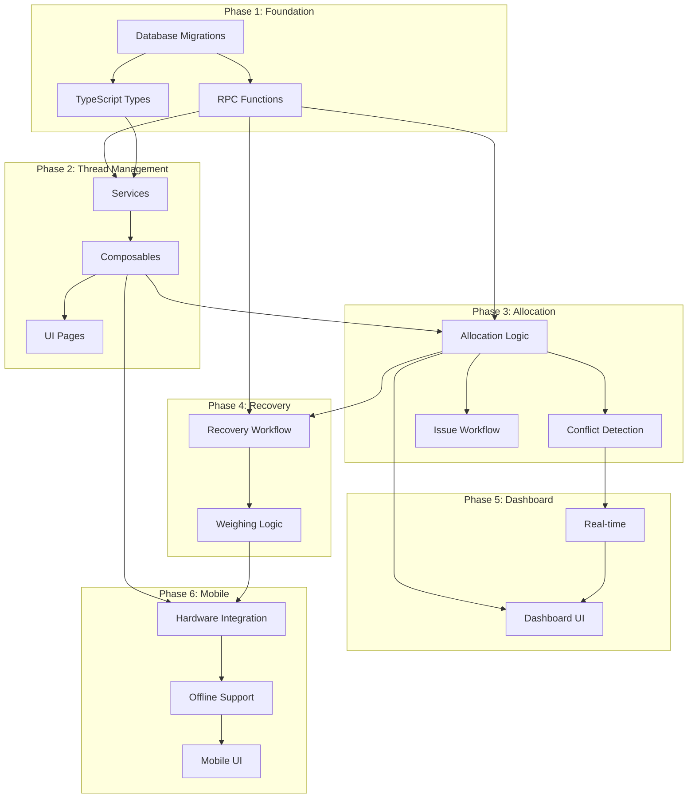

# Thread Management System - Tasks

## Overview

| Phase | Focus | Duration | Dependencies |
|-------|-------|----------|--------------|
| Phase 1 | Foundation | 1 week | None |
| Phase 2 | Basic Thread Management | 1.5 weeks | Phase 1 |
| Phase 3 | Allocation System | 2 weeks | Phase 2 |
| Phase 4 | Partial Cone Recovery | 1.5 weeks | Phase 3 |
| Phase 5 | Real-time Dashboard | 1 week | Phase 3 |
| Phase 6 | Mobile Warehouse App | 1.5 weeks | Phase 4 |
| Buffer | Testing & Fixes | 1.5 weeks | All |

**Total**: 10 weeks

---

## Phase 1: Foundation (Week 1)

**Goal**: Database schema, core types, and RPC functions ready for development.

**User Story Coverage**: None directly - infrastructure

### Tasks

| ID | Task | Files | Dependencies | Effort | Risk |
|----|------|-------|--------------|--------|------|
| P1-001 | Create database migration for thread_types table | `supabase/migrations/001_thread_types.sql` | None | 2h | Low |
| P1-002 | Create database migration for thread_inventory table | `supabase/migrations/002_thread_inventory.sql` | P1-001 | 3h | Low |
| P1-003 | Create database migration for thread_allocations + junction tables | `supabase/migrations/003_thread_allocations.sql` | P1-001, P1-002 | 3h | Low |
| P1-004 | Create database migration for thread_movements table | `supabase/migrations/004_thread_movements.sql` | P1-002, P1-003 | 2h | Low |
| P1-005 | Create database migration for thread_recovery table | `supabase/migrations/005_thread_recovery.sql` | P1-002 | 2h | Low |
| P1-006 | Create database migration for thread_conflicts table | `supabase/migrations/006_thread_conflicts.sql` | P1-003 | 1h | Low |
| P1-007 | Create database migration for thread_audit_log + triggers | `supabase/migrations/007_thread_audit.sql` | P1-001 to P1-006 | 3h | Medium |
| P1-008 | Create warehouses table migration (if not exists) | `supabase/migrations/008_warehouses.sql` | None | 1h | Low |
| P1-009 | Create RPC function: allocate_thread | `supabase/migrations/009_rpc_allocate.sql` | P1-002, P1-003 | 4h | High ⚠️ |
| P1-010 | Create RPC function: issue_cone | `supabase/migrations/010_rpc_issue.sql` | P1-003, P1-004 | 3h | High ⚠️ |
| P1-011 | Create RPC function: recover_cone | `supabase/migrations/011_rpc_recover.sql` | P1-002, P1-005 | 3h | Medium |
| P1-012 | Create TypeScript types for thread domain | `src/types/thread/index.ts`, `src/types/thread/thread-type.ts`, `src/types/thread/inventory.ts`, `src/types/thread/allocation.ts`, `src/types/thread/recovery.ts`, `src/types/thread/enums.ts` | None | 4h | Low |
| P1-013 | Create backend types for thread domain | `server/types/thread.ts` | None | 2h | Low |
| P1-014 | Apply all migrations to local Supabase | - | P1-001 to P1-011 | 1h | Low |
| P1-015 | Create seed data for testing | `supabase/seed/thread_seed.sql` | P1-014 | 2h | Low |

**Phase 1 Total Effort**: ~36 hours

### Definition of Done

- [ ] All migrations applied successfully to local Supabase
- [ ] RPC functions tested with sample data via psql
- [ ] TypeScript types compile without errors
- [ ] Seed data creates 5 thread types, 20 cones, 3 warehouses
- [ ] Audit triggers fire and log changes correctly

### Checkpoint

After Phase 1:
- Database schema ready for CRUD
- Core types available for frontend/backend
- RPC functions ready for allocation logic

---

## Phase 2: Basic Thread Management (Weeks 2-3)

**Goal**: Thread type and basic inventory CRUD with UI.

**User Story Coverage**: Story 1 (Thread Type Management), Story 7 (Stock Receipt - basic)

### Tasks

| ID | Task | Files | Dependencies | Effort | Risk |
|----|------|-------|--------------|--------|------|
| P2-001 | Create threadService.ts | `src/services/threadService.ts` | P1-012 | 2h | Low |
| P2-002 | Create useThreadTypes composable | `src/composables/thread/useThreadTypes.ts` | P2-001 | 3h | Low |
| P2-003 | Create thread types Hono routes | `server/routes/threads.ts` | P1-013 | 4h | Low |
| P2-004 | Register thread routes in server index | `server/index.ts` | P2-003 | 0.5h | Low |
| P2-005 | Create thread-types list page | `src/pages/thread/index.vue` | P2-002 | 4h | Low |
| P2-006 | Create thread-type detail/edit page | `src/pages/thread/[id].vue` | P2-002 | 4h | Low |
| P2-007 | Create thread type form dialog component | `src/components/thread/ThreadTypeFormDialog.vue` | P2-002 | 3h | Low |
| P2-008 | Add density factor calculator UI | `src/components/thread/DensityCalculator.vue` | None | 2h | Low |
| P2-009 | Create inventoryService.ts | `src/services/inventoryService.ts` | P1-012 | 3h | Low |
| P2-010 | Create useInventory composable | `src/composables/thread/useInventory.ts` | P2-009 | 4h | Low |
| P2-011 | Create inventory Hono routes | `server/routes/inventory.ts` | P1-013, P1-009 | 5h | Medium |
| P2-012 | Create inventory list page | `src/pages/thread/inventory.vue` | P2-010 | 5h | Low |
| P2-013 | Create stock receipt form dialog | `src/components/thread/StockReceiptDialog.vue` | P2-010 | 4h | Medium |
| P2-014 | Implement cone_id auto-generation | `server/routes/inventory.ts` | P2-011 | 1h | Low |
| P2-015 | Add weight-to-meters conversion display | `src/components/thread/WeightMeterDisplay.vue` | P2-010 | 2h | Low |
| P2-016 | Create inventory filters component | `src/components/thread/InventoryFilters.vue` | P2-010 | 2h | Low |
| P2-017 | Add duplicate thread code check (409) | `server/routes/threads.ts` | P2-003 | 1h | Low |
| P2-018 | Add batch fetch for >1000 inventory rows | `server/routes/inventory.ts` | P2-011 | 2h | Low |

**Phase 2 Total Effort**: ~51.5 hours

### Definition of Done

- [ ] CRUD operations for thread types working via UI
- [ ] Duplicate thread code returns 409 with Vietnamese message
- [ ] Stock receipt creates inventory with calculated meters
- [ ] Inventory list displays with filters (thread type, status, warehouse)
- [ ] Density calculator shows meters from weight input
- [ ] All Vietnamese error messages display correctly
- [ ] Composables handle notifications (no duplicate snackbars)

### Checkpoint

After Phase 2:
- Thread type management complete (Story 1 ✓)
- Basic inventory receipt working (Story 7 partial)
- Users can view and filter inventory

---

## Phase 3: Allocation System (Weeks 4-5)

**Goal**: Soft allocation, FEFO, conflict detection, and resolution.

**User Story Coverage**: Story 4, Story 5, Story 8 (Issue)

### Tasks

| ID | Task | Files | Dependencies | Effort | Risk |
|----|------|-------|--------------|--------|------|
| P3-001 | Create allocationService.ts | `src/services/allocationService.ts` | P1-012 | 3h | Low |
| P3-002 | Create useAllocations composable | `src/composables/thread/useAllocations.ts` | P3-001 | 5h | Medium |
| P3-003 | Create allocation Hono routes | `server/routes/allocations.ts` | P1-013, P1-009, P1-010 | 6h | High ⚠️ |
| P3-004 | Implement priority score calculation | `server/routes/allocations.ts` | P3-003 | 2h | Low |
| P3-005 | Implement FEFO cone selection in RPC | `supabase/migrations/012_rpc_fefo_update.sql` | P1-009 | 3h | Medium |
| P3-006 | Implement partial cone priority in allocation | `supabase/migrations/012_rpc_fefo_update.sql` | P3-005 | 2h | Medium |
| P3-007 | Create allocations list page | `src/pages/thread/allocations.vue` | P3-002 | 5h | Medium |
| P3-008 | Create allocation form dialog | `src/components/thread/AllocationFormDialog.vue` | P3-002 | 4h | Medium |
| P3-009 | Create useConflicts composable | `src/composables/thread/useConflicts.ts` | P3-001 | 3h | Medium |
| P3-010 | Create conflict detection logic | `server/routes/allocations.ts` | P3-003 | 4h | High ⚠️ |
| P3-011 | Create conflict timeline component | `src/components/thread/ConflictTimeline.vue` | P3-009 | 4h | Medium |
| P3-012 | Create conflict resolution panel | `src/components/thread/ConflictResolutionPanel.vue` | P3-009 | 5h | High ⚠️ |
| P3-013 | Implement allocation cancellation | `server/routes/allocations.ts`, `src/composables/thread/useAllocations.ts` | P3-003 | 2h | Low |
| P3-014 | Implement waitlist management | `server/routes/allocations.ts` | P3-003 | 3h | Medium |
| P3-015 | Create issue-to-production workflow | `server/routes/allocations.ts` | P3-003, P1-010 | 4h | Medium |
| P3-016 | Create issue dialog component | `src/components/thread/IssueDialog.vue` | P3-002 | 3h | Medium |
| P3-017 | Add allocation status badge component | `src/components/thread/AllocationStatusBadge.vue` | None | 1h | Low |
| P3-018 | Add conflict notification on creation | `server/routes/allocations.ts` | P3-010 | 2h | Low |
| P3-019 | Test concurrent allocation scenarios | - | P3-003, P3-010 | 4h | High ⚠️ |

**Phase 3 Total Effort**: ~65 hours

### Definition of Done

- [ ] Soft allocation creates reservations from available stock
- [ ] FEFO applies correctly (earliest expiry allocated first)
- [ ] Partial cones allocated before full cones
- [ ] Priority score calculated: (priority × 10) + age
- [ ] Conflicts detected when demand > supply
- [ ] Conflict timeline shows all affected allocations
- [ ] Resolution panel allows priority adjustment
- [ ] Issue converts soft → hard allocation
- [ ] Waitlist populated for unfulfilled demand
- [ ] Concurrent allocation test passes without race conditions

### Checkpoint

After Phase 3:
- Story 4 (Soft Allocation) ✓
- Story 5 (Conflict Resolution) ✓
- Story 8 (Issue to Production) ✓
- Core business logic complete

---

## Phase 4: Partial Cone Recovery (Weeks 6-7)

**Goal**: Recovery workflow from production return to re-entry.

**User Story Coverage**: Story 9 (Warehouse Recovery), Story 12 (Worker Return)

### Tasks

| ID | Task | Files | Dependencies | Effort | Risk |
|----|------|-------|--------------|--------|------|
| P4-001 | Create recoveryService.ts | `src/services/recoveryService.ts` | P1-012 | 2h | Low |
| P4-002 | Create useRecovery composable | `src/composables/thread/useRecovery.ts` | P4-001 | 4h | Medium |
| P4-003 | Create recovery Hono routes | `server/routes/recovery.ts` | P1-013, P1-011 | 5h | Medium |
| P4-004 | Create recovery page | `src/pages/thread/recovery.vue` | P4-002 | 5h | Medium |
| P4-005 | Create return initiation dialog | `src/components/thread/ReturnInitiateDialog.vue` | P4-002 | 3h | Low |
| P4-006 | Create weighing form dialog | `src/components/thread/WeighingDialog.vue` | P4-002 | 4h | Medium |
| P4-007 | Implement write-off logic (< 50g) | `server/routes/recovery.ts` | P4-003 | 2h | Low |
| P4-008 | Create write-off confirmation dialog | `src/components/thread/WriteOffDialog.vue` | P4-002 | 2h | Low |
| P4-009 | Update inventory status on recovery confirm | `server/routes/recovery.ts` | P4-003 | 2h | Low |
| P4-010 | Create recovery status timeline | `src/components/thread/RecoveryTimeline.vue` | P4-002 | 3h | Low |
| P4-011 | Add consumption calculation display | `src/components/thread/ConsumptionSummary.vue` | P4-002 | 2h | Low |
| P4-012 | Create partial cone indicator component | `src/components/thread/PartialConeIndicator.vue` | None | 1h | Low |
| P4-013 | Add abnormal consumption alert (REC-002) | `server/routes/recovery.ts` | P4-003 | 2h | Low |
| P4-014 | Test full recovery workflow | - | P4-003 | 3h | Medium |

**Phase 4 Total Effort**: ~40 hours

### Definition of Done

- [ ] Worker can initiate return with barcode scan
- [ ] Warehouse receives and weighs returned cone
- [ ] Meters calculated from weight using density factor
- [ ] Write-off triggered for < 50g with supervisor approval
- [ ] Recovered cone re-enters inventory as AVAILABLE + partial
- [ ] Consumption tracked (original - returned)
- [ ] Abnormal consumption flagged if deviation > threshold
- [ ] Full workflow tested: PRODUCTION → RETURN → WEIGH → AVAILABLE

### Checkpoint

After Phase 4:
- Story 9 (Partial Cone Recovery) ✓
- Story 12 (Worker Return) ✓
- Complete production cycle possible

---

## Phase 5: Real-time Dashboard (Week 8)

**Goal**: Planning dashboard with real-time updates and alerts.

**User Story Coverage**: Story 3 (Inventory Dashboard), Story 6 (Reports - partial)

### Tasks

| ID | Task | Files | Dependencies | Effort | Risk |
|----|------|-------|--------------|--------|------|
| P5-001 | Create dashboardService.ts | `src/services/dashboardService.ts` | P1-012 | 2h | Low |
| P5-002 | Create useDashboard composable | `src/composables/thread/useDashboard.ts` | P5-001 | 3h | Low |
| P5-003 | Create dashboard Hono routes | `server/routes/dashboard.ts` | P1-013 | 3h | Low |
| P5-004 | Create useRealtime composable | `src/composables/useRealtime.ts` | None | 4h | Medium |
| P5-005 | Enable Supabase Realtime for thread tables | `supabase/migrations/013_realtime_enable.sql` | P1-014 | 1h | Low |
| P5-006 | Create dashboard page | `src/pages/thread/dashboard.vue` | P5-002 | 5h | Medium |
| P5-007 | Create inventory summary cards | `src/components/thread/InventorySummaryCard.vue` | P5-002 | 3h | Low |
| P5-008 | Create stock level indicator (OK/LOW/CRITICAL) | `src/components/thread/StockLevelIndicator.vue` | None | 1h | Low |
| P5-009 | Create active conflicts widget | `src/components/thread/ActiveConflictsWidget.vue` | P3-009 | 3h | Low |
| P5-010 | Create pending allocations widget | `src/components/thread/PendingAllocationsWidget.vue` | P3-002 | 2h | Low |
| P5-011 | Create waitlist widget | `src/components/thread/WaitlistWidget.vue` | P3-002 | 2h | Low |
| P5-012 | Implement real-time inventory updates | `src/composables/thread/useDashboard.ts` | P5-004 | 3h | Medium |
| P5-013 | Implement real-time conflict notifications | `src/composables/thread/useConflicts.ts` | P5-004 | 2h | Medium |
| P5-014 | Add low stock alert creation (INV-001) | `server/routes/dashboard.ts` | P5-003 | 2h | Low |
| P5-015 | Create alerts widget | `src/components/thread/AlertsWidget.vue` | P5-002 | 2h | Low |
| P5-016 | Test real-time update latency (< 500ms) | - | P5-012 | 2h | Medium |

**Phase 5 Total Effort**: ~40 hours

### Definition of Done

- [ ] Dashboard loads within 2 seconds
- [ ] Inventory changes reflect within 500ms
- [ ] Low stock amber warning at reorder level
- [ ] Critical red alert at < 25% of reorder
- [ ] Active conflicts visible with quick-access link
- [ ] Pending allocations and waitlist visible
- [ ] Filters by warehouse work correctly
- [ ] Real-time updates tested with concurrent users

### Checkpoint

After Phase 5:
- Story 3 (Dashboard) ✓
- Story 6 (Reports - partial, basic views)
- Planning role has real-time visibility

---

## Phase 6: Mobile Warehouse App + Hardware (Weeks 9-10)

**Goal**: Mobile-optimized warehouse operations with scanner and scale.

**User Story Coverage**: Story 7 (Stock Receipt - complete), Story 10 (Offline)

### Tasks

| ID | Task | Files | Dependencies | Effort | Risk |
|----|------|-------|--------------|--------|------|
| P6-001 | Create useScanner composable | `src/composables/hardware/useScanner.ts` | None | 4h | Medium |
| P6-002 | Create useScale composable | `src/composables/hardware/useScale.ts` | None | 5h | High ⚠️ |
| P6-003 | Create scale connection dialog | `src/components/hardware/ScaleConnectionDialog.vue` | P6-002 | 3h | Medium |
| P6-004 | Create manual weight input fallback | `src/components/hardware/ManualWeightInput.vue` | None | 2h | Low |
| P6-005 | Create barcode scan field component | `src/components/hardware/BarcodeScanField.vue` | P6-001 | 3h | Medium |
| P6-006 | Create mobile stock receipt page | `src/pages/thread/mobile/receive.vue` | P2-010, P6-001, P6-002 | 6h | High ⚠️ |
| P6-007 | Create mobile issue page | `src/pages/thread/mobile/issue.vue` | P3-002, P6-001 | 5h | Medium |
| P6-008 | Create mobile recovery page | `src/pages/thread/mobile/recovery.vue` | P4-002, P6-001, P6-002 | 5h | Medium |
| P6-009 | Create mobile navigation layout | `src/layouts/MobileWarehouseLayout.vue` | None | 3h | Low |
| P6-010 | Create useOfflineSync composable | `src/composables/useOfflineSync.ts` | None | 5h | High ⚠️ |
| P6-011 | Create offline queue store (IndexedDB) | `src/stores/thread/offlineQueue.ts` | None | 4h | Medium |
| P6-012 | Create SyncStatus component | `src/components/thread/SyncStatus.vue` | P6-010 | 2h | Low |
| P6-013 | Implement offline stock receipt | `src/composables/thread/useInventory.ts` | P6-010, P6-011 | 4h | High ⚠️ |
| P6-014 | Implement offline issue | `src/composables/thread/useAllocations.ts` | P6-010, P6-011 | 4h | High ⚠️ |
| P6-015 | Implement offline recovery | `src/composables/thread/useRecovery.ts` | P6-010, P6-011 | 4h | High ⚠️ |
| P6-016 | Create sync conflict resolution UI | `src/components/thread/SyncConflictDialog.vue` | P6-010 | 3h | Medium |
| P6-017 | Add 48px touch targets for mobile | Mobile pages | None | 2h | Low |
| P6-018 | Add audio feedback for scan/weigh | `src/composables/hardware/useAudioFeedback.ts` | None | 2h | Low |
| P6-019 | Test offline → online sync flow | - | P6-013, P6-014, P6-015 | 4h | High ⚠️ |
| P6-020 | Test scale integration with real hardware | - | P6-002 | 4h | High ⚠️ |

**Phase 6 Total Effort**: ~74 hours

### Definition of Done

- [ ] Barcode scanner works in keyboard wedge mode
- [ ] Scale connects via Web Serial API
- [ ] Manual weight entry available when scale unavailable
- [ ] Mobile pages have 48px touch targets
- [ ] Audio feedback on successful scan/weigh
- [ ] Stock receipt, issue, recovery work offline
- [ ] Operations queued in IndexedDB when offline
- [ ] Sync occurs automatically on reconnect
- [ ] Sync conflicts flagged for resolution
- [ ] Scale tested with actual hardware

### Checkpoint

After Phase 6:
- Story 7 (Stock Receipt) complete with hardware ✓
- Story 10 (Offline Operations) ✓
- Story 11 (Thread Request) - basic view ✓
- Mobile warehouse operations production-ready

---

## Buffer Phase: Testing & Fixes (Weeks 10.5-12)

**Goal**: End-to-end testing, bug fixes, and polish.

### Tasks

| ID | Task | Files | Dependencies | Effort | Risk |
|----|------|-------|--------------|--------|------|
| BUF-001 | End-to-end testing: full production cycle | - | All | 8h | - |
| BUF-002 | Performance testing: 100 concurrent allocations | - | Phase 3 | 4h | - |
| BUF-003 | Load testing: 10,000 daily transactions | - | All | 4h | - |
| BUF-004 | Security audit: RLS policies | - | Phase 1 | 4h | - |
| BUF-005 | Accessibility audit: WCAG AAA | - | All UI | 6h | - |
| BUF-006 | Vietnamese language review | All | All | 4h | - |
| BUF-007 | Bug fixes from testing | Various | Testing | 16h | - |
| BUF-008 | Documentation: user guide | `docs/thread-user-guide.md` | All | 8h | - |
| BUF-009 | Documentation: API reference | `docs/thread-api.md` | All | 4h | - |
| BUF-010 | Final deployment checklist | - | All | 2h | - |

**Buffer Total Effort**: ~60 hours

---

## Risk Matrix

| ID | Risk | Probability | Impact | Mitigation |
|----|------|-------------|--------|------------|
| R1 | Race conditions in allocation | Medium | High | RPC with row-level locks, retry logic |
| R2 | Scale integration complexity | High | Medium | Manual fallback always available |
| R3 | Offline sync conflicts | Medium | Medium | Queue all operations, flag conflicts |
| R4 | Real-time performance | Low | Medium | Selective subscriptions by warehouse |
| R5 | Conversion accuracy | Medium | High | 6 decimal precision, supervisor override |
| R6 | Browser Serial API support | Low | High | Fallback to manual entry |

---

## Milestone Summary

| Milestone | Week | Deliverables |
|-----------|------|--------------|
| M1: Foundation | 1 | Database, types, RPC functions |
| M2: Thread CRUD | 3 | Thread types + basic inventory UI |
| M3: Allocation MVP | 5 | Soft allocation, conflict detection, issue |
| M4: Recovery | 7 | Partial cone recovery workflow |
| M5: Dashboard | 8 | Real-time planning dashboard |
| M6: Mobile + Hardware | 10 | Mobile app, scanner, scale integration |
| M7: Production Ready | 12 | Tested, documented, deployed |

---

## Dependencies Graph

---

## Task Status Legend

| Symbol | Meaning |
|--------|---------|
| [ ] | Not started |
| [~] | In progress |
| [✓] | Complete |
| [!] | Blocked |
| ⚠️ | High risk task |
