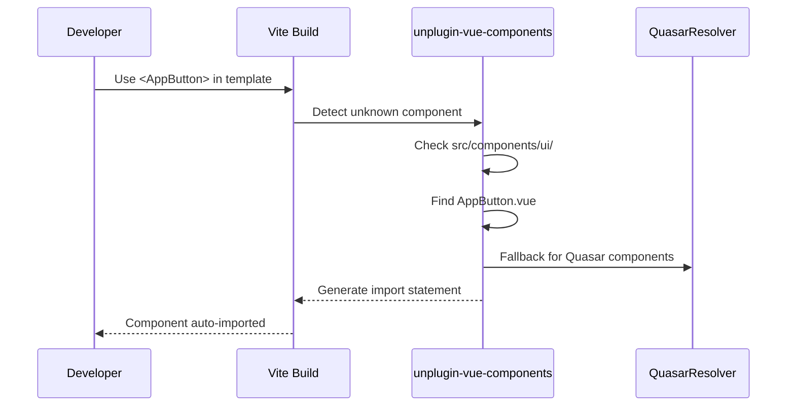
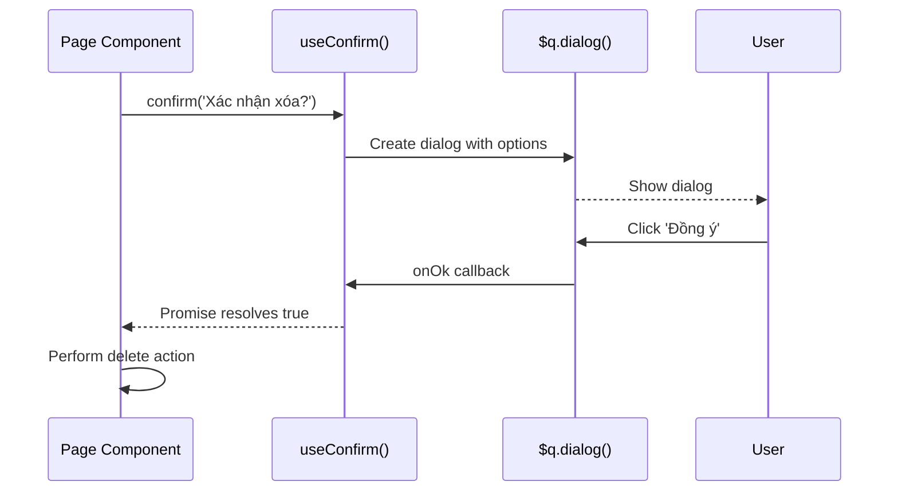

# UI Component Library - Technical Design

## Architecture Overview

Thư viện UI component sử dụng pattern "Wrapper Component" - bọc Quasar components với layer abstraction để chuẩn hóa API, thêm defaults, và đảm bảo type safety.

Pattern tham khảo: `src/components/DarkModeToggle.vue` (lines 1-25)

**Implementation Status**: 63 components implemented across 12 categories

## Implemented Component Inventory

| Category | Components | Count |
|----------|------------|-------|
| buttons | AppButton, IconButton, ButtonGroup, ButtonToggle, ButtonDropdown | 5 |
| inputs | AppInput, AppSelect, SearchInput, AppCheckbox, AppToggle, AppSlider, AppRange, AppTextarea | 8 |
| feedback | AppSpinner, AppProgress, CircularProgress, AppSkeleton, EmptyState, AppBanner, InnerLoading | 7 |
| dialogs | AppDialog, FormDialog, ConfirmDialog, DeleteDialog, PopupEdit, AppMenu, AppTooltip | 7 |
| tables | DataTable | 1 |
| lists | AppList, ListItem | 2 |
| cards | AppCard, AppBadge, AppChip, InfoCard, StatCard | 5 |
| navigation | AppBreadcrumbs, AppPagination, AppTabs, TabPanel, AppStepper, StepperStep, SidebarItem | 7 |
| layout | PageHeader, SectionHeader, AppDrawer, AppToolbar, AppSeparator, AppSpace | 6 |
| media | AppCarousel, AppImage, AppVideo, AppParallax | 4 |
| pickers | DatePicker, TimePicker, ColorPicker, AppEditor, FilePicker | 5 |
| scroll | ScrollArea, VirtualScroll, InfiniteScroll, PullToRefresh, Timeline, TimelineEntry | 6 |

**Note**: SidebarItem uses `@/types/navigation` (NavItem type), not `@/types/ui`

**Type Files**: base.ts, buttons.ts, inputs.ts, feedback.ts, data-display.ts, dialogs.ts, navigation.ts, layout.ts, media.ts, pickers.ts, scroll.ts, index.ts (12 files)

## Folder Structure

```
src/
├── components/
│   └── ui/
│       ├── index.ts                    # Barrel export tất cả components
│       ├── buttons/
│       │   ├── index.ts
│       │   ├── AppButton.vue           ✅
│       │   ├── IconButton.vue          ✅
│       │   ├── ButtonGroup.vue         ✅
│       │   ├── ButtonToggle.vue        ✅
│       │   └── ButtonDropdown.vue      ✅
│       ├── inputs/
│       │   ├── index.ts
│       │   ├── AppInput.vue            ✅
│       │   ├── AppSelect.vue           ✅
│       │   ├── AppCheckbox.vue         ✅
│       │   ├── AppToggle.vue           ✅
│       │   ├── AppSlider.vue           ✅
│       │   ├── AppRange.vue            ✅
│       │   ├── SearchInput.vue         ✅
│       │   ├── AppTextarea.vue         ✅
│       │   ├── AppFile.vue             ⚠️ NOT IMPLEMENTED
│       │   └── AppUploader.vue         ⚠️ NOT IMPLEMENTED
│       ├── feedback/
│       │   ├── index.ts
│       │   ├── AppSpinner.vue          ✅
│       │   ├── AppProgress.vue         ✅
│       │   ├── CircularProgress.vue    ✅ BONUS
│       │   ├── AppSkeleton.vue         ✅
│       │   ├── EmptyState.vue          ✅
│       │   ├── AppBanner.vue           ✅
│       │   └── InnerLoading.vue        ✅
│       ├── tables/
│       │   ├── index.ts
│       │   ├── DataTable.vue           ✅
│       │   ├── EditableCell.vue        ⚠️ NOT IMPLEMENTED
│       │   ├── TableActions.vue        ⚠️ NOT IMPLEMENTED
│       │   ├── TablePagination.vue     ⚠️ NOT IMPLEMENTED
│       │   └── TableFilter.vue         ⚠️ NOT IMPLEMENTED
│       ├── lists/
│       │   ├── index.ts
│       │   ├── AppList.vue             ✅
│       │   ├── ListItem.vue            ✅
│       │   ├── AppTree.vue             ⚠️ NOT IMPLEMENTED
│       │   ├── TreeNode.vue            ⚠️ NOT IMPLEMENTED
│       │   ├── ExpansionItem.vue       ⚠️ NOT IMPLEMENTED
│       │   └── ExpansionList.vue       ⚠️ NOT IMPLEMENTED
│       ├── cards/
│       │   ├── index.ts
│       │   ├── AppCard.vue             ✅
│       │   ├── InfoCard.vue            ✅
│       │   ├── StatCard.vue            ✅
│       │   ├── AppBadge.vue            ✅
│       │   └── AppChip.vue             ✅
│       ├── dialogs/
│       │   ├── index.ts
│       │   ├── AppDialog.vue           ✅
│       │   ├── ConfirmDialog.vue       ✅
│       │   ├── FormDialog.vue          ✅
│       │   ├── DeleteDialog.vue        ✅
│       │   ├── AppMenu.vue             ✅
│       │   ├── AppTooltip.vue          ✅
│       │   └── PopupEdit.vue           ✅
│       ├── navigation/
│       │   ├── index.ts
│       │   ├── AppTabs.vue             ✅
│       │   ├── TabPanel.vue            ✅
│       │   ├── AppBreadcrumbs.vue      ✅
│       │   ├── AppPagination.vue       ✅
│       │   ├── AppStepper.vue          ✅
│       │   ├── StepperStep.vue         ✅
│       │   └── SidebarItem.vue         ✅ (uses @/types/navigation, not @/types/ui)
│       ├── layout/
│       │   ├── index.ts
│       │   ├── AppToolbar.vue          ✅
│       │   ├── AppSeparator.vue        ✅
│       │   ├── AppSpace.vue            ✅
│       │   ├── PageHeader.vue          ✅
│       │   ├── SectionHeader.vue       ✅
│       │   └── AppDrawer.vue           ✅
│       ├── media/
│       │   ├── index.ts
│       │   ├── AppCarousel.vue         ✅
│       │   ├── AppImage.vue            ✅
│       │   ├── AppVideo.vue            ✅
│       │   └── AppParallax.vue         ✅
│       ├── pickers/
│       │   ├── index.ts
│       │   ├── DatePicker.vue          ✅
│       │   ├── TimePicker.vue          ✅
│       │   ├── ColorPicker.vue         ✅
│       │   ├── AppEditor.vue           ✅
│       │   └── FilePicker.vue          ✅
│       ├── scroll/
│       │   ├── index.ts
│       │   ├── ScrollArea.vue          ✅
│       │   ├── VirtualScroll.vue       ✅
│       │   ├── InfiniteScroll.vue      ✅
│       │   ├── PullToRefresh.vue       ✅
│       │   ├── Timeline.vue            ✅
│       │   └── TimelineEntry.vue       ✅
│       └── common/
│           ├── index.ts
│           └── DarkModeToggle.vue      ⚠️ NOT MIGRATED (still in src/components/)
│
├── types/
│   └── ui/
│       ├── index.ts                    # Barrel export ✅
│       ├── base.ts                     # BaseProps, ColorType, SizeType ✅
│       ├── buttons.ts                  # Button component types ✅
│       ├── inputs.ts                   # Input component types ✅
│       ├── feedback.ts                 # Feedback component types ✅
│       ├── data-display.ts             # Table, List, Card types ✅
│       ├── dialogs.ts                  # Dialog component types ✅
│       ├── navigation.ts               # Navigation types ✅
│       ├── layout.ts                   # Layout types ✅
│       ├── media.ts                    # Media types ✅
│       ├── pickers.ts                  # Picker types ✅
│       └── scroll.ts                   # Scroll types ✅
│
└── composables/
    ├── useConfirm.ts                   # ✅ Wraps $q.dialog()
    ├── useSnackbar.ts                  # ✅ Wraps $q.notify()
    ├── useDialog.ts                    # ✅ Generic dialog state with typed payloads
    ├── useLoading.ts                   # ✅ Count-based loading with withLoading wrapper
    ├── useDarkMode.ts                  # ✅ Theme switching with localStorage persistence
    └── useSidebar.ts                   # ✅ Global sidebar state with nav items
```

## Component Wrapper Pattern

### Template Pattern (AppButton làm mẫu)

```vue
<template>
  <q-btn
    v-bind="quasarProps"
    :class="computedClasses"
    @click="handleClick"
  >
    <template v-if="$slots.default" #default>
      <slot />
    </template>
    <template v-if="$slots.loading" #loading>
      <slot name="loading" />
    </template>
  </q-btn>
</template>

<script setup lang="ts">
import { computed } from 'vue'
import type { AppButtonProps } from '@/types/ui/buttons'

// Props với Vietnamese defaults
const props = withDefaults(defineProps<AppButtonProps>(), {
  variant: 'primary',
  size: 'md',
  outlined: false,
  loading: false,
  disabled: false,
})

const emit = defineEmits<{
  click: [event: MouseEvent]
}>()

// Map app props to Quasar props
const quasarProps = computed(() => ({
  color: variantColorMap[props.variant],
  size: sizeMap[props.size],
  outline: props.outlined,
  loading: props.loading,
  disable: props.disabled, // Note: Quasar uses 'disable', not 'disabled'
  icon: props.icon,
  iconRight: props.iconRight,
  to: props.to,
  label: props.label,
}))

const variantColorMap: Record<string, string> = {
  primary: 'primary',
  secondary: 'secondary', 
  danger: 'negative',
  warning: 'warning',
  success: 'positive',
  info: 'info',
}

const sizeMap: Record<string, string> = {
  xs: 'xs',
  sm: 'sm',
  md: 'md',
  lg: 'lg',
}

const computedClasses = computed(() => [
  props.class,
])

const handleClick = (event: MouseEvent) => {
  if (!props.disabled && !props.loading) {
    emit('click', event)
  }
}
</script>
```

### v-model Pattern (for Input Components)

Components that use v-model implement a computed pattern for two-way binding:

```vue
<script setup lang="ts">
import { computed } from 'vue'

const props = defineProps<{
  modelValue?: string | number
}>()

const emit = defineEmits<{
  'update:modelValue': [value: string | number]
}>()

// Computed for v-model two-way binding
const model = computed({
  get: () => props.modelValue,
  set: (value) => emit('update:modelValue', value)
})
</script>

<template>
  <q-input v-model="model" />
</template>
```

This pattern is used consistently across:
- All input components (AppInput, AppSelect, AppTextarea, etc.)
- Toggle components (AppCheckbox, AppToggle)
- Picker components (DatePicker, TimePicker, ColorPicker)
- Dialog components (AppDialog, etc.)

## TypeScript Interface Pattern

### Base Types (`src/types/ui/base.ts`)

```typescript
/**
 * Base types cho UI Component Library
 */

// Màu sắc sử dụng trong toàn bộ library
export type ColorType = 'primary' | 'secondary' | 'positive' | 'negative' | 'warning' | 'info'

// Variant cho buttons và các interactive components
export type VariantType = 'primary' | 'secondary' | 'danger' | 'warning' | 'success' | 'info'

// Size chuẩn
export type SizeType = 'xs' | 'sm' | 'md' | 'lg' | 'xl'

// Base props áp dụng cho tất cả components
export interface BaseProps {
  class?: string
  style?: string | Record<string, string>
}

// Props cho components có label
export interface LabeledProps extends BaseProps {
  label?: string
  hint?: string
  hideHint?: boolean
}

// Props cho components có validation
export interface ValidatableProps extends LabeledProps {
  rules?: ((val: unknown) => boolean | string)[]
  errorMessage?: string
  error?: boolean
}

// Slots type helper
export type SlotProps<T = unknown> = {
  value: T
  index?: number
}
```

### Component-specific Types (`src/types/ui/buttons.ts`)

```typescript
import type { BaseProps, VariantType, SizeType } from './base'
import type { RouteLocationRaw } from 'vue-router'

export interface AppButtonProps extends BaseProps {
  /** Variant style của button */
  variant?: VariantType
  /** Kích thước button */
  size?: SizeType
  /** Hiển thị outline style */
  outlined?: boolean
  /** Trạng thái loading */
  loading?: boolean
  /** Vô hiệu hóa button */
  disabled?: boolean
  /** Icon bên trái */
  icon?: string
  /** Icon bên phải */
  iconRight?: string
  /** Vue Router navigation */
  to?: RouteLocationRaw
  /** Label text */
  label?: string
  /** Nền trong suốt */
  flat?: boolean
  /** Button tròn */
  round?: boolean
  /** Dense mode */
  dense?: boolean
}

export interface IconButtonProps extends BaseProps {
  icon: string
  size?: SizeType
  color?: ColorType
  flat?: boolean
  round?: boolean
  disabled?: boolean
  tooltip?: string
}

export interface ButtonGroupProps extends BaseProps {
  outlined?: boolean
  spread?: boolean
  push?: boolean
}

export interface ButtonToggleProps extends BaseProps {
  modelValue?: string | number
  options: Array<{
    value: string | number
    label?: string
    icon?: string
    slot?: string
  }>
  spread?: boolean
  outline?: boolean
  color?: ColorType
}

export interface ButtonDropdownProps extends AppButtonProps {
  split?: boolean
  dropdownIcon?: string
  menuAnchor?: string
  menuSelf?: string
}
```

### Input Types (`src/types/ui/inputs.ts`)

```typescript
import type { ValidatableProps, SizeType, BaseProps } from './base'

export interface AppInputProps extends ValidatableProps {
  modelValue?: string | number
  type?: 'text' | 'password' | 'email' | 'number' | 'tel' | 'url' | 'textarea'
  placeholder?: string
  outlined?: boolean
  filled?: boolean
  dense?: boolean
  clearable?: boolean
  readonly?: boolean
  disabled?: boolean
  autofocus?: boolean
  maxlength?: number
  counter?: boolean
  prefix?: string
  suffix?: string
  mask?: string
}

export interface AppSelectProps<T = unknown> extends ValidatableProps {
  modelValue?: T | T[]
  options: Array<T | { label: string; value: T; disable?: boolean }>
  multiple?: boolean
  useChips?: boolean
  useInput?: boolean
  inputDebounce?: number
  emitValue?: boolean
  mapOptions?: boolean
  optionLabel?: string | ((opt: T) => string)
  optionValue?: string | ((opt: T) => unknown)
  optionDisable?: string | ((opt: T) => boolean)
  clearable?: boolean
  outlined?: boolean
  filled?: boolean
  dense?: boolean
  loading?: boolean
  emptyLabel?: string // Mặc định: "Không có lựa chọn"
}

export interface AppCheckboxProps extends BaseProps {
  modelValue?: boolean | null
  label?: string
  leftLabel?: boolean
  color?: ColorType
  disabled?: boolean
  indeterminateValue?: unknown
}

export interface AppToggleProps extends BaseProps {
  modelValue?: boolean
  label?: string
  leftLabel?: boolean
  color?: ColorType
  disabled?: boolean
  icon?: string
  checkedIcon?: string
  uncheckedIcon?: string
}

export interface SearchInputProps extends Omit<AppInputProps, 'type'> {
  debounce?: number
  minLength?: number
  loading?: boolean
}
```

## Barrel Export Strategy

### Category-level export (`src/components/ui/buttons/index.ts`)

```typescript
// Re-export tất cả button components
export { default as AppButton } from './AppButton.vue'
export { default as IconButton } from './IconButton.vue'
export { default as ButtonGroup } from './ButtonGroup.vue'
export { default as ButtonToggle } from './ButtonToggle.vue'
export { default as ButtonDropdown } from './ButtonDropdown.vue'
```

### Root-level export (`src/components/ui/index.ts`)

```typescript
// Buttons
export * from './buttons'

// Inputs
export * from './inputs'

// Feedback
export * from './feedback'

// Tables
export * from './tables'

// Lists
export * from './lists'

// Cards
export * from './cards'

// Dialogs
export * from './dialogs'

// Navigation
export * from './navigation'

// Layout
export * from './layout'

// Media
export * from './media'

// Pickers
export * from './pickers'

// Scroll
export * from './scroll'

// Common
export * from './common'
```

### Types barrel (`src/types/ui/index.ts`)

```typescript
export * from './base'
export * from './buttons'
export * from './inputs'
export * from './feedback'
export * from './tables'
export * from './dialogs'
// ... các category khác
```

## Vite Config Integration

Cập nhật `vite.config.mts` để thêm QuasarResolver:

```typescript
import { quasar, transformAssetUrls } from '@quasar/vite-plugin'
import Components from 'unplugin-vue-components/vite'
import { QuasarResolver } from 'unplugin-vue-components/resolvers'
// ... other imports

export default defineConfig({
  plugins: [
    // ... existing plugins
    Components({
      dts: 'src/components.d.ts',
      dirs: ['src/components'],
      resolvers: [
        QuasarResolver(), // Thêm dòng này
      ],
    }),
  ],
  // ... rest of config
})
```

## Composables Update Pattern

### useConfirm.ts - Wrap $q.dialog() ✅ IMPLEMENTED

```typescript
import { useQuasar } from 'quasar'

interface ConfirmOptions {
  title?: string
  message: string
  confirmText?: string
  cancelText?: string
  type?: 'info' | 'warning' | 'error'
  persistent?: boolean
}

export function useConfirm() {
  const $q = useQuasar()

  const confirm = (config: string | ConfirmOptions): Promise<boolean> => {
    const options = typeof config === 'string' 
      ? { message: config } 
      : config

    return new Promise((resolve) => {
      $q.dialog({
        title: options.title || 'Xác nhận',
        message: options.message,
        cancel: {
          label: options.cancelText || 'Hủy',
          flat: true,
        },
        ok: {
          label: options.confirmText || 'Đồng ý',
          color: options.type === 'error' ? 'negative' : 'primary',
        },
        persistent: options.persistent,
      })
        .onOk(() => resolve(true))
        .onCancel(() => resolve(false))
        .onDismiss(() => resolve(false))
    })
  }

  // Warning confirmation
  const confirmWarning = (options: ConfirmOptions): Promise<boolean> => {
    return confirm({ ...options, type: 'warning' })
  }

  // Delete confirmation with Vietnamese defaults
  const confirmDelete = (itemName?: string): Promise<boolean> => {
    return confirm({
      title: 'Xác nhận xóa',
      message: itemName 
        ? `Bạn có chắc muốn xóa "${itemName}"?` 
        : 'Bạn có chắc muốn xóa mục này?',
      type: 'error',
      confirmText: 'Xóa',
    })
  }

  return {
    confirm,
    confirmWarning,
    confirmDelete,
  }
}
```

### useSnackbar.ts - Wrap $q.notify() ✅ IMPLEMENTED

```typescript
import { useQuasar } from 'quasar'

interface SnackbarOptions {
  message: string
  color?: string
  timeout?: number
  position?: 'top' | 'bottom' | 'top-right' | 'top-left' | 'bottom-right' | 'bottom-left'
  icon?: string
  actions?: Array<{ label: string; handler: () => void }>
}

export function useSnackbar() {
  const $q = useQuasar()

  const show = (config: string | SnackbarOptions) => {
    const options = typeof config === 'string'
      ? { message: config }
      : config

    $q.notify({
      message: options.message,
      color: options.color || 'dark',
      timeout: options.timeout || 3000,
      position: options.position || 'bottom',
      icon: options.icon,
      actions: options.actions?.map(a => ({
        label: a.label,
        color: 'white',
        handler: a.handler,
      })),
    })
  }

  const success = (message: string, timeout?: number) => {
    show({ message, color: 'positive', icon: 'check_circle', timeout })
  }

  const error = (message: string, timeout?: number) => {
    show({ message, color: 'negative', icon: 'error', timeout: timeout || 5000 })
  }

  const warning = (message: string, timeout?: number) => {
    show({ message, color: 'warning', icon: 'warning', timeout })
  }

  const info = (message: string, timeout?: number) => {
    show({ message, color: 'info', icon: 'info', timeout })
  }

  // Loading notification with spinner
  const loading = (message: string) => {
    return $q.notify({
      message,
      spinner: true,
      timeout: 0, // Persistent until dismissed
    })
  }

  return {
    show,
    success,
    error,
    warning,
    info,
    loading,
  }
}
    success,
    error,
    warning,
    info,
  }
}
```

### useDialog.ts - Generic Dialog State ✅ IMPLEMENTED

See `src/composables/useDialog.ts:1-29` for full implementation

```typescript
export function useDialog<T = any>(defaultValue?: T) {
  // Returns:
  // - isOpen: Ref<boolean> - Dialog visibility state
  // - data: Ref<T | undefined> - Typed payload data
  // - open(payload?: T): void - Open dialog with optional payload
  // - close(): void - Close dialog and reset data
  // - toggle(): void - Toggle dialog visibility
}
```

**Use Case**: Generic dialog state management with typed payloads for edit dialogs, detail views, etc.

### useLoading.ts - Count-based Loading State ✅ IMPLEMENTED

See `src/composables/useLoading.ts:1-43` for full implementation

```typescript
export function useLoading(initialState = false) {
  // Returns:
  // - isLoading: ComputedRef<boolean> - Loading state
  // - loadingCount: ComputedRef<number> - Active loading operations count
  // - start(): void - Increment loading count
  // - stop(): void - Decrement loading count
  // - reset(): void - Reset to initial state
  // - withLoading<T>(fn: () => Promise<T>): Promise<T> - Wrapper for async operations
}
```

**Use Case**: Count-based loading for concurrent operations. `withLoading()` automatically manages start/stop.

### useDarkMode.ts - Theme Switching ✅ IMPLEMENTED

See `src/composables/useDarkMode.ts:1-48` for full implementation

```typescript
export function useDarkMode() {
  // Returns:
  // - preference: Ref<'auto' | 'light' | 'dark'> - Current preference
  // - setMode(mode: 'auto' | 'light' | 'dark'): void - Set and persist mode
  // - toggle(): void - Cycle through light → dark → auto
  // - isDark(): boolean - Check if dark mode is active
  // - init(): void - Apply saved preference on mount
}
```

**Use Case**: Theme switching with localStorage persistence (`quasar-dark-mode` key).

### useSidebar.ts - Global Sidebar State ✅ IMPLEMENTED

See `src/composables/useSidebar.ts:1-49` for full implementation

```typescript
export function useSidebar() {
  // Returns:
  // - isOpen: WritableComputedRef<boolean> - v-model compatible
  // - navItems: NavItem[] - Navigation items (defined at module level)
  // - toggle(): void - Toggle sidebar visibility
  // - open(): void - Open sidebar
  // - close(): void - Close sidebar
}

// Uses module-level ref for shared state across components
// NavItem type from @/types/navigation (not @/types/ui)
```

**Use Case**: Global sidebar state shared across layout components.

## Naming Conventions

| Category | Pattern | Example |
|----------|---------|---------|
| Wrapper components | `App[Name]` | `AppButton`, `AppInput`, `AppDialog` |
| Composite components | `[Context][Name]` | `DataTable`, `FormDialog`, `StatCard` |
| Item components | `[Parent]Item` | `ListItem`, `TimelineEntry`, `StepperStep` |
| Types | `[Component]Props` | `AppButtonProps`, `DataTableProps` |
| Composables | `use[Feature]` | `useConfirm`, `useSnackbar` |

## Integration với Existing Codebase

### Types Migration

Existing types tại `src/types/components.ts` (lines 1-98) sẽ được:
1. Di chuyển vào các file tương ứng trong `src/types/ui/`
2. Cập nhật imports trong code hiện tại
3. Giữ backward compatibility qua re-export từ `src/types/index.ts`

### Composables Migration

Existing composables tại `src/composables/` sẽ được:
1. `useConfirm.ts` - Refactor để wrap `$q.dialog()` thay vì manual state
2. `useSnackbar.ts` - Refactor để wrap `$q.notify()` thay vì manual state
3. `useDarkMode.ts` - Giữ nguyên, component DarkModeToggle migrate vào ui/common/

### Demo Page

`src/pages/components.vue` (1237 lines) sẽ được split thành:
- `src/pages/components/index.vue` - Overview page
- `src/pages/components/buttons.vue` - Button demos
- `src/pages/components/inputs.vue` - Input demos
- ... và các category khác (8 sections total)

## Key Flows

### Component Auto-Import Flow



### Confirm Dialog Flow



## Error Handling

| Error Case | Response |
|------------|----------|
| Component import fail | Dev build error với clear path suggestion |
| Invalid props | TypeScript compile error + runtime warning |
| Slot not found | Fallback to default content |
| Validation fail | Hiển thị error message tiếng Việt |

## Test Strategy

- **Unit**: Test individual component props/emit với Vue Test Utils
- **Integration**: Test composables với Quasar plugins mock
- **Visual**: Manual testing qua demo pages (Story 11)

---

## Implementation Notes

**Last Synced**: 2026-01-28  
**Status**: Synced from implementation analysis

### Key Patterns Discovered

1. **Computed v-model Pattern**: All input/toggle/picker components use `computed({ get, set })` for two-way binding
2. **Vietnamese Defaults**: Consistently applied across confirm dialogs, empty states, and form validations
3. **Type Consolidation**: Types organized into `data-display.ts` (tables, lists, cards) instead of separate files

### Components Deferred

| Component | Category | Reason |
|-----------|----------|--------|
| AppFile | inputs | File upload not yet needed |
| AppUploader | inputs | Complex drag-drop deferred |
| EditableCell | tables | Inline editing deferred |
| TableActions | tables | Custom actions per-table preferred |
| TablePagination | tables | Using QTable built-in |
| TableFilter | tables | Using QTable built-in |
| AppTree | lists | Tree component not yet needed |
| TreeNode | lists | Tree component not yet needed |
| ExpansionItem | lists | Using QExpansionItem directly |
| ExpansionList | lists | Using QList with expansion directly |
| DarkModeToggle (migration) | common | Still in src/components/ |

### Bonus Components

| Component | Category | Description |
|-----------|----------|-------------|
| CircularProgress | feedback | Wraps QCircularProgress with standard props |
