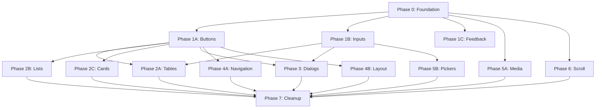

# UI Component Library - Tasks

## Implementation Summary

| Phase | Status | Completed Tasks | Notes |
|-------|--------|-----------------|-------|
| Phase 0 | ✅ Complete | 9/9 | Foundation setup done |
| Phase 1A | ✅ Complete | 6/6 | All 5 button components |
| Phase 1B | ⚠️ Partial | 10/12 | Missing: AppFile, AppUploader |
| Phase 1C | ✅ Complete | 8/8 | +CircularProgress bonus |
| Phase 2A | ⚠️ Partial | 2/7 | Only DataTable done |
| Phase 2B | ⚠️ Partial | 3/8 | Only AppList, ListItem done |
| Phase 2C | ✅ Complete | 7/7 | All 5 card components |
| Phase 3 | ✅ Complete | 11/11 | All dialogs + composables refactored |
| Phase 4A | ✅ Complete | 9/9 | All 7 navigation components (including SidebarItem) |
| Phase 4B | ✅ Complete | 8/8 | All 6 layout components |
| Phase 5A | ✅ Complete | 6/6 | All 4 media components |
| Phase 5B | ✅ Complete | 7/7 | All 5 picker components |
| Phase 6 | ✅ Complete | 8/8 | All 6 scroll components |
| Phase 7 | ⚠️ Partial | 2/8 | DarkModeToggle not migrated |

**Total Components Implemented**: 63 (vs 80+ originally planned)

---

## Phase 0: Foundation Setup (P1 - MVP)

**Target**: Story 1 - Cài đặt nền tảng  
**Estimated**: 2-3 ngày  
**Prerequisites**: None  
**Status**: ✅ Complete

| # | Task | Files | DoD | Status |
|---|------|-------|-----|--------|
| 0.1 | Thêm QuasarResolver vào vite config | `vite.config.mts` | QuasarResolver được import và thêm vào resolvers array, build thành công | [x] |
| 0.2 | Tạo folder structure cho ui components | `src/components/ui/` | Tạo 12 thư mục: buttons, inputs, feedback, tables, lists, cards, dialogs, navigation, layout, media, pickers, scroll, common | [x] |
| 0.3 | Tạo base types | `src/types/ui/base.ts` | BaseProps, ColorType, SizeType, VariantType, LabeledProps, ValidatableProps interfaces được định nghĩa | [x] |
| 0.4 | Tạo button types | `src/types/ui/buttons.ts` | AppButtonProps, IconButtonProps, ButtonGroupProps, ButtonToggleProps, ButtonDropdownProps được định nghĩa | [x] |
| 0.5 | Tạo types barrel export | `src/types/ui/index.ts` | Export tất cả types, update `src/types/index.ts` để re-export | [x] |
| 0.6 | Tạo template AppButton component | `src/components/ui/buttons/AppButton.vue` | Component wrap QBtn với props mapping, Vietnamese defaults, emit click event | [x] |
| 0.7 | Tạo buttons barrel export | `src/components/ui/buttons/index.ts` | Export AppButton | [x] |
| 0.8 | Tạo root barrel export | `src/components/ui/index.ts` | Re-export từ buttons (sẽ thêm các category khác sau) | [x] |
| 0.9 | Verify auto-import hoạt động | N/A | Sử dụng AppButton trong một page, không cần import thủ công, type-check pass | [x] |

**Checkpoint**: ✅ `npm run type-check` pass, AppButton render được trong demo page

---

## Phase 1A: Core Components - Buttons (P1 - MVP)

**Target**: Story 2 - Buttons  
**Estimated**: 1-2 ngày  
**Prerequisites**: Phase 0  
**Status**: ✅ Complete

| # | Task | Files | DoD | Status |
|---|------|-------|-----|--------|
| 1A.1 | Hoàn thiện AppButton với tất cả variants | `src/components/ui/buttons/AppButton.vue` | Support variant, size, outlined, flat, round, dense, loading, disabled, icon, iconRight, to props | [x] |
| 1A.2 | Tạo IconButton component | `src/components/ui/buttons/IconButton.vue` | Wrap QBtn với icon-only style, tooltip support, size/color props | [x] |
| 1A.3 | Tạo ButtonGroup component | `src/components/ui/buttons/ButtonGroup.vue` | Wrap QBtnGroup với outlined, spread, push props, slot default | [x] |
| 1A.4 | Tạo ButtonToggle component | `src/components/ui/buttons/ButtonToggle.vue` | Wrap QBtnToggle với v-model, options array, spread/outline/color props | [x] |
| 1A.5 | Tạo ButtonDropdown component | `src/components/ui/buttons/ButtonDropdown.vue` | Extend AppButton với dropdown menu, split mode support | [x] |
| 1A.6 | Update barrel exports | `src/components/ui/buttons/index.ts` | Export tất cả 5 button components | [x] |

**Checkpoint**: ✅ Tất cả button components render và hoạt động trong demo page

---

## Phase 1B: Core Components - Inputs (P1 - MVP)

**Target**: Story 3 - Inputs  
**Estimated**: 2-3 ngày  
**Prerequisites**: Phase 0  
**Status**: ⚠️ Partial (8/10 components)

| # | Task | Files | DoD | Status |
|---|------|-------|-----|--------|
| 1B.1 | Tạo input types | `src/types/ui/inputs.ts` | AppInputProps, AppSelectProps, AppCheckboxProps, AppToggleProps, SearchInputProps được định nghĩa | [x] |
| 1B.2 | Tạo AppInput component | `src/components/ui/inputs/AppInput.vue` | Wrap QInput với outlined default, clearable, validation rules, Vietnamese error messages | [x] |
| 1B.3 | Tạo AppSelect component | `src/components/ui/inputs/AppSelect.vue` | Wrap QSelect với options, multiple, useChips, emptyLabel="Không có lựa chọn" | [x] |
| 1B.4 | Tạo AppCheckbox component | `src/components/ui/inputs/AppCheckbox.vue` | Wrap QCheckbox với v-model, label, leftLabel, color props | [x] |
| 1B.5 | Tạo AppToggle component | `src/components/ui/inputs/AppToggle.vue` | Wrap QToggle với v-model, label, icon support | [x] |
| 1B.6 | Tạo AppSlider component | `src/components/ui/inputs/AppSlider.vue` | Wrap QSlider với v-model, min, max, step, label props | [x] |
| 1B.7 | Tạo AppRange component | `src/components/ui/inputs/AppRange.vue` | Wrap QRange với v-model (min/max object), snap, markers | [x] |
| 1B.8 | Tạo SearchInput component | `src/components/ui/inputs/SearchInput.vue` | Extend AppInput với debounce, search icon, clearable, loading state | [x] |
| 1B.9 | Tạo AppTextarea component | `src/components/ui/inputs/AppTextarea.vue` | Wrap QInput type=textarea với autogrow, counter props | [x] |
| 1B.10 | Tạo AppFile component | `src/components/ui/inputs/AppFile.vue` | Wrap QFile với accept, multiple, maxFileSize props | [ ] ⚠️ NOT IMPLEMENTED |
| 1B.11 | Tạo AppUploader component | `src/components/ui/inputs/AppUploader.vue` | Wrap QUploader với drag-drop, progress, preview | [ ] ⚠️ NOT IMPLEMENTED |
| 1B.12 | Update types và barrel exports | `src/types/ui/index.ts`, `src/components/ui/inputs/index.ts`, `src/components/ui/index.ts` | Export tất cả input types và components | [x] |

**Checkpoint**: ⚠️ Form với input components validate và submit thành công (missing file upload components)

---

## Phase 1C: Core Components - Feedback (P1 - MVP)

**Target**: Story 4 - Feedback  
**Estimated**: 1 ngày  
**Prerequisites**: Phase 0  
**Status**: ✅ Complete (+1 bonus component)

| # | Task | Files | DoD | Status |
|---|------|-------|-----|--------|
| 1C.1 | Tạo feedback types | `src/types/ui/feedback.ts` | AppSpinnerProps, AppProgressProps, EmptyStateProps, AppBannerProps được định nghĩa | [x] |
| 1C.2 | Tạo AppSpinner component | `src/components/ui/feedback/AppSpinner.vue` | Wrap QSpinner với size, color, thickness props | [x] |
| 1C.3 | Tạo AppProgress component | `src/components/ui/feedback/AppProgress.vue` | Wrap QLinearProgress với value, indeterminate, color, stripe props | [x] |
| 1C.3b | Tạo CircularProgress component (BONUS) | `src/components/ui/feedback/CircularProgress.vue` | Wrap QCircularProgress với value, size, color, thickness props | [x] ✨ |
| 1C.4 | Tạo AppSkeleton component | `src/components/ui/feedback/AppSkeleton.vue` | Wrap QSkeleton với type (text/rect/circle), animation, size | [x] |
| 1C.5 | Tạo EmptyState component | `src/components/ui/feedback/EmptyState.vue` | Custom component với icon, title="Không có dữ liệu", description, action slot | [x] |
| 1C.6 | Tạo AppBanner component | `src/components/ui/feedback/AppBanner.vue` | Wrap QBanner với type (info/warning/error/success), closable, icon auto-mapping | [x] |
| 1C.7 | Tạo InnerLoading component | `src/components/ui/feedback/InnerLoading.vue` | Wrap QInnerLoading với showing, label, color props | [x] |
| 1C.8 | Update barrel exports | `src/components/ui/feedback/index.ts`, `src/components/ui/index.ts` | Export tất cả feedback components | [x] |

**Checkpoint**: ✅ Loading states và empty states hiển thị đúng với Vietnamese text

---

## Phase 2A: Data Display - Tables (P2)

**Target**: Story 5 - Tables  
**Estimated**: 2 ngày  
**Prerequisites**: Phase 1  
**Status**: ⚠️ Partial (1/5 components)

| # | Task | Files | DoD | Status |
|---|------|-------|-----|--------|
| 2A.1 | Tạo table types | `src/types/ui/data-display.ts` | DataTableProps, DataTableColumn, TablePaginationProps, TableActionsProps được định nghĩa | [x] |
| 2A.2 | Tạo DataTable component | `src/components/ui/tables/DataTable.vue` | Wrap QTable với columns, rows, loading, pagination, selection, filter, Vietnamese pagination labels | [x] |
| 2A.3 | Tạo EditableCell component | `src/components/ui/tables/EditableCell.vue` | Inline editing cell với v-model, type (text/number/select), save/cancel | [ ] ⚠️ NOT IMPLEMENTED |
| 2A.4 | Tạo TableActions component | `src/components/ui/tables/TableActions.vue` | Preset actions: edit, delete, view, copy với icons và tooltips | [ ] ⚠️ NOT IMPLEMENTED |
| 2A.5 | Tạo TablePagination component | `src/components/ui/tables/TablePagination.vue` | Custom pagination với "Trang X / Y", "Hiển thị X-Y của Z" labels | [ ] ⚠️ NOT IMPLEMENTED |
| 2A.6 | Tạo TableFilter component | `src/components/ui/tables/TableFilter.vue` | Filter input với column selector, operator selector, value input | [ ] ⚠️ NOT IMPLEMENTED |
| 2A.7 | Update barrel exports | `src/components/ui/tables/index.ts`, `src/components/ui/index.ts` | Export tất cả table components | [x] |

**Checkpoint**: ⚠️ DataTable hiển thị data với sort, pagination hoạt động (advanced components deferred)

---

## Phase 2B: Data Display - Lists (P2)

**Target**: Story 6 (Lists)  
**Estimated**: 1.5 ngày  
**Prerequisites**: Phase 1  
**Status**: ⚠️ Partial (2/6 components)

| # | Task | Files | DoD | Status |
|---|------|-------|-----|--------|
| 2B.1 | Tạo list types | `src/types/ui/data-display.ts` | AppListProps, ListItemProps, AppTreeProps | [x] |
| 2B.2 | Tạo AppList component | `src/components/ui/lists/AppList.vue` | Wrap QList với bordered, separator, dense props | [x] |
| 2B.3 | Tạo ListItem component | `src/components/ui/lists/ListItem.vue` | Wrap QItem với clickable, active, v-ripple, slots: left, default, right | [x] |
| 2B.4 | Tạo AppTree component | `src/components/ui/lists/AppTree.vue` | Wrap QTree với nodes, v-model:ticked, tick-strategy, filter | [ ] ⚠️ NOT IMPLEMENTED |
| 2B.5 | Tạo TreeNode component | `src/components/ui/lists/TreeNode.vue` | Custom tree node với icon, expandable, lazy-load support | [ ] ⚠️ NOT IMPLEMENTED |
| 2B.6 | Tạo ExpansionItem component | `src/components/ui/lists/ExpansionItem.vue` | Wrap QExpansionItem với label, caption, icon, v-model | [ ] ⚠️ NOT IMPLEMENTED |
| 2B.7 | Tạo ExpansionList component | `src/components/ui/lists/ExpansionList.vue` | Container cho ExpansionItems với accordion mode | [ ] ⚠️ NOT IMPLEMENTED |
| 2B.8 | Update barrel exports | `src/components/ui/lists/index.ts`, `src/components/ui/index.ts` | Export tất cả list components | [x] |

**Checkpoint**: ⚠️ Basic AppList và ListItem done (Tree và Expansion components deferred)

---

## Phase 2C: Data Display - Cards (P2)

**Target**: Story 6 (Cards)  
**Estimated**: 1.5 ngày  
**Prerequisites**: Phase 1  
**Status**: ✅ Complete

| # | Task | Files | DoD | Status |
|---|------|-------|-----|--------|
| 2C.1 | Tạo card types | `src/types/ui/data-display.ts` | AppCardProps, StatCardProps, InfoCardProps, AppBadgeProps, AppChipProps | [x] |
| 2C.2 | Tạo AppCard component | `src/components/ui/cards/AppCard.vue` | Wrap QCard với slots: header, default, actions, flat/bordered props | [x] |
| 2C.3 | Tạo InfoCard component | `src/components/ui/cards/InfoCard.vue` | Card với title, subtitle, icon, content slot | [x] |
| 2C.4 | Tạo StatCard component | `src/components/ui/cards/StatCard.vue` | Card với title, value, trend (up/down/neutral), comparison, icon | [x] |
| 2C.5 | Tạo AppBadge component | `src/components/ui/cards/AppBadge.vue` | Wrap QBadge với color, floating, transparent props | [x] |
| 2C.6 | Tạo AppChip component | `src/components/ui/cards/AppChip.vue` | Wrap QChip với color, icon, removable, clickable | [x] |
| 2C.7 | Update barrel exports | `src/components/ui/cards/index.ts`, `src/components/ui/index.ts` | Export tất cả card components | [x] |

**Checkpoint**: ✅ StatCard hiển thị metrics với trend indicators đúng

---

## Phase 3: Dialogs & Overlays (P2)

**Target**: Story 7 - Dialogs  
**Estimated**: 2-3 ngày  
**Prerequisites**: Phase 1  
**Status**: ✅ Complete

| # | Task | Files | DoD | Status |
|---|------|-------|-----|--------|
| 3.1 | Tạo dialog types | `src/types/ui/dialogs.ts` | AppDialogProps, ConfirmDialogProps, FormDialogProps, DeleteDialogProps, AppMenuProps | [x] |
| 3.2 | Tạo AppDialog component | `src/components/ui/dialogs/AppDialog.vue` | Wrap QDialog với v-model, persistent, maximized, slots: header, default, actions | [x] |
| 3.3 | Tạo ConfirmDialog component | `src/components/ui/dialogs/ConfirmDialog.vue` | Dialog với title, message, confirmText="Đồng ý", cancelText="Hủy", type | [x] |
| 3.4 | Tạo FormDialog component | `src/components/ui/dialogs/FormDialog.vue` | Dialog với form slot, submit/cancel actions, validation | [x] |
| 3.5 | Tạo DeleteDialog component | `src/components/ui/dialogs/DeleteDialog.vue` | Warning dialog với confirmation input, delete button | [x] |
| 3.6 | Tạo AppMenu component | `src/components/ui/dialogs/AppMenu.vue` | Wrap QMenu với items array | [x] |
| 3.7 | Tạo AppTooltip component | `src/components/ui/dialogs/AppTooltip.vue` | Wrap QTooltip với text, delay, anchor props | [x] |
| 3.8 | Tạo PopupEdit component | `src/components/ui/dialogs/PopupEdit.vue` | Wrap QPopupEdit với v-model, input type, buttons | [x] |
| 3.9 | Refactor useConfirm.ts | `src/composables/useConfirm.ts` | Wrap $q.dialog() với confirm(), confirmWarning(), confirmDelete() helpers | [x] |
| 3.10 | Refactor useSnackbar.ts | `src/composables/useSnackbar.ts` | Wrap $q.notify() với show(), success(), error(), warning(), info(), loading() | [x] |
| 3.11 | Update barrel exports | `src/components/ui/dialogs/index.ts`, `src/components/ui/index.ts` | Export tất cả dialog components | [x] |

**Checkpoint**: ✅ useConfirm().confirm() return Promise và dialog hiển thị đúng

---

## Phase 4A: Navigation (P2)

**Target**: Story 8 (Navigation)  
**Estimated**: 1.5 ngày  
**Prerequisites**: Phase 1  
**Status**: ✅ Complete

| # | Task | Files | DoD | Status |
|---|------|-------|-----|--------|
| 4A.1 | Tạo navigation types | `src/types/ui/navigation.ts` | AppTabsProps, TabPanelProps, AppBreadcrumbsProps, AppPaginationProps, AppStepperProps | [x] |
| 4A.2 | Tạo AppTabs component | `src/components/ui/navigation/AppTabs.vue` | Wrap QTabs với v-model, inline-label, dense, align props | [x] |
| 4A.3 | Tạo TabPanel component | `src/components/ui/navigation/TabPanel.vue` | Wrap QTabPanel với name, keep-alive props | [x] |
| 4A.4 | Tạo AppBreadcrumbs component | `src/components/ui/navigation/AppBreadcrumbs.vue` | Wrap QBreadcrumbs với items array, separator, active-color | [x] |
| 4A.5 | Tạo AppPagination component | `src/components/ui/navigation/AppPagination.vue` | Wrap QPagination với v-model, max, boundary-links, direction-links, Vietnamese labels | [x] |
| 4A.6 | Tạo AppStepper component | `src/components/ui/navigation/AppStepper.vue` | Wrap QStepper với v-model, vertical/horizontal, header-nav, keep-alive | [x] |
| 4A.7 | Tạo StepperStep component | `src/components/ui/navigation/StepperStep.vue` | Wrap QStep với name, title, caption, icon, done, error | [x] |
| 4A.8 | Tạo SidebarItem component | `src/components/ui/navigation/SidebarItem.vue` | Recursive nav item with expansion, uses @/types/navigation (NavItem) | [x] ✨ |
| 4A.9 | Update barrel exports | `src/components/ui/navigation/index.ts`, `src/components/ui/index.ts` | Export tất cả navigation components | [x] |

**Checkpoint**: ✅ Tabs và Stepper navigate đúng giữa các steps

---

## Phase 4B: Layout (P2)

**Target**: Story 8 (Layout)  
**Estimated**: 1.5 ngày  
**Prerequisites**: Phase 1  
**Status**: ✅ Complete

| # | Task | Files | DoD | Status |
|---|------|-------|-----|--------|
| 4B.1 | Tạo layout types | `src/types/ui/layout.ts` | AppToolbarProps, PageHeaderProps, SectionHeaderProps, AppDrawerProps | [x] |
| 4B.2 | Tạo AppToolbar component | `src/components/ui/layout/AppToolbar.vue` | Wrap QToolbar với dense, inset props, slots: left, title, right | [x] |
| 4B.3 | Tạo AppSeparator component | `src/components/ui/layout/AppSeparator.vue` | Wrap QSeparator với spaced, vertical, inset props | [x] |
| 4B.4 | Tạo AppSpace component | `src/components/ui/layout/AppSpace.vue` | Utility component tạo spacing với size prop | [x] |
| 4B.5 | Tạo PageHeader component | `src/components/ui/layout/PageHeader.vue` | Composite: title, subtitle, breadcrumbs slot, actions slot | [x] |
| 4B.6 | Tạo SectionHeader component | `src/components/ui/layout/SectionHeader.vue` | Section title với optional subtitle và action slot | [x] |
| 4B.7 | Tạo AppDrawer component | `src/components/ui/layout/AppDrawer.vue` | Wrap QDrawer với v-model, side, bordered, width props | [x] |
| 4B.8 | Update barrel exports | `src/components/ui/layout/index.ts`, `src/components/ui/index.ts` | Export tất cả layout components | [x] |

**Checkpoint**: ✅ PageHeader render với breadcrumbs và actions đúng vị trí

---

## Phase 5A: Media (P3)

**Target**: Story 9 (Media)  
**Estimated**: 1 ngày  
**Prerequisites**: Phase 1  
**Status**: ✅ Complete

| # | Task | Files | DoD | Status |
|---|------|-------|-----|--------|
| 5A.1 | Tạo media types | `src/types/ui/media.ts` | AppCarouselProps, AppImageProps, AppVideoProps, AppParallaxProps | [x] |
| 5A.2 | Tạo AppCarousel component | `src/components/ui/media/AppCarousel.vue` | Wrap QCarousel với slides, autoplay, arrows, thumbnails, v-model | [x] |
| 5A.3 | Tạo AppImage component | `src/components/ui/media/AppImage.vue` | Wrap QImg với src, alt, ratio, placeholder, spinner-color | [x] |
| 5A.4 | Tạo AppVideo component | `src/components/ui/media/AppVideo.vue` | Wrap QVideo với src, ratio props | [x] |
| 5A.5 | Tạo AppParallax component | `src/components/ui/media/AppParallax.vue` | Wrap QParallax với src, height, speed props | [x] |
| 5A.6 | Update barrel exports | `src/components/ui/media/index.ts`, `src/components/ui/index.ts` | Export tất cả media components | [x] |

**Checkpoint**: ✅ Carousel autoplay và navigate đúng

---

## Phase 5B: Pickers (P3)

**Target**: Story 9 (Pickers)  
**Estimated**: 2 ngày  
**Prerequisites**: Phase 1  
**Status**: ✅ Complete

| # | Task | Files | DoD | Status |
|---|------|-------|-----|--------|
| 5B.1 | Tạo picker types | `src/types/ui/pickers.ts` | DatePickerProps, TimePickerProps, ColorPickerProps, AppEditorProps, FilePickerProps | [x] |
| 5B.2 | Tạo DatePicker component | `src/components/ui/pickers/DatePicker.vue` | Wrap QDate với v-model, format="DD/MM/YYYY", locale Vietnamese, range mode | [x] |
| 5B.3 | Tạo TimePicker component | `src/components/ui/pickers/TimePicker.vue` | Wrap QTime với v-model, format24h (default), now-btn | [x] |
| 5B.4 | Tạo ColorPicker component | `src/components/ui/pickers/ColorPicker.vue` | Wrap QColor với v-model, default-value, no-header-tabs props | [x] |
| 5B.5 | Tạo AppEditor component | `src/components/ui/pickers/AppEditor.vue` | Wrap QEditor với v-model, toolbar config, placeholder, min-height | [x] |
| 5B.6 | Tạo FilePicker component | `src/components/ui/pickers/FilePicker.vue` | Composite: input + preview với accept, multiple, maxSize, preview props | [x] |
| 5B.7 | Update barrel exports | `src/components/ui/pickers/index.ts`, `src/components/ui/index.ts` | Export tất cả picker components | [x] |

**Checkpoint**: ✅ DatePicker hiển thị calendar tiếng Việt với format DD/MM/YYYY

---

## Phase 6: Scroll & Advanced (P3)

**Target**: Story 10 - Scroll  
**Estimated**: 2 ngày  
**Prerequisites**: Phase 1  
**Status**: ✅ Complete

| # | Task | Files | DoD | Status |
|---|------|-------|-----|--------|
| 6.1 | Tạo scroll types | `src/types/ui/scroll.ts` | ScrollAreaProps, VirtualScrollProps, InfiniteScrollProps, TimelineProps | [x] |
| 6.2 | Tạo ScrollArea component | `src/components/ui/scroll/ScrollArea.vue` | Wrap QScrollArea với thumb-style, bar-style, visible props | [x] |
| 6.3 | Tạo VirtualScroll component | `src/components/ui/scroll/VirtualScroll.vue` | Wrap QVirtualScroll với items, virtual-scroll-slice-size, scroll-target | [x] |
| 6.4 | Tạo InfiniteScroll component | `src/components/ui/scroll/InfiniteScroll.vue` | Wrap QInfiniteScroll với @load, offset, debounce, reverse props | [x] |
| 6.5 | Tạo PullToRefresh component | `src/components/ui/scroll/PullToRefresh.vue` | Wrap QPullToRefresh với @refresh, color, icon props | [x] |
| 6.6 | Tạo Timeline component | `src/components/ui/scroll/Timeline.vue` | Wrap QTimeline với color, layout (dense/comfortable/loose) props | [x] |
| 6.7 | Tạo TimelineEntry component | `src/components/ui/scroll/TimelineEntry.vue` | Wrap QTimelineEntry với title, subtitle, body, icon, color, side | [x] |
| 6.8 | Update barrel exports | `src/components/ui/scroll/index.ts`, `src/components/ui/index.ts` | Export tất cả scroll components | [x] |

**Checkpoint**: ✅ VirtualScroll render 1000+ items mượt mà, InfiniteScroll load thêm data

---

## Phase 7: Cleanup & Documentation (P3)

**Target**: Story 11 - Documentation  
**Estimated**: 2-3 ngày  
**Prerequisites**: All previous phases  
**Status**: ⚠️ Partial (type consolidation done, cleanup pending)

| # | Task | Files | DoD | Status |
|---|------|-------|-----|--------|
| 7.1 | Split components.vue thành demo pages | `src/pages/components/*.vue` | Tạo overview page và sub-pages cho mỗi category | [ ] |
| 7.1a | → Create Section 1: Navigation & Actions | `src/pages/components/navigation-actions.vue` | Extract lines 16-131 from components.vue | [ ] |
| 7.1b | → Create Section 2: Form Controls | `src/pages/components/forms.vue` | Extract lines 132-335 from components.vue | [ ] |
| 7.1c | → Create Section 3: Data Display | `src/pages/components/data-display.vue` | Extract lines 336-466 from components.vue | [ ] |
| 7.1d | → Create Section 4: Feedback | `src/pages/components/feedback.vue` | Extract lines 467-604 from components.vue | [ ] |
| 7.1e | → Create Section 5: Containment | `src/pages/components/containment.vue` | Extract lines 605-739 from components.vue | [ ] |
| 7.1f | → Create Section 6: Selection & Tabs | `src/pages/components/selection-tabs.vue` | Extract lines 740-886 from components.vue | [ ] |
| 7.1g | → Create Section 7: Navigation | `src/pages/components/navigation.vue` | Extract lines 887-978 from components.vue | [ ] |
| 7.1h | → Create Section 8: Layout & Others | `src/pages/components/layout.vue` | Extract lines 979-1237 from components.vue | [ ] |
| 7.1i | → Create index with links to sections | `src/pages/components/index.vue` | Overview page linking to 8 section pages | [ ] |
| 7.2 | Migrate DarkModeToggle | `src/components/ui/common/DarkModeToggle.vue` | Di chuyển từ `src/components/`, update imports trong App.vue | [ ] ⚠️ NOT MIGRATED |
| 7.3 | Consolidate existing types | `src/types/ui/*.ts` | Di chuyển types từ `src/types/components.ts` vào files tương ứng, keep backward compat | [x] |
| 7.4 | Update src/types/index.ts | `src/types/index.ts` | Re-export từ ui/ để backward compatible | [x] |
| 7.5 | Thêm JSDoc cho button components | `src/components/ui/buttons/*.vue` | JSDoc cho tất cả props và methods | [ ] |
| 7.6 | Thêm JSDoc cho input components | `src/components/ui/inputs/*.vue` | JSDoc cho tất cả props và methods | [ ] |
| 7.7 | Thêm JSDoc cho các components còn lại | `src/components/ui/**/*.vue` | JSDoc cho tất cả props và methods | [ ] |
| 7.8 | Document composables API | `src/composables/*.ts` | JSDoc cho all 6 composables (useDialog, useLoading, useDarkMode, useSidebar, useConfirm, useSnackbar) | [ ] |
| 7.9 | Final type-check và build test | N/A | `npm run type-check` và `npm run build` pass không lỗi | [ ] |

**Checkpoint**: ⚠️ Types consolidated, demo pages và documentation pending

**Note**: components.vue is 1237 lines with 8 sections that need to be split into individual page files.

---

## Dependencies Graph

## Risk Mitigation

| Risk | Mitigation | Phase |
|------|------------|-------|
| Scope creep (80+ components) | Focus on P1 components first, defer P3 if needed | All |
| Breaking existing code | Backward compat exports, incremental migration | Phase 7 |
| Inconsistent patterns | Template component (Phase 0) làm reference cho tất cả | Phase 0 |
| TypeScript complexity | Start simple, add generics only when needed | Phase 0 |

## Estimated Total Effort

| Priority | Phases | Estimated Days | Actual Status |
|----------|--------|----------------|---------------|
| P1 (MVP) | 0, 1A, 1B, 1C | 6-8 ngày | ✅ Complete (1B partial) |
| P2 | 2A, 2B, 2C, 3, 4A, 4B | 9-12 ngày | ⚠️ Mostly Complete (2A, 2B partial) |
| P3 | 5A, 5B, 6, 7 | 7-10 ngày | ⚠️ 5A, 5B, 6 Complete; 7 partial |
| **Total** | **All** | **22-30 ngày** | **~80% Complete** |

---

## Implementation Notes

**Last Synced**: 2026-01-28  
**Status**: Synced from implementation analysis

### Components NOT Implemented (Deferred)

| Category | Components | Reason |
|----------|------------|--------|
| inputs | AppFile, AppUploader | File upload components deferred |
| tables | EditableCell, TableActions, TablePagination, TableFilter | Advanced table components deferred |
| lists | AppTree, TreeNode, ExpansionItem, ExpansionList | Tree/expansion components deferred |
| common | DarkModeToggle migration | Still in `src/components/` |

### Bonus Components Implemented

| Category | Component | Description |
|----------|-----------|-------------|
| feedback | CircularProgress | Wraps QCircularProgress with standard props |

### Composables Implemented (6 total)

**useConfirm.ts** (wraps $q.dialog()):
- `confirm(options)` - Generic confirmation dialog
- `confirmWarning(options)` - Warning-styled confirmation
- `confirmDelete(itemName?)` - Delete confirmation with Vietnamese defaults

**useSnackbar.ts** (wraps $q.notify()):
- `show(options)` - Generic notification
- `success(message)` - Green success notification
- `error(message)` - Red error notification  
- `warning(message)` - Orange warning notification
- `info(message)` - Blue info notification
- `loading(message)` - Loading notification with spinner

**useDialog.ts** (generic dialog state):
- `isOpen` - Ref<boolean> for visibility
- `data` - Ref<T> for typed payload
- `open(payload?)` - Open with optional data
- `close()` - Close and reset
- `toggle()` - Toggle visibility

**useLoading.ts** (count-based loading):
- `isLoading` - ComputedRef<boolean> for state
- `loadingCount` - Number of active operations
- `start()` / `stop()` - Manual control
- `reset()` - Reset to initial
- `withLoading(fn)` - Async wrapper (auto start/stop)

**useDarkMode.ts** (theme switching):
- `preference` - 'auto' | 'light' | 'dark'
- `setMode(mode)` - Set and persist to localStorage
- `toggle()` - Cycle light → dark → auto
- `isDark()` - Check if dark active
- `init()` - Apply on mount

**useSidebar.ts** (global sidebar state):
- `isOpen` - WritableComputedRef (v-model compatible)
- `navItems` - Navigation items array
- `toggle()` / `open()` / `close()` - State control
- Uses module-level ref for shared state
- Types from `@/types/navigation` (NavItem)

### Vietnamese Default Strings Used

| String | Context |
|--------|---------|
| 'Xác nhận' | Confirm dialog title |
| 'Đồng ý' | Confirm button text |
| 'Hủy' | Cancel button text |
| 'Xác nhận xóa' | Delete dialog title |
| 'Xóa' | Delete button text |
| 'Không có dữ liệu' | EmptyState default message |
