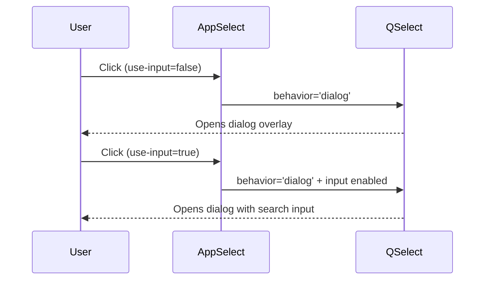
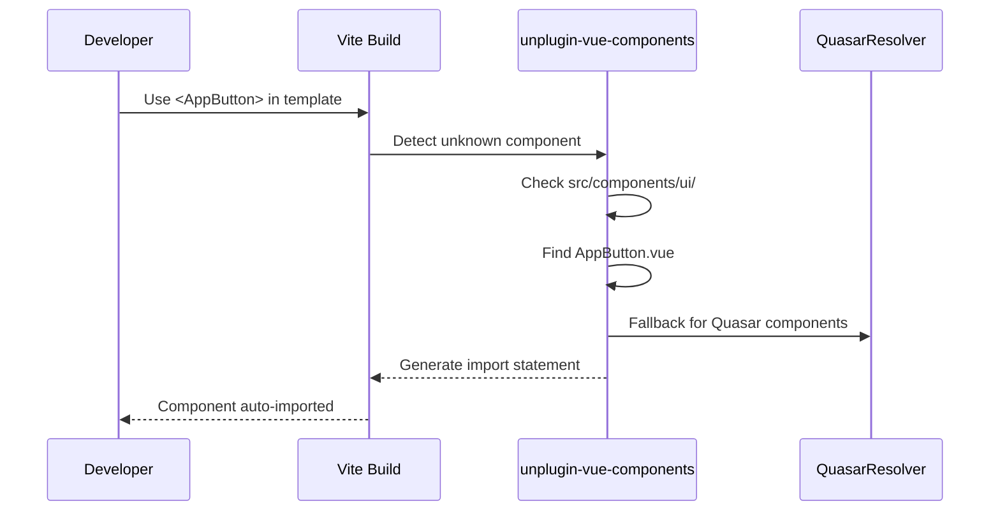
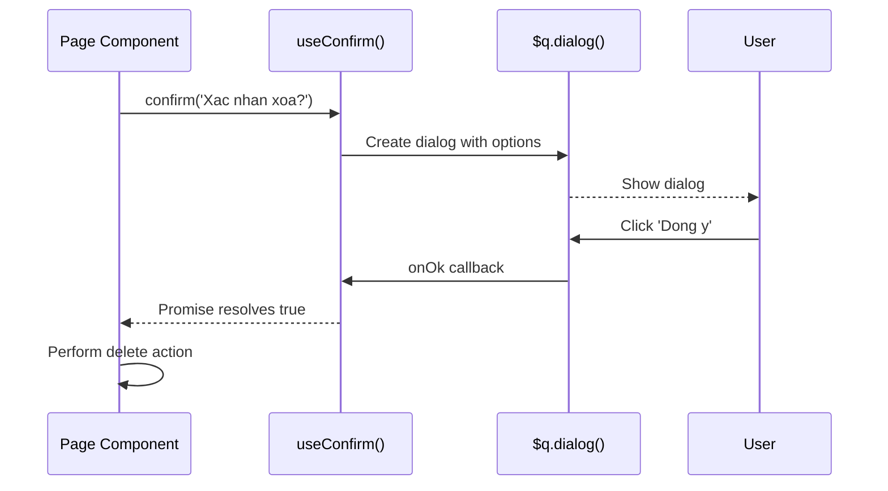

# UI Component Library - Technical Design

## Architecture Overview

UI component library uses "Wrapper Component" pattern - wrapping Quasar components with abstraction layer to standardize API, add defaults, and ensure type safety.

Pattern reference: `src/components/DarkModeToggle.vue` (lines 1-25)

**Implementation Status**: 63 components implemented across 12 categories

## Implemented Component Inventory

| Category | Components | Count |
|----------|------------|-------|
| buttons | AppButton, IconButton, ButtonGroup, ButtonToggle, ButtonDropdown | 5 |
| inputs | AppInput, AppSelect, SearchInput, AppCheckbox, AppToggle, AppSlider, AppRange, AppTextarea | 8 |
| feedback | AppSpinner, AppProgress, CircularProgress, AppSkeleton, EmptyState, AppBanner, InnerLoading | 7 |
| dialogs | AppDialog, FormDialog, ConfirmDialog, DeleteDialog, PopupEdit, AppMenu, AppTooltip | 7 |
| tables | DataTable | 1 |
| lists | AppList, ListItem | 2 |
| cards | AppCard, AppBadge, AppChip, InfoCard, StatCard | 5 |
| navigation | AppBreadcrumbs, AppPagination, AppTabs, TabPanel, AppStepper, StepperStep, SidebarItem | 7 |
| layout | PageHeader, SectionHeader, AppDrawer, AppToolbar, AppSeparator, AppSpace | 6 |
| media | AppCarousel, AppImage, AppVideo, AppParallax | 4 |
| pickers | DatePicker, TimePicker, ColorPicker, AppEditor, FilePicker | 5 |
| scroll | ScrollArea, VirtualScroll, InfiniteScroll, PullToRefresh, Timeline, TimelineEntry | 6 |

**Note**: SidebarItem uses `@/types/navigation` (NavItem type), not `@/types/ui`

**Type Files**: base.ts, buttons.ts, inputs.ts, feedback.ts, data-display.ts, dialogs.ts, navigation.ts, layout.ts, media.ts, pickers.ts, scroll.ts, index.ts (12 files)

## Folder Structure

```
src/
├── components/
│   └── ui/
│       ├── index.ts                    # Barrel export all components
│       ├── buttons/
│       │   ├── index.ts
│       │   ├── AppButton.vue           ✅
│       │   ├── IconButton.vue          ✅
│       │   ├── ButtonGroup.vue         ✅
│       │   ├── ButtonToggle.vue        ✅
│       │   └── ButtonDropdown.vue      ✅
│       ├── inputs/
│       │   ├── index.ts
│       │   ├── AppInput.vue            ✅
│       │   ├── AppSelect.vue           ✅ (behavior prop added)
│       │   ├── AppCheckbox.vue         ✅
│       │   ├── AppToggle.vue           ✅
│       │   ├── AppSlider.vue           ✅
│       │   ├── AppRange.vue            ✅
│       │   ├── SearchInput.vue         ✅
│       │   ├── AppTextarea.vue         ✅
│       │   ├── AppFile.vue             ⚠️ NOT IMPLEMENTED
│       │   └── AppUploader.vue         ⚠️ NOT IMPLEMENTED
│       ├── feedback/
│       │   ├── index.ts
│       │   ├── AppSpinner.vue          ✅
│       │   ├── AppProgress.vue         ✅
│       │   ├── CircularProgress.vue    ✅ BONUS
│       │   ├── AppSkeleton.vue         ✅
│       │   ├── EmptyState.vue          ✅
│       │   ├── AppBanner.vue           ✅
│       │   └── InnerLoading.vue        ✅
│       ├── tables/
│       │   ├── index.ts
│       │   ├── DataTable.vue           ✅
│       │   ├── EditableCell.vue        ⚠️ NOT IMPLEMENTED
│       │   ├── TableActions.vue        ⚠️ NOT IMPLEMENTED
│       │   ├── TablePagination.vue     ⚠️ NOT IMPLEMENTED
│       │   └── TableFilter.vue         ⚠️ NOT IMPLEMENTED
│       ├── lists/
│       │   ├── index.ts
│       │   ├── AppList.vue             ✅
│       │   ├── ListItem.vue            ✅
│       │   ├── AppTree.vue             ⚠️ NOT IMPLEMENTED
│       │   ├── TreeNode.vue            ⚠️ NOT IMPLEMENTED
│       │   ├── ExpansionItem.vue       ⚠️ NOT IMPLEMENTED
│       │   └── ExpansionList.vue       ⚠️ NOT IMPLEMENTED
│       ├── cards/
│       │   ├── index.ts
│       │   ├── AppCard.vue             ✅
│       │   ├── InfoCard.vue            ✅
│       │   ├── StatCard.vue            ✅
│       │   ├── AppBadge.vue            ✅
│       │   └── AppChip.vue             ✅
│       ├── dialogs/
│       │   ├── index.ts
│       │   ├── AppDialog.vue           ✅
│       │   ├── ConfirmDialog.vue       ✅
│       │   ├── FormDialog.vue          ✅
│       │   ├── DeleteDialog.vue        ✅
│       │   ├── AppMenu.vue             ✅
│       │   ├── AppTooltip.vue          ✅
│       │   └── PopupEdit.vue           ✅
│       ├── navigation/
│       │   ├── index.ts
│       │   ├── AppTabs.vue             ✅
│       │   ├── TabPanel.vue            ✅
│       │   ├── AppBreadcrumbs.vue      ✅
│       │   ├── AppPagination.vue       ✅
│       │   ├── AppStepper.vue          ✅
│       │   ├── StepperStep.vue         ✅
│       │   └── SidebarItem.vue         ✅ (uses @/types/navigation, not @/types/ui)
│       ├── layout/
│       │   ├── index.ts
│       │   ├── AppToolbar.vue          ✅
│       │   ├── AppSeparator.vue        ✅
│       │   ├── AppSpace.vue            ✅
│       │   ├── PageHeader.vue          ✅
│       │   ├── SectionHeader.vue       ✅
│       │   └── AppDrawer.vue           ✅
│       ├── media/
│       │   ├── index.ts
│       │   ├── AppCarousel.vue         ✅
│       │   ├── AppImage.vue            ✅
│       │   ├── AppVideo.vue            ✅
│       │   └── AppParallax.vue         ✅
│       ├── pickers/
│       │   ├── index.ts
│       │   ├── DatePicker.vue          ✅
│       │   ├── TimePicker.vue          ✅
│       │   ├── ColorPicker.vue         ✅
│       │   ├── AppEditor.vue           ✅
│       │   └── FilePicker.vue          ✅
│       ├── scroll/
│       │   ├── index.ts
│       │   ├── ScrollArea.vue          ✅
│       │   ├── VirtualScroll.vue       ✅
│       │   ├── InfiniteScroll.vue      ✅
│       │   ├── PullToRefresh.vue       ✅
│       │   ├── Timeline.vue            ✅
│       │   └── TimelineEntry.vue       ✅
│       └── common/
│           ├── index.ts
│           └── DarkModeToggle.vue      ⚠️ NOT MIGRATED (still in src/components/)
│
├── types/
│   └── ui/
│       ├── index.ts                    # Barrel export ✅
│       ├── base.ts                     # BaseProps, ColorType, SizeType ✅
│       ├── buttons.ts                  # Button component types ✅
│       ├── inputs.ts                   # Input component types ✅ (includes behavior prop)
│       ├── feedback.ts                 # Feedback component types ✅
│       ├── data-display.ts             # Table, List, Card types ✅
│       ├── dialogs.ts                  # Dialog component types ✅
│       ├── navigation.ts               # Navigation types ✅
│       ├── layout.ts                   # Layout types ✅
│       ├── media.ts                    # Media types ✅
│       ├── pickers.ts                  # Picker types ✅
│       └── scroll.ts                   # Scroll types ✅
│
└── composables/
    ├── useConfirm.ts                   # ✅ Wraps $q.dialog()
    ├── useSnackbar.ts                  # ✅ Wraps $q.notify()
    ├── useDialog.ts                    # ✅ Generic dialog state with typed payloads
    ├── useLoading.ts                   # ✅ Count-based loading with withLoading wrapper
    ├── useDarkMode.ts                  # ✅ Theme switching with localStorage persistence
    └── useSidebar.ts                   # ✅ Global sidebar state with nav items
```

## Component Wrapper Pattern

### Template Pattern (AppButton as example)

```vue
<template>
  <q-btn
    v-bind="quasarProps"
    :class="computedClasses"
    @click="handleClick"
  >
    <template v-if="$slots.default" #default>
      <slot />
    </template>
    <template v-if="$slots.loading" #loading>
      <slot name="loading" />
    </template>
  </q-btn>
</template>

<script setup lang="ts">
import { computed } from 'vue'
import type { AppButtonProps } from '@/types/ui/buttons'

// Props with Vietnamese defaults
const props = withDefaults(defineProps<AppButtonProps>(), {
  variant: 'primary',
  size: 'md',
  outlined: false,
  loading: false,
  disabled: false,
})

const emit = defineEmits<{
  click: [event: MouseEvent]
}>()

// Map app props to Quasar props
const quasarProps = computed(() => ({
  color: variantColorMap[props.variant],
  size: sizeMap[props.size],
  outline: props.outlined,
  loading: props.loading,
  disable: props.disabled, // Note: Quasar uses 'disable', not 'disabled'
  icon: props.icon,
  iconRight: props.iconRight,
  to: props.to,
  label: props.label,
}))

const variantColorMap: Record<string, string> = {
  primary: 'primary',
  secondary: 'secondary', 
  danger: 'negative',
  warning: 'warning',
  success: 'positive',
  info: 'info',
}

const sizeMap: Record<string, string> = {
  xs: 'xs',
  sm: 'sm',
  md: 'md',
  lg: 'lg',
}

const computedClasses = computed(() => [
  props.class,
])

const handleClick = (event: MouseEvent) => {
  if (!props.disabled && !props.loading) {
    emit('click', event)
  }
}
</script>
```

### v-model Pattern (for Input Components)

Components that use v-model implement a computed pattern for two-way binding:

```vue
<script setup lang="ts">
import { computed } from 'vue'

const props = defineProps<{
  modelValue?: string | number
}>()

const emit = defineEmits<{
  'update:modelValue': [value: string | number]
}>()

// Computed for v-model two-way binding
const model = computed({
  get: () => props.modelValue,
  set: (value) => emit('update:modelValue', value)
})
</script>

<template>
  <q-input v-model="model" />
</template>
```

This pattern is used consistently across:
- All input components (AppInput, AppSelect, AppTextarea, etc.)
- Toggle components (AppCheckbox, AppToggle)
- Picker components (DatePicker, TimePicker, ColorPicker)
- Dialog components (AppDialog, etc.)

## AppSelect Behavior Prop Fix

### Problem
When `use-input=false`, QSelect's default behavior mode can fail to trigger popup on click.

### Solution
Add explicit `behavior` prop with default `'dialog'` mode to ensure popup opens reliably when `use-input=false`.

### Implementation

**File: `src/types/ui/inputs.ts`** - Add to AppSelectProps:
```typescript
export interface AppSelectProps extends BaseComponentProps, LabeledProps, ValidatableProps {
  // ... existing props ...
  
  /** Popup behavior mode - 'dialog' recommended when use-input=false */
  behavior?: 'menu' | 'dialog'
}
```

**File: `src/components/ui/inputs/AppSelect.vue`**:
- Template: Add `:behavior="behavior"` binding
- Script: Add `behavior: 'dialog'` to withDefaults

### Flow



## TypeScript Interface Pattern

### Base Types (`src/types/ui/base.ts`)

```typescript
/**
 * Base types for UI Component Library
 */

// Colors used throughout library
export type ColorType = 'primary' | 'secondary' | 'positive' | 'negative' | 'warning' | 'info'

// Variant for buttons and interactive components
export type VariantType = 'primary' | 'secondary' | 'danger' | 'warning' | 'success' | 'info'

// Standard sizes
export type SizeType = 'xs' | 'sm' | 'md' | 'lg' | 'xl'

// Base props applied to all components
export interface BaseProps {
  class?: string
  style?: string | Record<string, string>
}

// Props for components with label
export interface LabeledProps extends BaseProps {
  label?: string
  hint?: string
  hideHint?: boolean
}

// Props for components with validation
export interface ValidatableProps extends LabeledProps {
  rules?: ((val: unknown) => boolean | string)[]
  errorMessage?: string
  error?: boolean
}

// Slots type helper
export type SlotProps<T = unknown> = {
  value: T
  index?: number
}
```

### Component-specific Types (`src/types/ui/buttons.ts`)

```typescript
import type { BaseProps, VariantType, SizeType } from './base'
import type { RouteLocationRaw } from 'vue-router'

export interface AppButtonProps extends BaseProps {
  /** Variant style of button */
  variant?: VariantType
  /** Button size */
  size?: SizeType
  /** Display outline style */
  outlined?: boolean
  /** Loading state */
  loading?: boolean
  /** Disable button */
  disabled?: boolean
  /** Icon on left */
  icon?: string
  /** Icon on right */
  iconRight?: string
  /** Vue Router navigation */
  to?: RouteLocationRaw
  /** Label text */
  label?: string
  /** Transparent background */
  flat?: boolean
  /** Round button */
  round?: boolean
  /** Dense mode */
  dense?: boolean
}
```

### Input Types (`src/types/ui/inputs.ts`)

```typescript
import type { ValidatableProps, SizeType, BaseProps } from './base'

export interface AppInputProps extends ValidatableProps {
  modelValue?: string | number
  type?: 'text' | 'password' | 'email' | 'number' | 'tel' | 'url' | 'textarea'
  placeholder?: string
  outlined?: boolean
  filled?: boolean
  dense?: boolean
  clearable?: boolean
  readonly?: boolean
  disabled?: boolean
  autofocus?: boolean
  maxlength?: number
  counter?: boolean
  prefix?: string
  suffix?: string
  mask?: string
}

export interface AppSelectProps<T = unknown> extends ValidatableProps {
  modelValue?: T | T[]
  options: Array<T | { label: string; value: T; disable?: boolean }>
  multiple?: boolean
  useChips?: boolean
  useInput?: boolean
  inputDebounce?: number
  emitValue?: boolean
  mapOptions?: boolean
  optionLabel?: string | ((opt: T) => string)
  optionValue?: string | ((opt: T) => unknown)
  optionDisable?: string | ((opt: T) => boolean)
  clearable?: boolean
  outlined?: boolean
  filled?: boolean
  dense?: boolean
  loading?: boolean
  emptyLabel?: string // Default: "Khong co lua chon"
  /** Popup behavior mode - 'menu' is default, 'dialog' for mobile/nested dialogs */
  behavior?: 'menu' | 'dialog'
}
```

## Barrel Export Strategy

### Category-level export (`src/components/ui/buttons/index.ts`)

```typescript
// Re-export all button components
export { default as AppButton } from './AppButton.vue'
export { default as IconButton } from './IconButton.vue'
export { default as ButtonGroup } from './ButtonGroup.vue'
export { default as ButtonToggle } from './ButtonToggle.vue'
export { default as ButtonDropdown } from './ButtonDropdown.vue'
```

### Root-level export (`src/components/ui/index.ts`)

```typescript
// Buttons
export * from './buttons'

// Inputs
export * from './inputs'

// Feedback
export * from './feedback'

// Tables
export * from './tables'

// Lists
export * from './lists'

// Cards
export * from './cards'

// Dialogs
export * from './dialogs'

// Navigation
export * from './navigation'

// Layout
export * from './layout'

// Media
export * from './media'

// Pickers
export * from './pickers'

// Scroll
export * from './scroll'

// Common
export * from './common'
```

## Composables

### useConfirm.ts - Wrap $q.dialog()

See `src/composables/useConfirm.ts` for full implementation.

API: `confirm()`, `confirmWarning()`, `confirmDelete()`

### useSnackbar.ts - Wrap $q.notify()

See `src/composables/useSnackbar.ts` for full implementation.

API: `show()`, `success()`, `error()`, `warning()`, `info()`, `loading()`

### useDialog.ts - Generic Dialog State

See `src/composables/useDialog.ts:1-29` for full implementation.

API: `isOpen`, `data`, `open(payload?)`, `close()`, `toggle()`

### useLoading.ts - Count-based Loading State

See `src/composables/useLoading.ts:1-43` for full implementation.

API: `isLoading`, `loadingCount`, `start()`, `stop()`, `reset()`, `withLoading(fn)`

### useDarkMode.ts - Theme Switching

See `src/composables/useDarkMode.ts:1-48` for full implementation.

API: `preference`, `setMode(mode)`, `toggle()`, `isDark()`, `init()`

### useSidebar.ts - Global Sidebar State

See `src/composables/useSidebar.ts:1-49` for full implementation.

API: `isOpen`, `navItems`, `toggle()`, `open()`, `close()`

## Key Flows

### Component Auto-Import Flow



### Confirm Dialog Flow



## Naming Conventions

| Category | Pattern | Example |
|----------|---------|---------|
| Wrapper components | `App[Name]` | `AppButton`, `AppInput`, `AppDialog` |
| Composite components | `[Context][Name]` | `DataTable`, `FormDialog`, `StatCard` |
| Item components | `[Parent]Item` | `ListItem`, `TimelineEntry`, `StepperStep` |
| Types | `[Component]Props` | `AppButtonProps`, `DataTableProps` |
| Composables | `use[Feature]` | `useConfirm`, `useSnackbar` |

## Error Handling

| Error Case | Response |
|------------|----------|
| Component import fail | Dev build error with clear path suggestion |
| Invalid props | TypeScript compile error + runtime warning |
| Slot not found | Fallback to default content |
| Validation fail | Display Vietnamese error message |
| Invalid behavior value | TypeScript compile error (union type enforcement) |

## Test Strategy

- **Unit**: Test individual component props/emit with Vue Test Utils
- **Integration**: Test composables with Quasar plugins mock
- **Visual**: Manual testing via demo pages (Story 11)

### AppSelect Behavior Verification

1. Click AppSelect with `use-input=false` -> popup opens
2. Click AppSelect with `use-input=true` -> popup opens with search
3. Click AppSelect with `behavior="dialog"` -> popup opens as dialog overlay
4. Default behavior is 'dialog' without explicit prop (ensures reliable popup opening)

## AppSelect Filter Handler Auto-Update (2026-01-30)

### Problem
When `use-input=true`, QSelect emits `@filter` event expecting the handler to call `update()` callback. If parent doesn't handle `@filter`, dropdown shows infinite loading.

### Solution
Detect parent handler using `useAttrs().onFilter`. Auto-call `update()` when no handler exists.

### Implementation

**File**: `src/components/ui/inputs/AppSelect.vue`

```typescript
import { computed, useAttrs } from 'vue'

defineOptions({
  name: 'AppSelect',
  inheritAttrs: false  // Required for useAttrs() to work
})

const attrs = useAttrs()

// Smart filter handler - auto-completes when parent doesn't handle @filter
const handleFilter = (val: string, update: (fn: () => void) => void, abort: () => void) => {
  if (attrs.onFilter) {
    emit('filter', val, update, abort)  // Parent handles filtering
  } else {
    update(() => {})  // Auto-complete, show all options
  }
}
```

### Usage Pattern

**With filtering (parent handles @filter)**:
```vue
<AppSelect
  v-model="value"
  :options="filteredOptions"
  use-input
  @filter="handleFilter"
/>
```

**Without filtering (auto-complete)**:
```vue
<AppSelect
  v-model="value"
  :options="options"
  use-input
  <!-- No @filter needed - auto-completes -->
/>
```

### Flow Diagram

```
User types in search box (use-input=true)
           ↓
handleFilter called with (val, update, abort)
           ↓
     ┌─────────────────────────┐
     │ Check attrs.onFilter    │
     └─────────────────────────┘
           ↓
  ┌────────┴────────┐
  │                 │
Has handler    No handler
  ↓                 ↓
emit('filter')  update(() => {})
  ↓                 ↓
Parent calls    Show all
update()        options
```

---

## Implementation Notes

**Last Synced**: 2026-01-30
**Status**: Synced from implementation analysis

### Key Patterns Discovered

1. **Computed v-model Pattern**: All input/toggle/picker components use `computed({ get, set })` for two-way binding
2. **Vietnamese Defaults**: Consistently applied across confirm dialogs, empty states, and form validations
3. **Type Consolidation**: Types organized into `data-display.ts` (tables, lists, cards) instead of separate files
4. **Behavior Prop Pattern**: AppSelect uses explicit `behavior='dialog'` default to ensure popup opens reliably when `use-input=false`
5. **Filter Handler Auto-Update Pattern**: AppSelect uses `useAttrs()` to detect parent handler presence and auto-completes when no handler exists (2026-01-30)

### Components Deferred

| Component | Category | Reason |
|-----------|----------|--------|
| AppFile | inputs | File upload not yet needed |
| AppUploader | inputs | Complex drag-drop deferred |
| EditableCell | tables | Inline editing deferred |
| TableActions | tables | Custom actions per-table preferred |
| TablePagination | tables | Using QTable built-in |
| TableFilter | tables | Using QTable built-in |
| AppTree | lists | Tree component not yet needed |
| TreeNode | lists | Tree component not yet needed |
| ExpansionItem | lists | Using QExpansionItem directly |
| ExpansionList | lists | Using QList with expansion directly |
| DarkModeToggle (migration) | common | Still in src/components/ |

### Bonus Components

| Component | Category | Description |
|-----------|----------|-------------|
| CircularProgress | feedback | Wraps QCircularProgress with standard props |
